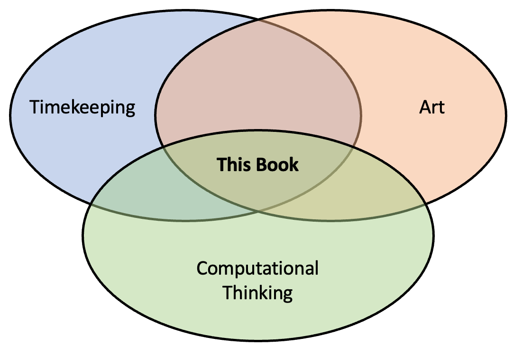
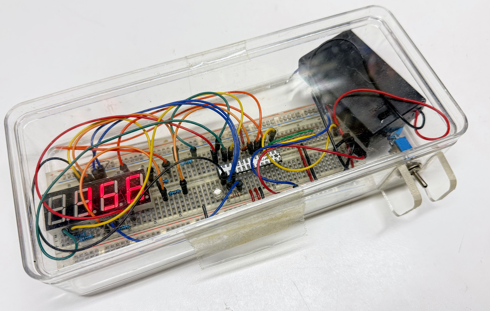

# About the MicroPython Clocks and Watches Site

Innovation often occurs at the seams of specialties.  This book fits
at the intersection of timekeeping, art and teaching computational thinking.

This book can serve as a hands-on guide to introducing students to the fun
world of building your own customized clocks and watches with low-cost parts and some
MicroPython code to make it all work together.

## Why We Created This Book

<!-- 
Sample Prompt:
Create a persuasive motivational article about the values of a website dedicated
to the creation of clocks and watches using MicroPython.
Reference the following points:

1. Kids love clocks and watches
2. The lower cost of components
3. The need to teach computational thinking
4. The value of project-based learning
5. The value of social construction
6. The need for well-designed lesson plans
7. The focus on user experience
-->

My STEM students often hold a special facination with timekeeping.
I don't know exactly what it is that gets them so excited about
these projects.  But the bottom line is they quickly become
motivated to learn Python to create their own timekeeping
devices that are customized to their interests.  Owning their
own devices and showing off these
projects to their friends is also a big plus.

At the core of
 [Project Based Learning (PBL)](https://en.wikipedia.org/wiki/Project-based_learning)
 is the desire to allow students to pick their own projects.  My role
 as a mentor is to have a rich set of projects they can get
 started on.  They may not understand all the components, but
 to fix and modify the projects they end up learning
 faster than if I gave them a dozen lectures with PowerPoint.

## The Timeless Allure of Timekeeping: Sparking a Passion for Coding with MicroPython Clocks and Watches

In a world driven by digital innovation, the essence of time remains universally compelling. From the ancient sundials to the modern-day smartwatches, humans have always been fascinated by the pursuit of measuring time. This intrigue, particularly among the younger generation, is why a library of fun MicroPython Clocks and Watches serves as an exceptional entry point into the universe of coding and computational thinking.

## Tapping into the Child's Natural Curiosity

Children possess an innate sense of wonder. The ticking of a clock or the changing digits on a digital watch captivates their imagination. They question how it works, what makes it tick, and how they can possibly create one of their own. By introducing them to a collection of engaging MicroPython timekeeping projects, we are not only answering their questions but also kindling a flame of creativity and innovation.

## From Boring Lectures to Tangible Results

Traditional pedagogical methods, characterized by long hours of lectures, often fail to hold the attention of young learners. However, project-based learning flips this paradigm. When a child is given the tools and guidance to create their very own digital clock or watch, the learning process transforms. They're no longer passive recipients of information but active creators, brimming with ideas and enthusiasm.

A MicroPython Clock project, for instance, isn’t just a coding endeavor; it's a journey. From understanding the concept, drafting the design, writing the first line of code, to finally witnessing their creation come to life – every step is a lesson in problem-solving, critical thinking, and perseverance.

## Building Blocks of Computational Thinking

Computational thinking is a cornerstone of modern education. It’s not just about writing code, but a way of approaching problems logically, breaking them down into smaller tasks, and finding efficient solutions. By creating a timekeeping device, children undergo a practical exercise in computational thinking. They decide the features they want, debug issues, and constantly refine their work, all while having fun!

## Social Construction: The Joy of Shared Creation

Imagine a part of every school library or a display case where clocks and watches are on display.   Each devices can tell its unique story, representing a young coder's journey. Sharing these creations allows children to learn from each other, celebrate their achievements, and draw inspiration. Such a collaborative environment fosters not just coding skills but also empathy, teamwork, and a sense of community.  Technically, we call group building projects [Social constructivism](https://en.wikipedia.org/wiki/Social_constructivism#Education).  And there is ample
research to show that students that learn in groups have higer participation rates and can usually develop better outcomes.

## Engineered for User Experience

Great STEM projects don't just fall off a shelf into our laps.  They need to be designed and tested carefully using the same agile processes that we use in software development.  [User Experience](https://en.wikipedia.org/wiki/User_experience) (UX) professionals need to help us observe our students using and learning from our lessons.

## The Evolution of Learning

The above image was my attempt in 2014 to use a breadboard and the original ATmega328P microcontroller to build a clock.  This required deep knowledge of the ATmega328P microcontroller and programming in raw low-level C code.
Just setting up the integrated development environment could take days.
The code needed to be complied and the entire program downloaded into the memory just to run a simple test.  You were limited to just 2K or RAM and the clock ran at a slow 16MhZ.

Today the Raspberry Pi has enough RAM to run a full Python interpreter and 264K of RAM just for program memory.  It can run up to 150MhZ and has multiple cores that can be working on different tasks such as reading sensors and updating displays.

In short, this power translates into fun projects that are easy to write.  Combining these powerful microcontrollers with AI assistants means even novice programmers can quickly achieve great things!  Building DIY projects has never been so fun!

## In Conclusion

A library of MicroPython Clocks and Watches isn't just a collection of projects; it’s a treasure trove of experiences, learnings, and memories. By introducing children to the magic of timekeeping in the digital age, we are equipping them with skills for the future, fostering a love for coding, and most importantly, reminding them that learning can be both fun and profoundly meaningful. The timeless allure of time, coupled with the dynamic world of coding, creates a perfect blend to mold the innovators and thinkers of tomorrow.