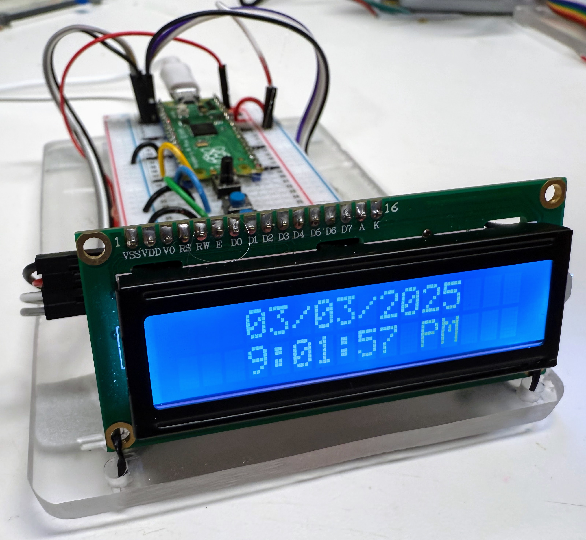

# Character LCD Clock



The LCD1602 is a low cost ($5) character LCD display with 16 characters in two rows.  They frequently come with an I2C interface.  In this
kit we combine this display with a real-time clock chip to
create a clock that will display the date, time and temperature 


## I2C Scanner

In our kit, we put the I2C data pins on GPIO 0 (row 1 of the breadboard) and we put the I2C clock pin on GPIO 1 (row 2 of the breadboard).

When we run the I2C scanner we should be able to see the address of the LCD display and the real-time clock.

Here is the I2C scanner code:

```python
import machine
I2C_SDA_PIN = 0
I2C_SCL_PIN = 1
i2c=machine.I2C(0,sda=machine.Pin(I2C_SDA_PIN), scl=machine.Pin(I2C_SCL_PIN), freq=400000)

print('Scanning I2C bus.')
devices = i2c.scan() # this returns a list of devices
device_count = len(devices)
if device_count == 0:
    print('No i2c device found.')
else:
    print(device_count, 'devices found.')
for device in devices:
    print('Decimal address:', device, ", Hex address: ", hex(device))
```

### LCD1602 MicroPython Libraries

Because the LCD1602 is a common display, there are several LCD1602 libraries.  Many of the share a common interface language.

Here is how we initialize the LCD driver

```python
I2C_ADDR     = 0x27
I2C_NUM_ROWS = 2
I2C_NUM_COLS = 16

i2c = I2C(0, sda=Pin(0), scl=Pin(1), freq=400000)
lcd = I2cLcd(i2c, I2C_ADDR, I2C_NUM_ROWS, I2C_NUM_COLS)
```

## Sample Clock Program

```python
from machine import I2C, Pin
from lcd_api import LcdApi
from pico_i2c_lcd import I2cLcd
from utime import sleep, localtime

I2C_ADDR     = 0x27
I2C_NUM_ROWS = 2
I2C_NUM_COLS = 16

i2c = I2C(0, sda=Pin(0), scl=Pin(1), freq=400000)
lcd = I2cLcd(i2c, I2C_ADDR, I2C_NUM_ROWS, I2C_NUM_COLS)

while True:
    # Clear the display before writing new content
    lcd.clear()
    
    # change this line to read the RTC time
    now = localtime()
    year = now[0]
    month = now[1]
    day = now[2]
    hour = now[3]
    minute = now[4]
    second = now[5]
    
    if hour == 0:
        # Midnight edge case
        hour = 12
        am_pm = 'AM'
    elif hour == 12:
        # Noon edge case
        am_pm = 'PM'
    elif hour > 12:
        # Afternoon hours
        hour -= 12
        am_pm = 'PM'
    else:
        # Morning hours
        am_pm = 'AM'
    
    # Format date on first row - centered
    date_str = f"{month:02d}/{day:02d}/{year}"
    lcd.move_to((16 - len(date_str)) // 2, 0)  # Center the date
    lcd.putstr(date_str)
    
    # Format time on second row with seconds
    time_str = f"{hour}:{minute:02d}:{second:02d} {am_pm}"
    lcd.move_to((16 - len(time_str)) // 2, 1)  # Center the time
    lcd.putstr(time_str)
    
    sleep(1)
```

## Purchasing

I recommend getting the version with the 

[eBay Listing with I2c Backpack](eBay-listing-16X2-char-lcd-i2c.png)

## References

[eBay Search for 16X3 LCD Display I2C](https://www.ebay.com/sch/i.html?_nkw=16%C3%972+LCD+Display+I2C)