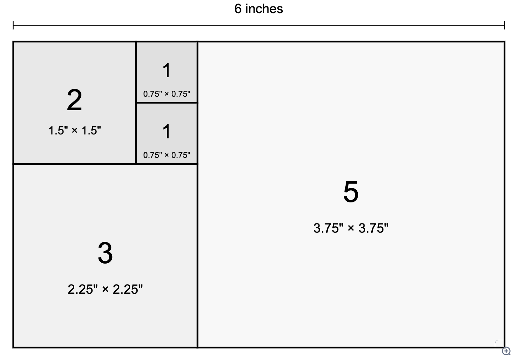

# Fibonacci Clock Dimensions

Here is a design of the dimensions of a a Fibonacci clock with five squares arranged in a landscape configuration on a 6-inch wide display which is 3.75 inches high.

A Fibonacci clock uses five squares whose sizes correspond to the first five Fibonacci numbers (1, 1, 2, 3, 5). These squares can be arranged to form a rectangle in a way that mimics the Fibonacci spiral.

For our 6-inch wide plexiglass in landscape orientation, here are the exact dimensions for each square:

1.  The largest square (representing 5 in the sequence): 3.75 inches × 3.75 inches
2.  The medium square (representing 3): 2.25 inches × 2.25 inches
3.  The small square (representing 2): 1.5 inches × 1.5 inches
4.  Two smallest squares (each representing 1): 0.75 inch × 0.75 inch each

These dimensions will create a perfect 6 × 6 inch square when arranged properly. However, since you mentioned you want a landscape orientation with a 6-inch width, we can adjust the arrangement to be wider than it is tall.

The optimal landscape arrangement would be:

-   Place the 5-square (3.75") on the right
-   To its left, stack the 3-square (2.25") on bottom and the 2-square (1.5") on the top
-   To the right of the 2-square, stack the two 1-squares (0.75" each)

This arrangement will give you a rectangle that's exactly 6 inches wide (3.75" + 2.25") and 3.75 inches tall, making efficient use of our 6-inch wide display while maintaining the Fibonacci sequence relationship between the squares.

