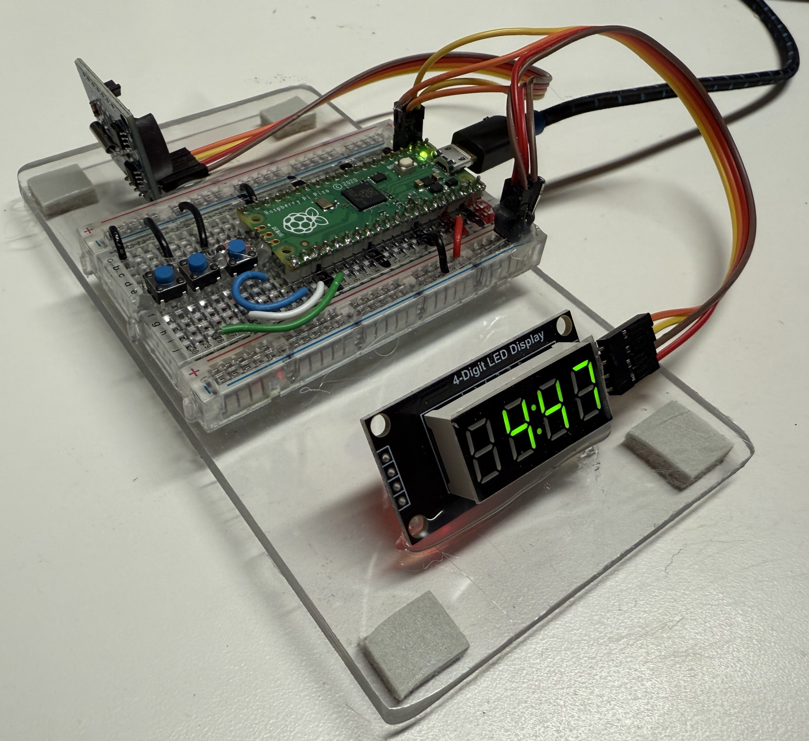
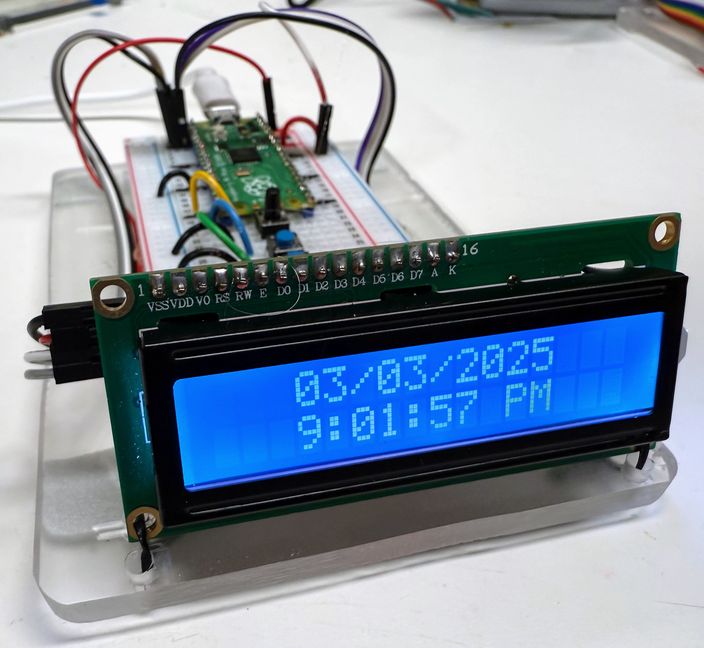
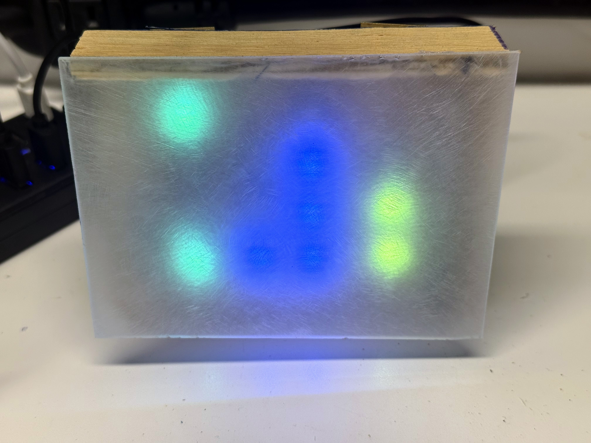
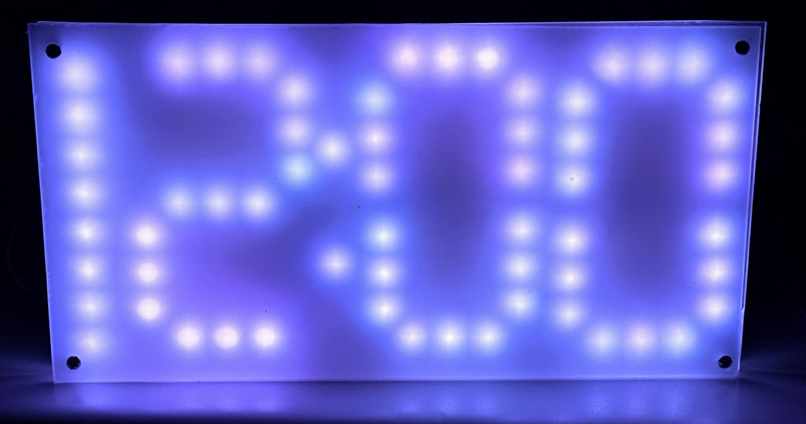
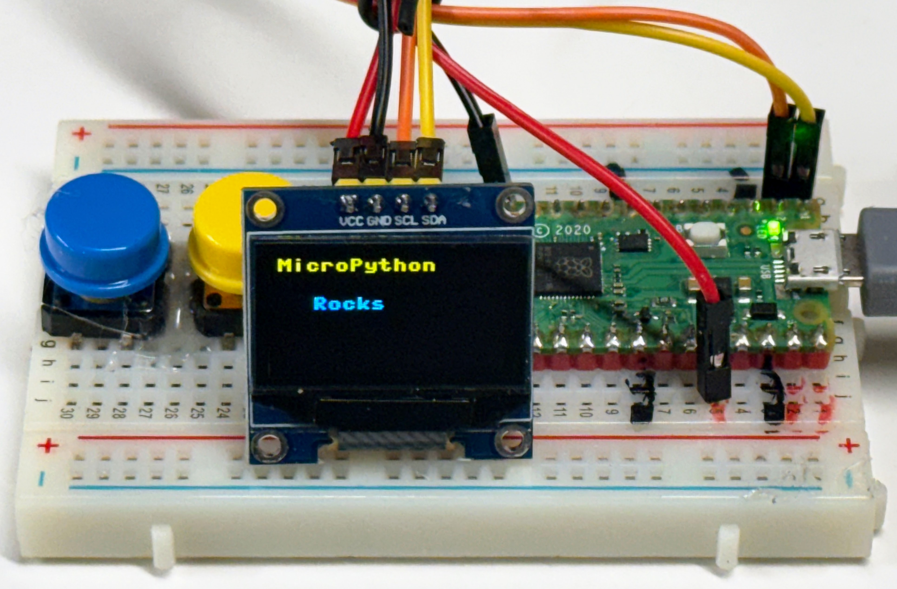
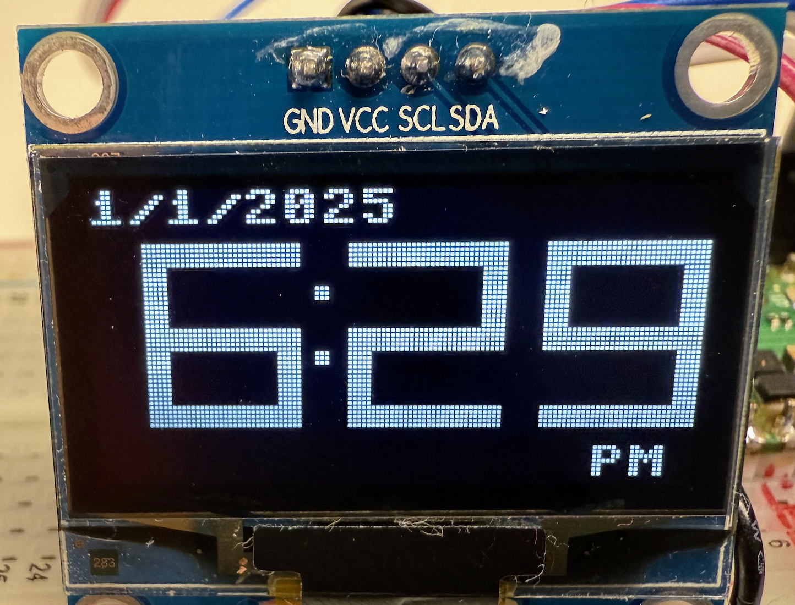
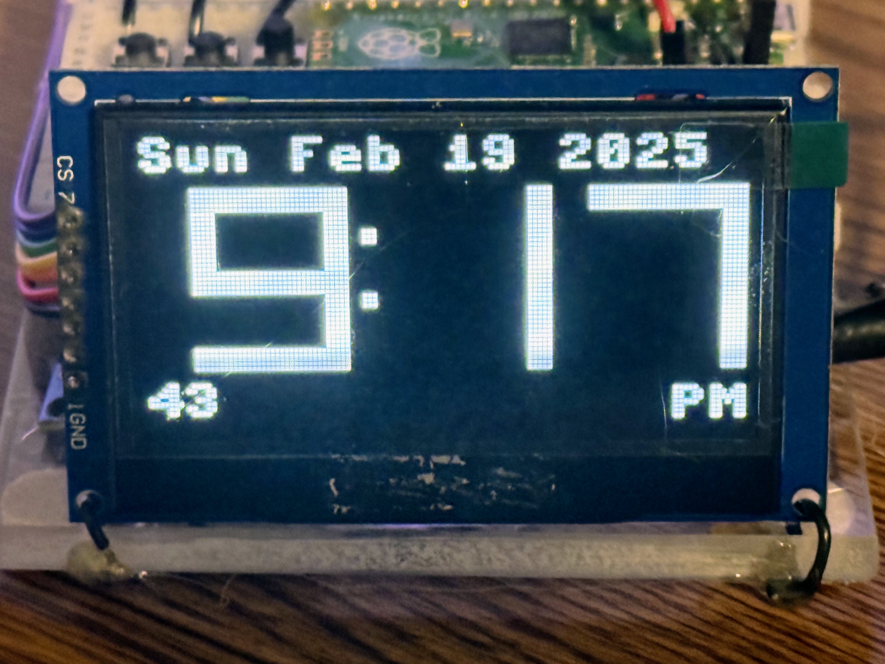
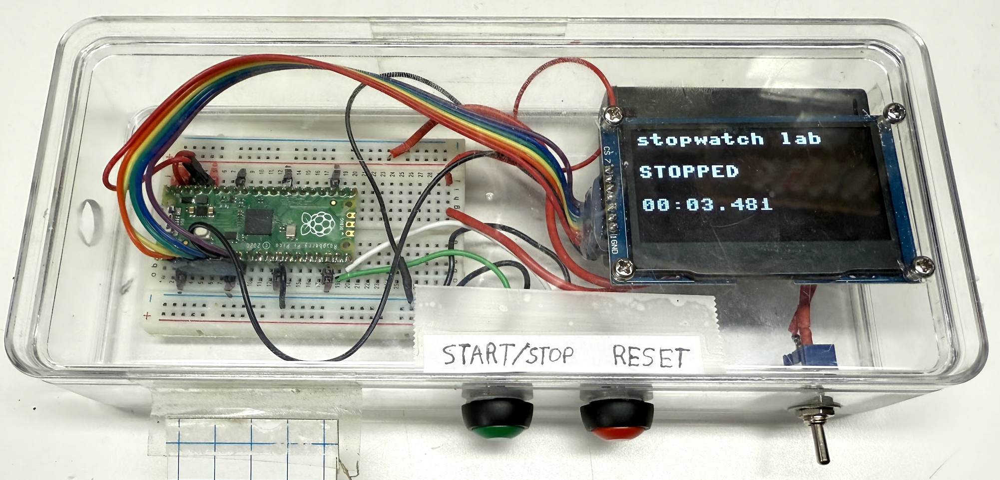
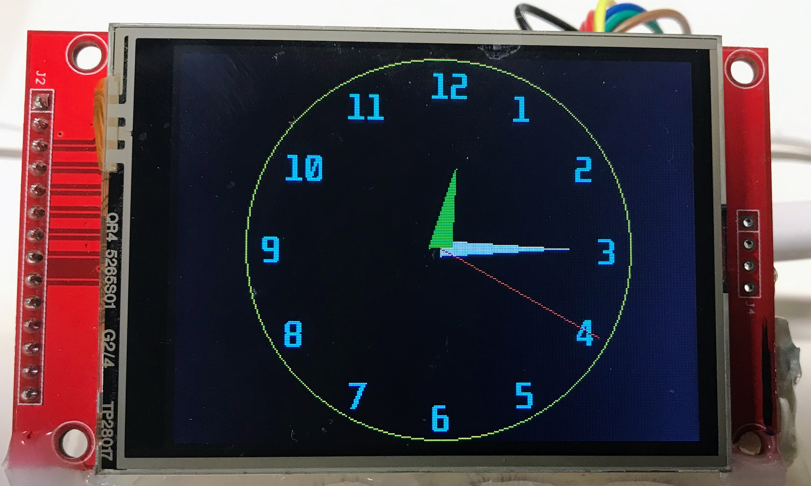
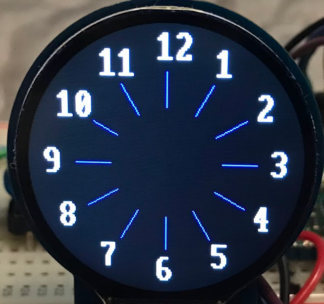

# Gallery of Clock and Watch Projects

- [TM1637 LED Clock](./tm1637/index.md) 
- [Character LCD Clock](./char-lcd-clock/index.md) 
- [NeoPixel Binary Clock](./neopixel/binary-clock/index.md) 
- [NeoPixel Seven Segment Clock](./neopixel/seven-segment-clock/index.md) 
- [OLED SSD1306 I2C Clock](./ssd1306-i2c/index.md) 
- [OLED SH1106 Clock](./sh1106/index.md) 
- [ST7735 Color LCD Clock](./st7735/index.md) 
- [Large SSD1306 OLED Clock](./oled-large/index.md) 
- [Stopwatch](./stopwatch/index.md) 
- [Wireless Clock](./oled-wireless/index.md) 
- [ILI9341](./ili9341/index.md) 
- [GC9a01 Smartwatch Display](./gc9a01/index.md) 
- [EPaper Display Clock](./e-paper/index.md) (TBD)
- [NeoPixel Fibonacci-clock](./neopixel/fibonacci-clock/index.md) (TBD)
- Shift Register Clocks (TBD)
- Alarm Clock(TBD)

