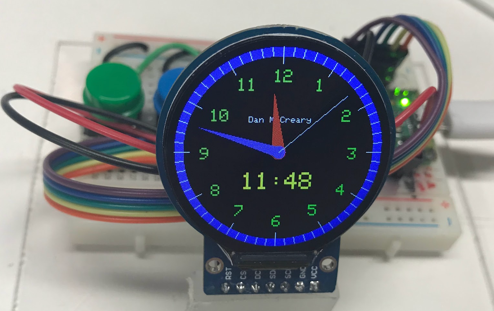

# GC9A01 Display



The gc9a01 is a chip that drives a 240x240 round display that is connected to a microcontroller by
an SPI display.

The current gc9a01 drivers are not compatable with the current release of framebuf in
the standard MicroPython runtime.  Therefore the standard framebuf functions
such as ```ellipse()``` and ```poly()``` functions do not work.  This limits the portability
of many of or clock and watch example.

The good news is that you can do some drawing operations faster and your code
does not have to run the ```show()``` command.  Functions such as ```line()```
will draw directly to the display.

To connect we need to either use a firmware version or load the driver into the /lib directory and we can then use the following code:

```py
from machine import Pin, SPI
import gc9a01 as gc9a01

# hardware config
SCL_PIN = 2
SDA_PIN = 3
DC_PIN = 4
CS_PIN = 5
RST_PIN = 6
spi = SPI(0, baudrate=60000000, sck=Pin(SCL_PIN), mosi=Pin(SDA_PIN))

# initialize the display
tft = gc9a01.GC9A01(
    spi,
    dc=Pin(DC_PIN, Pin.OUT),
    cs=Pin(CS_PIN, Pin.OUT),
    reset=Pin(RST_PIN, Pin.OUT),
    rotation=0)

tft.fill(gc9a01.BLACK)

# x, y, width, height
# red
tft.fill_rect(50,  75, 50, 60, gc9a01.color565(255,0,0))
# green
tft.fill_rect(100, 75, 50, 60, gc9a01.color565(0,255,0))
# blue
tft.fill_rect(150, 75, 50, 60, gc9a01.color565(0,0,255))
```

## Rotation

The driver supports 8 different types of rotations:

- 0 - PORTRAIT
- 1 - LANDSCAPE
- 2 - INVERTED PORTRAIT
- 3 - INVERTED LANDSCAPE
- 4 - PORTRAIT MIRRORED
- 5 - LANDSCAPE MIRRORED
- 6 - INVERTED PORTRAIT MIRRORED
- 7 - INVERTED LANDSCAPE MIRRORED

In our labs we have the connector at the bottom so we use the Portrait rotation of 0
which is the default rotation.

## References

1. [Russ Hughes](https://github.com/russhughes/gc9a01_mpy) - Russ provides firmware images that you can use
for both the Pico and Pico W.
    1. [Raspberry Pi Pico](https://github.com/russhughes/gc9a01_mpy/tree/main/firmware/RP2/firmware.uf2)
    2. [Raspberry Pi Pico W](https://github.com/russhughes/gc9a01_mpy/blob/main/firmware/RP2W/firmware.uf2)

