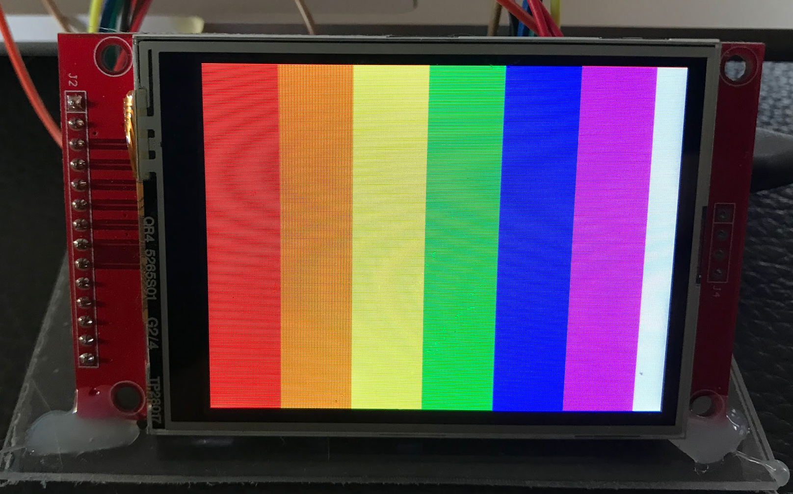

# Rainbow Test



```py
from ili9341 import Display, color565
from machine import Pin, SPI

# Use these PIN definitions.  SCK must be on 2 and data (SDL) on 3 for SPI bus 0
SCK_PIN = 2
MISO_PIN = 3 # labeled SDI(MOSI) on the back of the display
DC_PIN = 4
RESET_PIN = 5
CS_PIN = 6
ROTATION = 90

WIDTH=320
HEIGHT=240

spi = SPI(0, baudrate=40000000, sck=Pin(SCK_PIN), mosi=Pin(MISO_PIN))
display = Display(spi, dc=Pin(DC_PIN), cs=Pin(CS_PIN), rst=Pin(RESET_PIN), width=WIDTH, height=HEIGHT, rotation=ROTATION)

RED = color565(255,0,0)
ORANGE = color565(255,128,0)
YELLOW = color565(255,255,0)
GREEN = color565(0,255,0)
BLUE = color565(0,0,255)
PURPLE = color565(255,0,255)
WHITE = color565(255,255,255)
BLACK = color565(0,0,0)

display.fill_rectangle(0,0, 50,HEIGHT, RED)
display.fill_rectangle(50,0, 50,HEIGHT, ORANGE)
display.fill_rectangle(100,0, 50,HEIGHT, YELLOW)
display.fill_rectangle(150,0, 50,HEIGHT, GREEN)
display.fill_rectangle(200,0, 50,HEIGHT, BLUE)
display.fill_rectangle(250,0, 50,HEIGHT, PURPLE)
display.fill_rectangle(300,0, 20,HEIGHT, WHITE)

print('Done')
```

## Color Definitions

We can also use this same process for storing all of the common constants that
we duplicate in our examples.  For example all the named color defintions
can be moved into a serate color-defs.py file like this:


Sample colors.py
```py
from ili9341 import color565

WHITE = color565(255,255,255)
BLACK = color565(0,0,0)
RED = color565(255,0,0)
ORANGE = color565(255,128,0)
YELLOW = color565(255,255,0)
GREEN = color565(0,255,0)
BLUE = color565(0,0,255)
CYAN = color565(0,255,255)
PURPLE = color565(255,0,255)
```

This sample program imports both the config and the colors file:

```py
from ili9341 import Display, color565
from machine import Pin, SPI
import config
import colors

# Use these PIN definitions.  SCK must be on 2 and data (SDL) on 3
SCK_PIN = config.SCK_PIN
MISO_PIN = config.MISO_PIN # labeled SDI(MOSI) on the back of the display
DC_PIN = config.DC_PIN
RESET_PIN = config.RESET_PIN
CS_PIN = config.CS_PIN

WIDTH=config.WIDTH
HEIGHT=config.HEIGHT
ROTATION=config.ROTATION

# mosi=Pin(23)
# miso=Pin(MISO_PIN)
spi = SPI(0, baudrate=40000000, sck=Pin(SCK_PIN), mosi=Pin(MISO_PIN))
display = Display(spi, dc=Pin(DC_PIN), cs=Pin(CS_PIN), rst=Pin(RESET_PIN), width=WIDTH, height=HEIGHT, rotation=ROTATION)

display.fill_rectangle(0,0, 50,HEIGHT, colors.RED)
display.fill_rectangle(50,0, 50,HEIGHT, colors.ORANGE)
display.fill_rectangle(100,0, 50,HEIGHT, colors.YELLOW)
display.fill_rectangle(150,0, 50,HEIGHT, colors.GREEN)
display.fill_rectangle(200,0, 50,HEIGHT, colors.BLUE)
display.fill_rectangle(250,0, 50,HEIGHT, colors.PURPLE)
display.fill_rectangle(300,0, 20,HEIGHT, colors.WHITE)

print('Done')
```

Note that the string ```colors.``` must appear before each color name.  You can shorten
this to be just ```c.``` if you want to keep your code smaller and easier to read.

## Hiding Hardware Initialization

We could take this one step further and put the lines that setup the SPI and the Display
into a separate function.  However, in our labs we want to keep some of this code
explicit so we will leave the SPI and Display initialization in our examples.