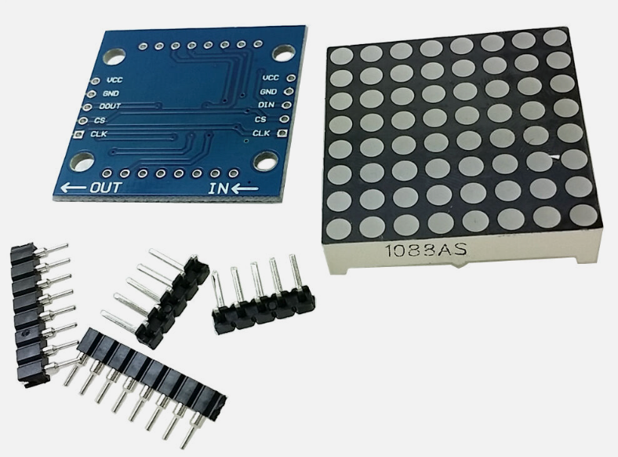

# MAX7219 Clocks

The Analog Devices [MAX7219](https://www.analog.com/en/products/max7219.html) is a low-cost chip that communicates with a row of seven-segment displays using a single serial interface.

[eBay search for MAX7219](https://www.ebay.com/sch/i.html?_nkw=MAX7219)

### Lesson Plan: Building a Clock with the MAX7219 Chip using MicroPython and Raspberry Pi Pico

#### Objective:

Students will learn about basic electronics and programming by building a digital clock using the MAX7219 LED driver chip with a Raspberry Pi Pico programmed in MicroPython.

#### Materials:

-   MAX7219 LED dot matrix modules
-   Raspberry Pi Pico
-   Jumper wires
-   Breadboard
-   USB cable for the Raspberry Pi Pico
-   Computers with Thonny Python IDE installed
-   Basic electronic components (resistors, capacitors, etc.)
-   Reference materials on MAX7219 and MicroPython programming

#### Duration:

5 classes (45 minutes each)

#### Class 1: Introduction to the MAX7219 and Raspberry Pi Pico

-   **Lecture Topic**: Overview of the MAX7219 chip and its applications in digital displays.
-   **Activity**: Demonstration of a simple LED matrix setup using the MAX7219 and Raspberry Pi Pico.
-   **Homework**: Read provided material about MAX7219 and basics of MicroPython.

#### Class 2: Basic Electronics and Circuit Design

-   **Lecture Topic**: Fundamentals of electronics, introduction to using a breadboard, and designing circuits.
-   **Activity**: Students practice creating basic circuits on the breadboard using Raspberry Pi Pico.
-   **Homework**: Sketch a basic circuit diagram for connecting the MAX7219 to the Raspberry Pi Pico.

#### Class 3: Introduction to MicroPython

-   **Lecture Topic**: Basics of MicroPython programming and its application in controlling electronic components.
-   **Activity**: Simple programming exercises in Thonny Python IDE to

understand MicroPython syntax and basic commands.

-   **Homework**: Write a simple program in MicroPython to blink an LED.

#### Class 4: Programming the MAX7219 with MicroPython

-   **Lecture Topic**: Detailed instruction on programming the MAX7219 using MicroPython.
-   **Activity**: Students will write and upload a MicroPython script to the Raspberry Pi Pico to control the MAX7219 module, starting with displaying static numbers.
-   **Homework**: Modify the script to create a simple animation or pattern on the LED matrix.

#### Class 5: Building and Programming the Clock

-   **Lecture Topic**: Integrating the knowledge gained to build a digital clock.
-   **Activity**: Students will complete the assembly of their digital clocks and program them to display the current time. This will involve fetching the time from the Raspberry Pi Pico and displaying it on the MAX7219 LED matrix.
-   **Assessment**: Evaluate the students' projects based on functionality, creativity, and understanding of the concepts taught.

#### Additional Notes:

-   Ensure that each student or group has access to all the necessary materials.
-   Supplement the course with online resources and forums for additional support.
-   Encourage students to document their progress and challenges for a reflective learning experience.
-   Consider having a session for students to present their finished clocks and share their learning experiences with the class.

## References

[DIY clock | Homemade 7 segments "nixie" tubes](https://www.youtube.com/watch?v=LkrGmI_SAOs)