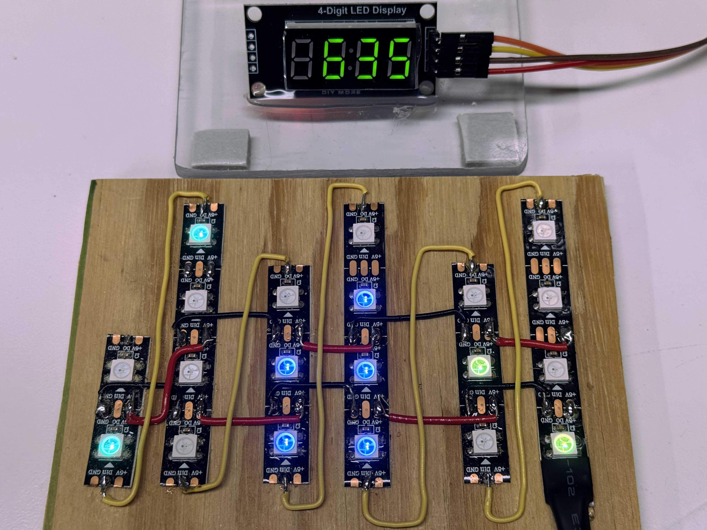

# Binary Clock



The binary clock is a popular project where binary numbers are used to display the digits of a clock.


This kit just needs a Pico and a short segment of an LED strip - about 20 pixels.

We can create a very simple binary clock using a single NeoPixel LED strip
with just 12 pixels.  You can see a simulation of the clock here:

<iframe src="../../../sims/binary-clock/binary-clock-vertical.html" width="420" height="295"></iframe>

The strip will have two rows of six pixels each:

1. The first row will be the binary hour (0 to 24) (5 green pixels) and one pixel that flashes the second
2. The second row will show the minutes (0 to 59) (6 blue pixels)


## Sample Code for Three Rows with Second Counter

1. Row 1 is five pixels with the hours (0-24)
2. Row 2 is the minutes with the minutes (0-60)
3. Row 3 is the seconds (0-60)

```py
from machine import Pin
from neopixel import NeoPixel
from utime import sleep, localtime

NEOPIXEL_PIN = 0
NUMBER_PIXELS = 18
strip = NeoPixel(Pin(NEOPIXEL_PIN), NUMBER_PIXELS)

sec_bits = [0,0,0,0,0,0]
min_bits = [0,0,0,0,0,0]
hr_bits = [0,0,0,0,0,0]

def decimal_to_binary(n, a):
    global sec_bits
    for i in range(0,6):
        if n % 2:
            a[i] = 1
        else:
            a[i] = 0
        # n is halfed doing a divide by 2
        n //= 2

def display_binary(binary, index, color):
    for i in range(0, 6):
        # print(i, ' ', end='')
        if binary[i] == 1:
            strip[index+i] = color
        else:
            strip[index+i] = (0,0,0)
    strip.write()

# light mark and write
def display_mark(loc):
    strip[loc] = (5,5,5)
    strip.write()

# update from the first time
# sec
display_mark(0)
display_mark(7)

# min
display_mark(9)
display_mark(16)

# min
display_mark(19)
display_mark(26)

now = localtime()
hour = now[3]
# use AM/PM 12 hour time
if hour > 12:
    hour = hour - 12
minute = now[4]

# this is not working
decimal_to_binary(minute, min_bits)
print('initial min:', minute, min_bits)
display_binary(min_bits, 10, (0,10,0))

decimal_to_binary(hour, hr_bits)
print('initial hour:', hour, hr_bits)
display_binary(hr_bits, 20, (0,0,10))

while True:
    now = localtime()
    hour = now[3]
    # use AM/PM 12 hour time
    if hour > 12:
        hour = hour - 12
    minute = now[4]
    sec = now[5]
    print(hour, ':', minute, ' ', sec, sep='')
    strip.write()
    decimal_to_binary(sec, sec_bits)
    print('sec:', sec, sec_bits)
    display_binary(sec_bits, 1, (10,0,0))
    if sec == 60:
        minute = minute + 1
        sec = 0
        decimal_to_binary(minute, min_bits)
        print('min:', minute, min_bits)
        display_binary(min_bits, 10, (0,10,0))
        if minute == 60:
            decimal_to_binary(hour, hr_bits)
            print('hour:', hour, hr_bits)
            display_binary(hr_bits, 20, (0,0,10))
            hour = hour + 1
            minute = 0
            if hour == 24:
                hour = 0
    sleep(1)
```
## References

* [Moving Rainbow Clock](https://dmccreary.github.io/moving-rainbow/lessons/20-clock/)