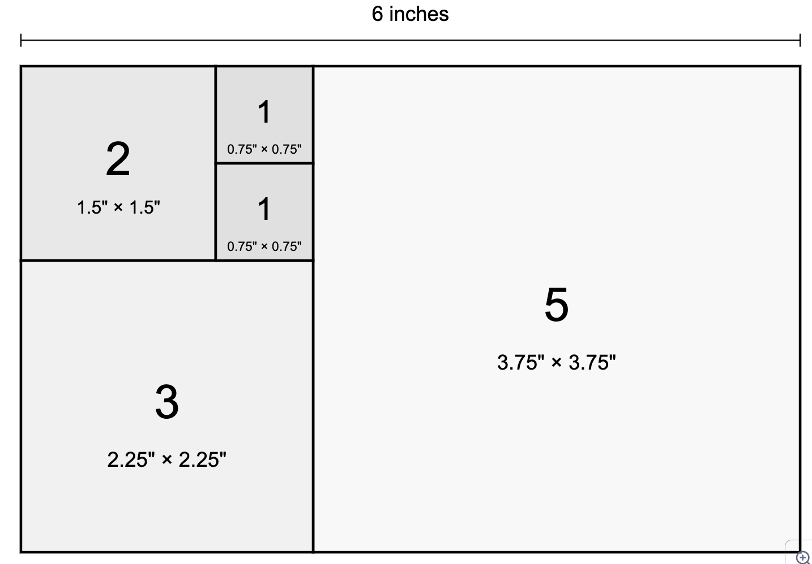
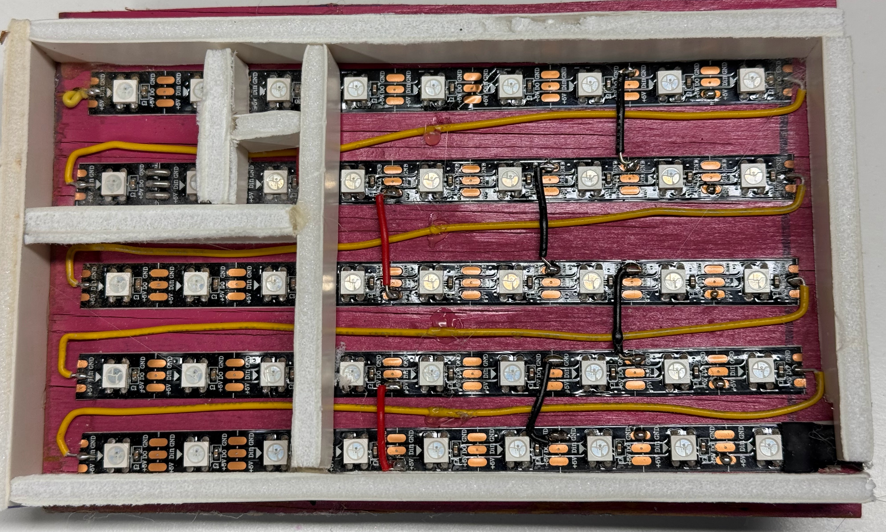

# Fibonacci Clock Dimensions



Here is a design of the dimensions of a a Fibonacci clock with five squares arranged in a landscape configuration on a 6-inch wide display which is 3.75 inches high.

A Fibonacci clock uses five squares whose sizes correspond to the first five Fibonacci numbers (1, 1, 2, 3, 5). These squares can be arranged to form a rectangle in a way that mimics the Fibonacci spiral.

For our 6-inch wide plexiglass in landscape orientation, here are the exact dimensions for each square:

1.  The largest square (representing 5 in the sequence): 3.75 inches × 3.75 inches
2.  The medium square (representing 3): 2.25 inches × 2.25 inches
3.  The small square (representing 2): 1.5 inches × 1.5 inches
4.  Two smallest squares (each representing 1): 0.75 inch × 0.75 inch each

These dimensions will create a perfect 6 × 6 inch square when arranged properly. However, since you mentioned you want a landscape orientation with a 6-inch width, we can adjust the arrangement to be wider than it is tall.

The optimal landscape arrangement would be:

-   Place the 5-square (3.75") on the right
-   To its left, stack the 3-square (2.25") on bottom and the 2-square (1.5") on the top
-   To the right of the 2-square, stack the two 1-squares (0.75" each)

This arrangement will give you a rectangle that's exactly 6 inches wide (3.75" + 2.25") and 3.75 inches tall, making efficient use of our 6-inch wide display while maintaining the Fibonacci sequence relationship between the squares.

Here is a photograph of the wiring of our clock using [NeoPixels](../../../glossary.md#neopixel).


Here are a few notes on our NeoPixel layout.

1. We are using NeoPixels that come in strips.  We used the double-sided tape on the back of the LED strips to adhere the strips to a six-inch wide board that was 1/4 inch think plywood.
2. There are 60 pixels per meter so the spacing between each NeoPixel is 1/60th of a meter or 0.656 inches per pixel
3. This spacing is about right for a single pixel for the one cells, 2x2 or 4 pixels for the two cell, 3x3 or 9 pixels for the three cell and 5x5 or pixels for the five cell.
4. Note that we actually use 6 columns in the image, but that was more due to an error on my part.
5. We used the back end of the LED strip that had both the 5V and GND wires presoldered onto the strip.
6. We used 22 gauge solid wire to hook up the data pins.  The data pin comes in at the upper left corner and then we use the yellow wire from the upper right corner to go to the second row.  The right end of the second row goes to the input of the third row.  We repeat this for the third and forth rows for the data wire.
7. For the power and ground, we just soldered short red and black wires between the rows so that each strip had power and ground connections.  We used short 1-inch wires and bent the ends so they would align with the copper pads on the LED strips.
8. We carefully tested the power and ground connections with a ohm-meter to make sure all the connections were working.
9. We used a simple MicroPython test program to verify that each color of each pixel was working correctly.

## Sample Python Test Code

Below is a test program in MicroPython that makes sure that all the NeoPixels are connected correctly and that we have the index numbers of each NeoPixel in a list for each cell.

```python
// Fibonacci Pixel Test
from machine import Pin
from neopixel import NeoPixel
from utime import sleep, ticks_ms

NEOPIXEL_PIN = 0
NUMBER_PIXELS = 45
RAINBOW_LENGTH = 7

strip = NeoPixel(Pin(NEOPIXEL_PIN), NUMBER_PIXELS)

## our matrix is five rows by 9 columns
## rows 1 to five columns 4 to 9
five = [3,4,5,6,7,8,12,13,14,15,16,17,21,22,23,24,25,26,30,31,32,33,34,35,39,40,41,42,43,44]   
three = [18,19,20, 27,28,29,36,37,38]
two = [0,1,9,10] 
oneA = [2]
oneB = [11]

lists = [oneA, oneB, two, three, five]

# make the five cell red
for i in five:
   strip[i] = (25,0,0)

# make the three cell green
for i in three:
   strip[i] = (0,25,0)

# make the two cell blue
for i in two:
   strip[i] = (0,0,25)

# make the one A cell yellow
for i in oneA:
   strip[i] = (25,25,0)

# make the one B cell purple
for i in oneB:
   strip[i] = (25,0,25)
   
strip.write()
```

