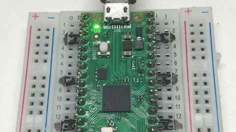

# Blink The Onboard LED



Our first program will just blink the on-board LED on the Raspberry Pi Pico.
It is a great way to tell if you got Thonny installed correctly
and that your computer can connect to the Raspberry Pi Pico.
Use the "copy" icon in the upper right corner to copy the code
below into your pastebuffer.  Then open Thonny and paste it into
a new file in your Thonny editor (or other Python programming tool).  
Then press the "Run" button.  You should see the small green
LED on the Pico flashing on and off every second.


```python
# Setup - run once
from machine import Pin # Get the Pin function from the machine module.
from time import sleep # Get the sleep library from the time module.

# This is the built-in green LED on the standard Pico.
# BUILT_IN_LED_PIN = 25
# On the Pico "W" we use the symbolic "name" of "LED", not a pin number
BUILT_IN_LED_PIN = Pin("LED", Pin.OUT)

# The line below indicates we are configuring this as an output (not input)
led = Pin(BUILT_IN_LED_PIN, Pin.OUT)

# Main loop: Repeat the forever...
while True:
    led.high() # turn on the LED
    sleep(0.5) # leave it on for 1/2 second
    led.low()  # Turn off the LED
    sleep(0.5) # leave it off for 1/2 second
```

When you run this program, the built-in LED on the Pico will blink every second.

!!! Challenges
    1. Change the delay time to be `0.25` seconds on and `0.25` second off.
    2. How fast can you make the LED blink?
    3. Go to the original [MicroPython for Kids](https://www.coderdojotc.org/micropython/) website and search for the term "blink" in the search form in the upper right.  What variations of blink are there in other kits?
    4. If you have any LEDs and 330 ohm resistors, try adding them to the breadboard and getting the external LED to blink.  See [this lab](https://www.coderdojotc.org/micropython/basics/03-blink/#blinking-an-external-led) for sample code.

## Debugging Tips.

If you are not getting any response when you click the "Run" button, try checking that your desktop computer is communicating with the Raspberry Pi Pico through the USB cable.

See the [Setup Desktop Debugging Tips](../../setup/01-desktop.md#debugging-tips) page for tips on how to make sure your connection is working.