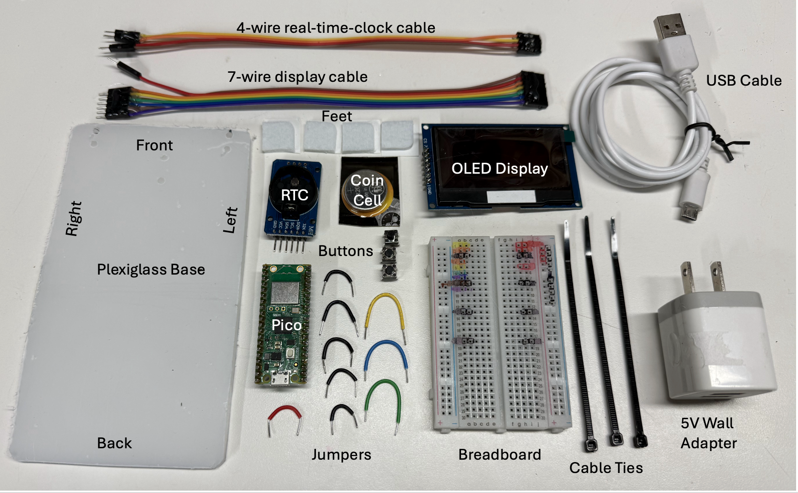
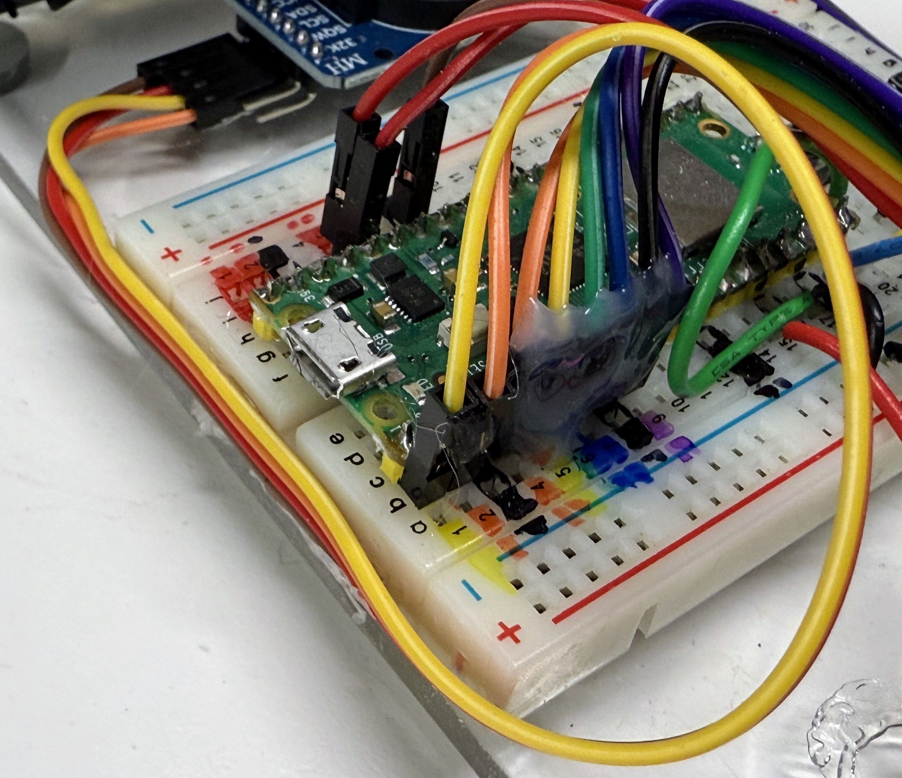

# Large OLED Assembly

Here are your assembly instructions for the Large OLED clock kit.
This kit comes with a Raspberry Pi W, a nice large 2.24" OLED display and a DS3132 real-time clock.  You can also optionally mount a speaker for an alarm clock.
Time can be set using three buttons (set, increment (+) and decrement (-))

## Kit Parts List

1. Plexiglass base with holes in front
1. 4 felt pads for the feet
1. Breadboard - 1/2 size - 30 rows - 400 ties
1. Raspberry Pi Pico W with header pins installed
1. OLED display (2.42" 128X64)
1. 7 wire display cable (20cm M-F)
1. Real time clock (DS3132)
1. CR2032 coin-cell battery
1. 4-wire real-time clock cable (20cm M-F)
1. 3 momentary push buttons - long for set, short for +/-
1. 5 black ground wires for buttons
1. 3 button wires (yellow, blue and green)
1. 1 red power jumper (3.3 to bus)
1. 3 cable ties
1. USB connector (A to micro)
1. 5-volt USB power adapter

## Assembly Steps

### Base

Peal both side protective backing off the plexiglass base.

### Feet

Attach the 4 felt pads to the corners of the base by pealing the release liner off each pad and placing each one in each corner.  This will be the bottom of your clock.

### Attach Breadboard

Peal off the release liner for the breadboard and place it in the center of the top base with row 1 on the right and row 30 on the left.

### Install Pico

Put the Raspberry Pi Pico W into the breadboard making sure that USB connector is at the top of the breadboard (row 1) and the pins are aligned like the diagram.

### 3.3 V Bus Jumper

Place the red jumper wire on the right row 5 to the red power bus on the right (+5).

### Ground Jumper

Attach the black jumper wire from row 8 on the right to the blue bus GND.
Note all rows that end in 3 or 8 are GND (3,8,13,18) and have a black mark on the breadboard.

### Add Buttons

Place the buttons on the breadboard over the center trough oriented so that the legs of the buttons are on opposite sides of the center trough and closing the switch will close the connection between the rows of the breadboard when pressed.

### Display Cable to OLED

Attach the 7-wire display cable to the OLED making sure that the black wire is on the GND connection.

### Display Cable to Breadboard

Attached the display cable to the breadboard in the left side from rows 3 to 9.  Make sure that the black wire is on the GND pin (row 8).  Make sure that the red wire is attached to right red positive power rail

### Coin Cell

Place the CR2032 coin cell battery in the real-time clock making sure the positive side is on the top.

### RTC Cable to RTC

Attach the 4-wire cable to there real time clock making sure that the black GND and the red VCC are connect to the correct pins, SDA is yellow and SCL is orange.  The SQW and 32K pins are not used.

### RTC Cable to Breadboard

Attach the other of the 4-wire real-time clock cable to the breadboard.  Connect yellow to row 1 on the left and orange on row 2 on the left.  Connect the red wire to the red power rail on the right and the black wire to the GND on the right.

### Button Ground
Attach the 3 black ground wires between lower left corner of the buttons to the GND power rail on the left

### Button Signal Wires

Attach the yellow, blue and green signal wires to the upper left of the buttons

### Cable Ties

(Optional) – use cable ties or twist ties to connect the display and the RTC to the base through the holes.  If you are planning to build your own case you can skip this step.
