# Large OLED Assembly


Here are your assembly instructions for the Large OLED clock kit.
This kit comes with a Raspberry Pi W, a nice large 2.24" OLED display and a DS3132 real-time clock.  You can also optionally mount a speaker for an alarm clock.
Time can be set using three buttons (mode-set, increment (+) and decrement (-))

## Kit Parts List

1. Plexiglass base with holes in front
1. 4 felt pads for the feet
1. Breadboard - 1/2 size - 30 rows - 400 ties
1. Raspberry Pi Pico W with header pins installed
1. OLED display (2.42" 128X64)
1. 7 wire display cable (20cm M-F)
1. Real time clock (DS3132)
1. CR2032 coin-cell battery
1. 4-wire real-time clock cable (20cm M-F)
1. 3 momentary push buttons - long for set, short for +/-
1. 5 black ground wires for buttons
1. 3 button wires (yellow, blue and green)
1. 1 red power jumper (3.3 to bus)
1. 3 cable ties
1. USB connector (A to micro)
1. 5-volt USB power adapter


## Assembly Steps

### Prepare Plexiglass Base

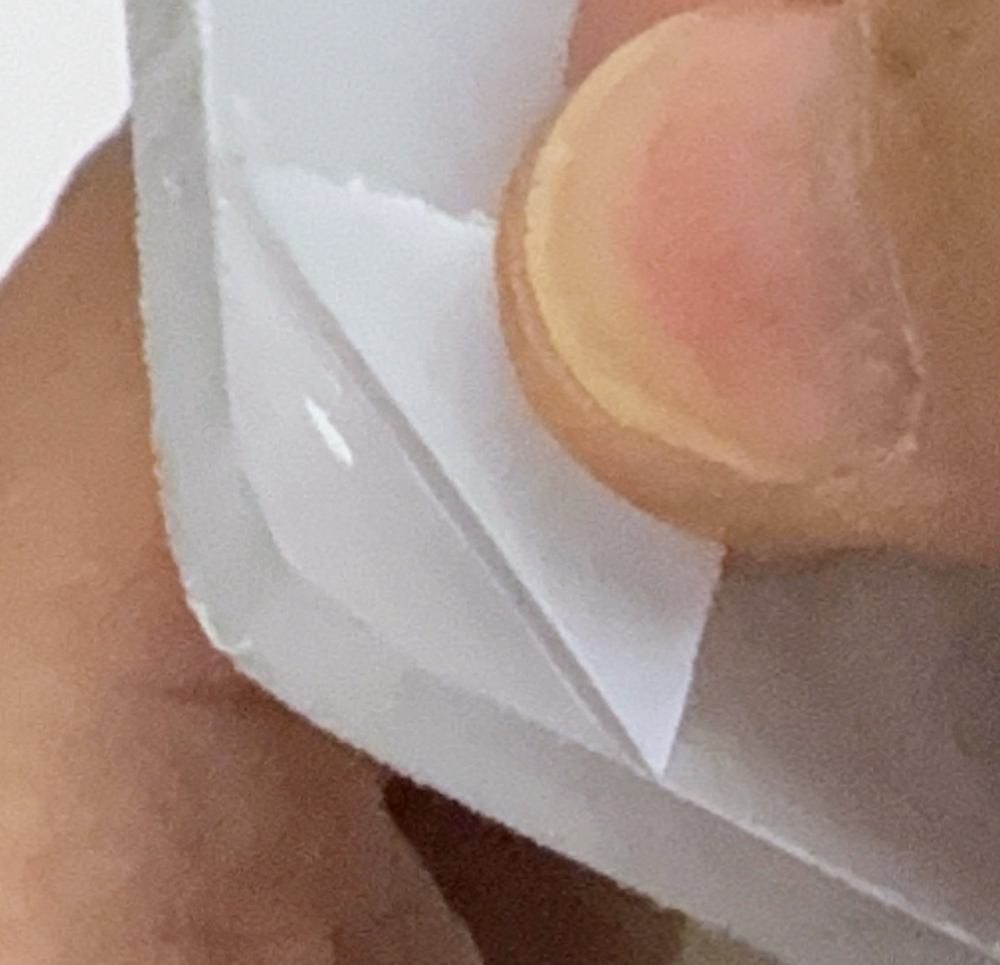

Peal the protective backing off of both sides of the plexiglass base.
You might need to use your fingernails or a knife to peal up the corner.

### Attach Felt Pads to Base

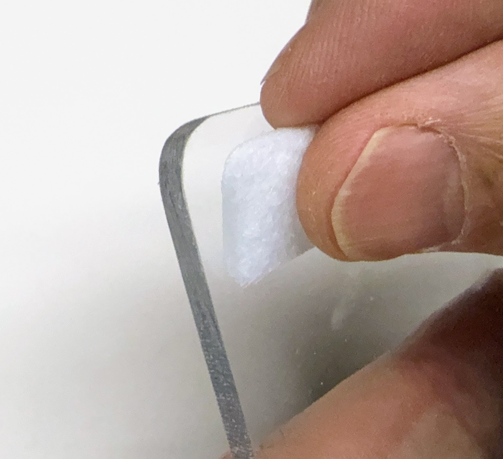

Attach the 4 felt pads to the corners of the base 
by pealing the release liner off each pad and placing 
each one in each corner.  If you are using cable
ties on the display, make sure you leave room
for the cable ties and positions the felt pads in about 1/4 of an 
inch from the side edges.

This will be the bottom of your clock.

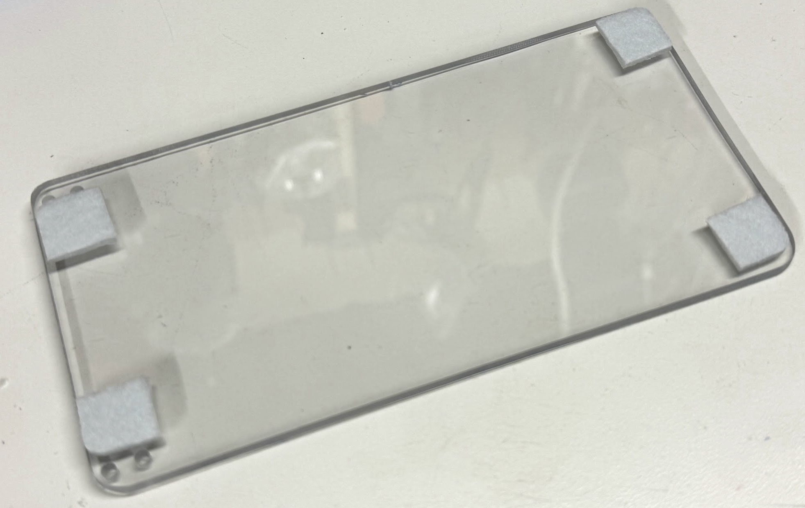

### Attach Breadboard to Base

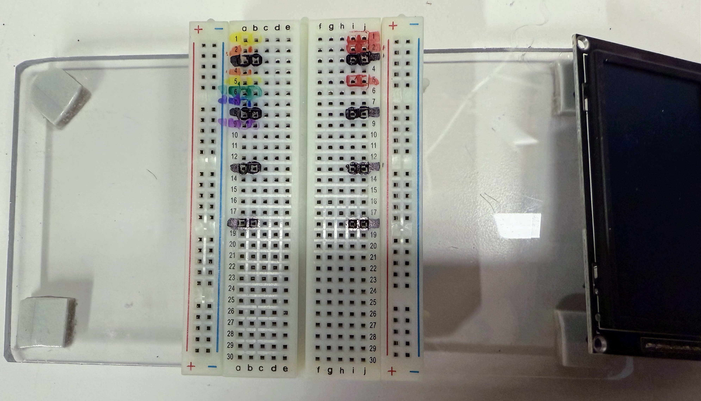

Peal off the release liner for the solderless 1/2 breadboard and place it 
in the center of the top base with row 1 on the right and row 30 on the left
as you face from the front of the clock.  Note that the top of the
breadboard is row 1 and the bottom is row 30.

### Install Pico W on Breadboard

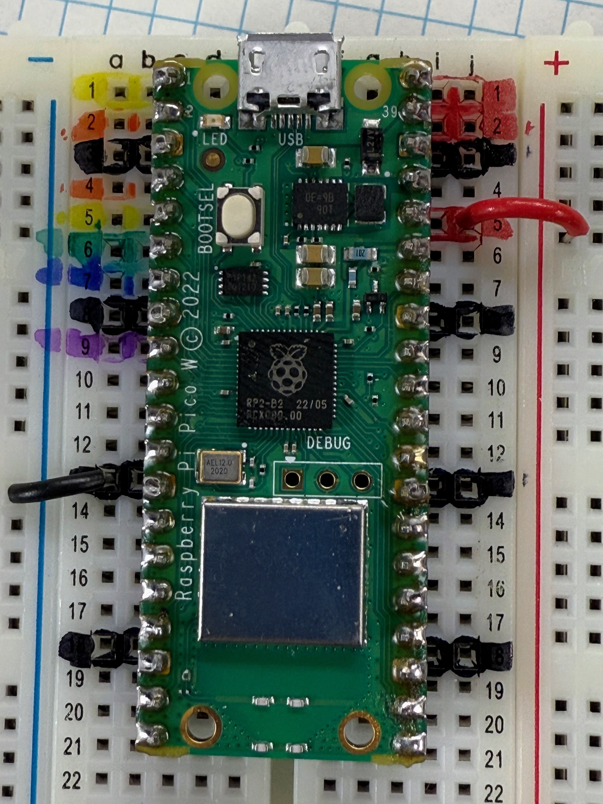

Put the Raspberry Pi Pico W into the breadboard making sure that USB 
connector is at the **top** of the breadboard (row 1) and the pins are 
aligned like the diagram.  The header pins on the Raspberry Pi Pico W
will be in columns "c" and "h".

### 3.3 V Red Bus Jumper

Use the red jumper wire to connect right row 5 (3.3 OUT) to the red power bus on the right.
Both the OLED display and the real-time clock will connect their power to this right power rail.

### Black Ground Jumper

Attach the black jumper wire from row 8 on the right to the blue bus GND.
Note all rows that end in the digit `3` or `8` are `GND` (3,8,13,18).
Your breadboard may have a black mark on the breadboard on these rows.
This connection allows the entire left power rail to be GND.

### Add Buttons

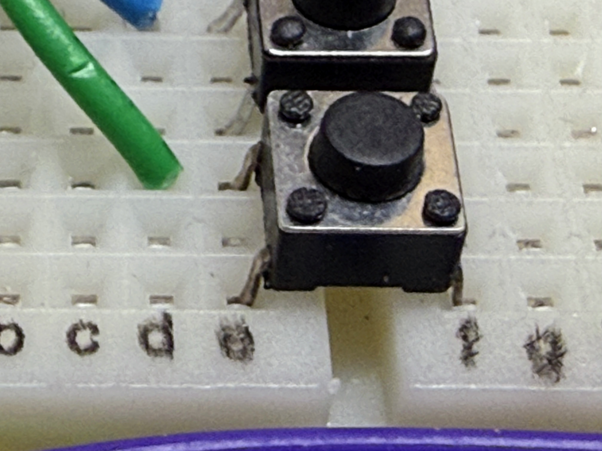

Place the three buttons on the breadboard over the center trough oriented so that the 
legs of the buttons are on opposite sides of the center trough and closing 
the switch will close the connection between the rows of the breadboard when pressed.

The internal connections of the buttons is shown below:


### Wire Buttons

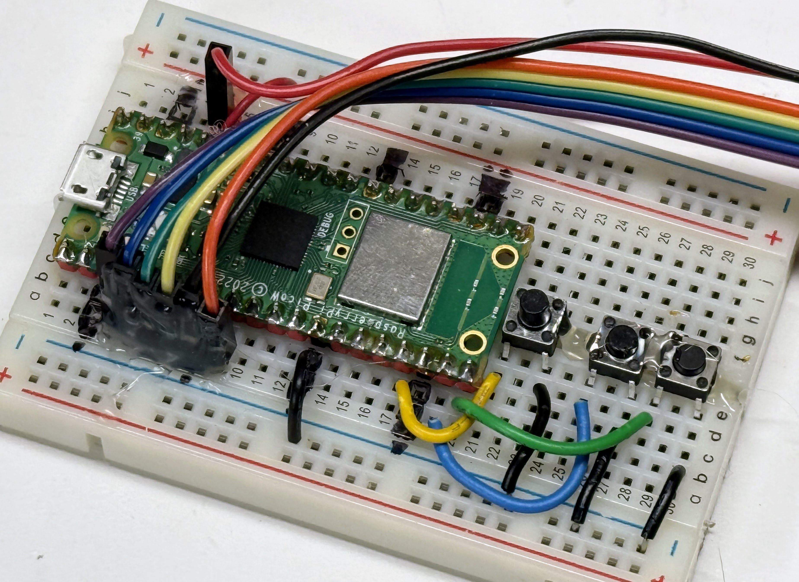

We are now ready to wire the three buttons up.  Their job is to connect
the pins on the lower left corner of the Pico W to GND when they
are pressed.  Each button has GND on the lower-left pin and signal on the upper-left corner
of the button.  The signal of the top button will go to row 17, the middle button to row 19 
and the bottom button will go to row 20.

A logical diagram of the button circuit is shown below:

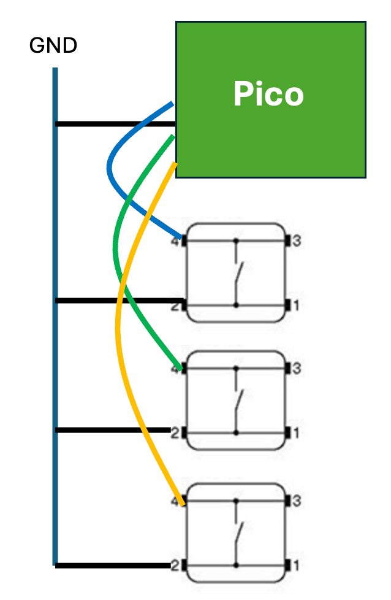

Here are the pin assignments will use in later labs:

|Breadboard Row|GPIO Pin|Function|
|---|---|---|
|Row 17|GPIO 13|Set (Mode)|
|Row 19|GPIO 14|Increment|
|Row 20|GPIO 15|Decrement|

!!! Note
    If you have your software loaded, you can run the 'buttons-test-print.py' to verify
    that the buttons are all connected correctly.  This program will print
    the name of the button being pressed to the console.  This is a great
    way to tell if you have missed any button connections.

### Display Cable to OLED


Locate the 7-wire display cable harness.  It has female pins on one end
and make pins on the other end.  The female pins will go into the OLED
display.  Note that you **must** hoop up the black wire to the GND connection
and the purple wire to the CS connection.  It is very easy to get this
connection reversed, so double check the orientation.

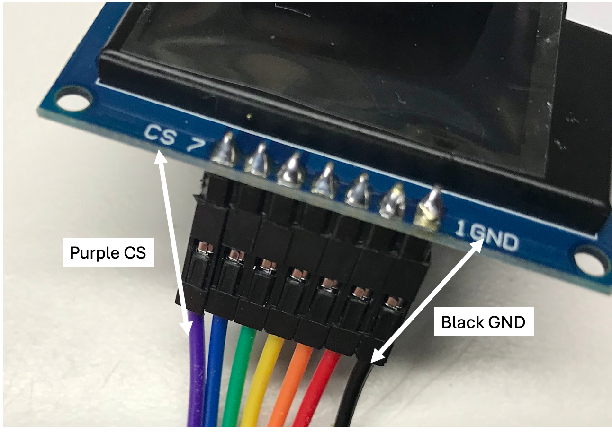


### Display Cable to Breadboard


Attached the display cable to the breadboard in the left side from rows 3 to 9.
The orange wire should be in row 4, yellow in 5, green in 6, blue in 7, black
in 8 and purple in 9.

Next, connect the red wire to the right side red power rail (3.3 volts)

Double check that the black wire is on the GND pin (row 8).  
Make sure that the red wire is attached to right red positive power rail.

### Install the Coin Cell Battery in the RTC

Place the CR2032 coin cell battery in the real-time clock (RTC) making sure the 
positive side is on the top.  The coin cell battery needs to be tucked
under the metal connector and pressed down.  You may need a small screw
driver to pry the batter back up to change it.  Most 

### RTC Cable to RTC

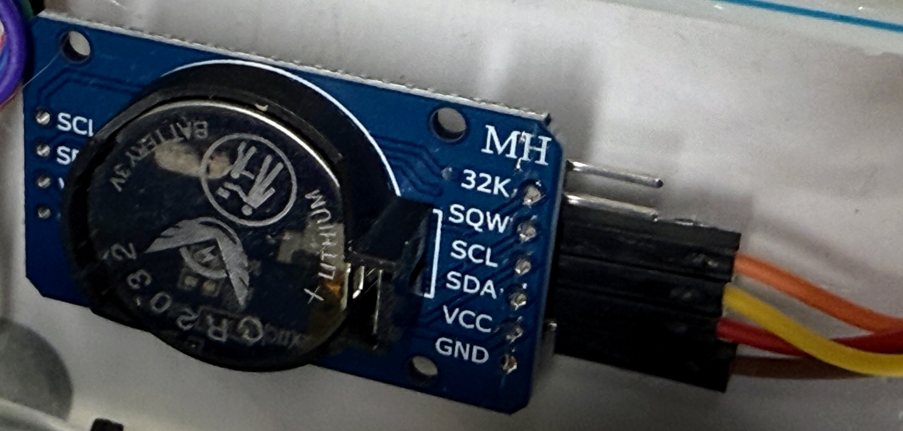

Attach the 4-wire cable to there real time clock making sure that the black GND and the red VCC are connect to the correct pins, SDA is yellow and SCL is orange.  The SQW and 32K pins are not used.

### RTC Cable to Breadboard


Attach the other of the 4-wire real-time clock cable to the breadboard.  
Connect yellow to row 1 on the left (GPIO 0) and orange on row 2 on the left (GPIO 1).  
Connect the red wire to the red power rail on the right and the black 
wire to the GND on the right.

### Cable Ties

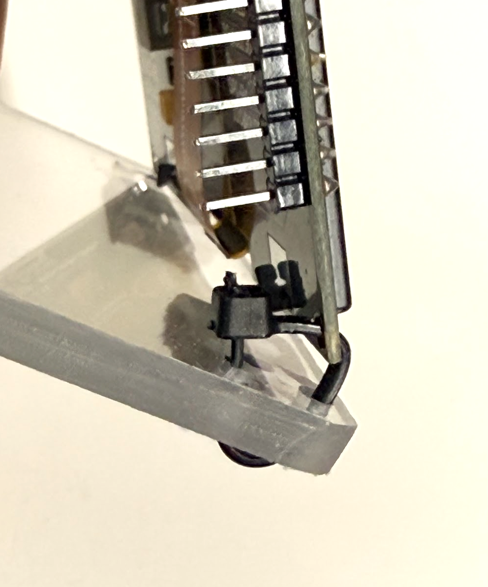

(Optional) You can use cable ties or twist ties to connect 
the display and the RTC to the base through the holes.  
If you are planning to build your own case you can skip this step.

## Final Tests

After you assemble your clock kit you will be abel to test the connections using MicroPython.  Here are some of the tests you will run:

1. Use the [blink](./00-blink.md) to verify that your USB connection is not blocked by your PC/Mac and you have downloaded the correct version of the MicroPython runtime.

2. Use the [i2c scanner](./02-i2c-scanner.md) to verify that your real-time clock is connected correctly.

3. Use the [hello world](./01-hello-world.md) program to test if your display is connected correctly.

4. Use the [button test](./05-button-test.md) program to test to see if your buttons are connected correctly.

## Troubleshooting

You can use generative AI tool like ChatGPT or Anthropic Claude to help you debug the clock.  Make sure you give a complete description of your problem using the following prompt template.

!!! prompt
    Please help me diagnose a problem I am having with MicroPython program running on the Raspberry Pi Pico W.  I am using a Mac to connect to the Pico with Thonny.  I am using Thonny version 4.1.6 and Mac OS 15.0.1.
    When I run ```ls /dev/cu*``` I can see the device listed.  When I press the Stop/Restart backend button I see the MicroPython version X on the console.
    
    However, when I run X I get the following error.


