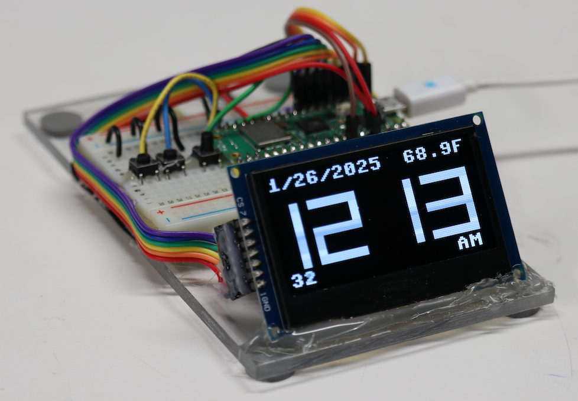
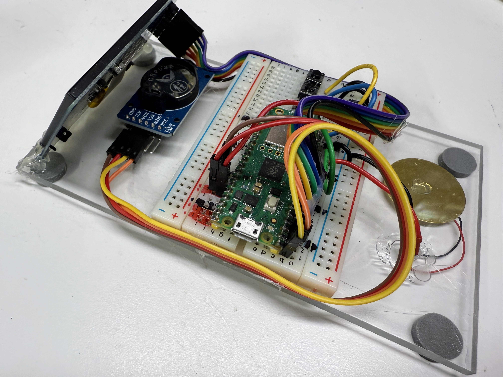

# Large OLED Kit



The Large OLED Kit is one of our most versatile kits.

It uses a bright monochrome 128x64 SSD1306 OLED with the Raspberry Pi Pico W and a
DS3231 real-time clock to keep time accurate to within 2 seconds per month.

The OLEDs are mounted on a piece of acrylic (Plexiglass) with a half-size breadboard.



Each board has three buttons so you can adjust the time and alarm clock settings
manually if you are not getting the time from your WiFi network.

## Component List

- Raspberry Pi W
- 128x64 SSD1306 OLED display on SPI bus
- DS3231 real-time clock on I2C bus
- 3 momentary push buttons

## Kit Assembly

If you have received a clock kit you can proceed directly to the [Assembly Instructions](./01-assembly.md).

Once your kit is assembled you can the start to program your clock.

## Programming

### Step 1: Setting up your Desktop and Loading MicroPython

We cover the desktop setup and loading MicroPython in our [Desktop Setup](../../setup/01-desktop.md)

### Blink the Builtin LED

[Go to the Blink Lab](./00-blink.md)

### Hello World

Your first program is our "Hello World!" program for this kit.
This is a great way to tell if your display connections are all
working.  We have one version that prints to the Thonny console
and one version that prints to the OLED display.

[Go to the Hello World! Program](./01-hello-world.md)

### Display Config

Most of our sample programs read the hardware settings from a configuration file called ```config.py```.  This program shows you how to show the configuration parameters on the display.

[Go to the Display Config Lab](./02-display-config.md)

### Display Raw Localtime

Date and time information is stored in a set of 6-8 integers.  This
first program just shows the raw integers on the display from the
 ```localtime()``` function.  Not
very pretty, but the program is pretty short and simple.

[Go to the Display Localtime Raw](./03-display-localtime-raw.md)

### Set the RTC from Localtime

Once you add your RTC to the kit you will need to
set the time inside the RTC memory.  The best way
to do this is to just grab the time from the MicroPython localtime()
which is set from your local computer when you connect your
Pico using Thonny.

[Set the RTC from Localtime](./02-set-rtc-from-localtime.md)

After you run this program your clock will be accurate to within
two seconds per month.  The backup lithium battery will remember the time even
when the clock is not plugged in or there is a power outage.  The battery will last
about 8 years.

### Display Single Large Digit

[Display Single Digit](./06-display-single-digit.md)