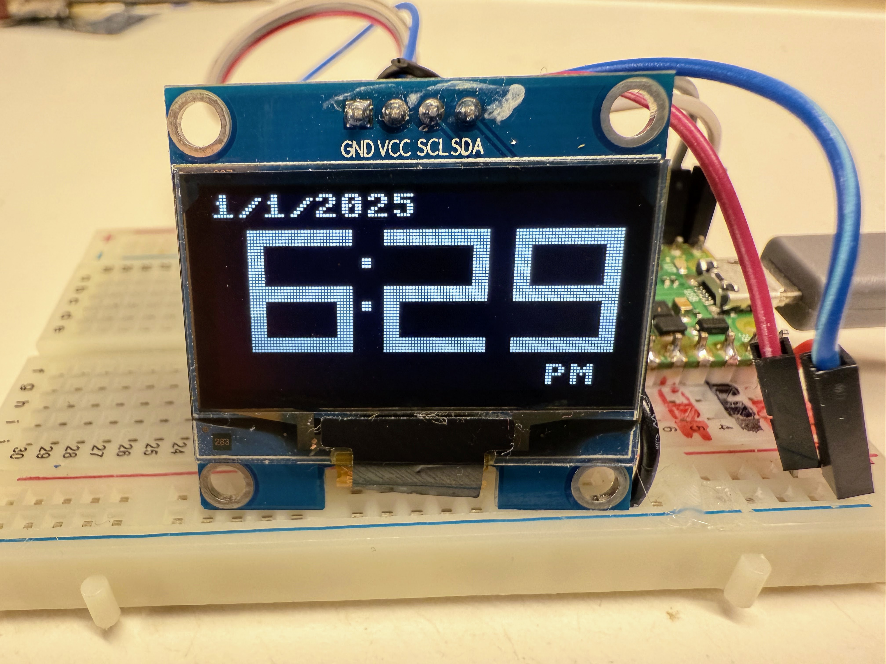

# SH1108 OLED Driver Kit



## Testing the OLED Connections

```python
from machine import Pin, I2C
from sh1106 import SH1106_I2C

# OLED DATA Pin on GPIO 0
OLED_SH11306_SDA_PIN = 0
# OLED Clock Pin on GPIO 1
OLED_SH11306_SCL_PIN = 1

sda=Pin(OLED_SH11306_SDA_PIN, Pin.OUT)
scl=Pin(OLED_SH11306_SCL_PIN, Pin.OUT)

# freq=198000 to 3600000 seem to work.  Use 3000000 as a safe option.
i2c = I2C(0, scl=scl, sda=sda, freq=100000)

# Initialize display (128x64 pixels)
oled = SH1106_I2C(128, 64, i2c)
oled.rotate(180)

# Clear display
oled.fill(0)

# Write text
oled.text("MicroPython", 0, 0)
oled.text("Rocks!", 20, 20)

# Show the display
oled.show()
```

## Displaying Clock Digits

Note that the pins are on the bottom, so for our example we had to do a ```oled.rotate(180)```

```python
from machine import Pin, I2C
from sh1106 import SH1106_I2C
from utime import sleep, localtime

# OLED DATA Pin on GPIO 0
OLED_SH11306_SDA_PIN = 0
# OLED Clock Pin on GPIO 1
OLED_SH11306_SCL_PIN = 1

sda=Pin(OLED_SH11306_SDA_PIN, Pin.OUT)
scl=Pin(OLED_SH11306_SCL_PIN, Pin.OUT)

# freq=30000 (30K) to 4000000 (4M) seem to work.  Use 3000000 (3M) as a safe option.
i2c = I2C(0, scl=scl, sda=sda, freq=3000000)

# Initialize display (128x64 pixels)
oled = SH1106_I2C(128, 64, i2c)
oled.rotate(180)

segmentMapping = [
  #a, b, c, d, e, f, g
  [1, 1, 1, 1, 1, 1, 0], # 0
  [0, 1, 1, 0, 0, 0, 0], # 1
  [1, 1, 0, 1, 1, 0, 1], # 2
  [1, 1, 1, 1, 0, 0, 1], # 3
  [0, 1, 1, 0, 0, 1, 1], # 4
  [1, 0, 1, 1, 0, 1, 1], # 5
  [1, 0, 1, 1, 1, 1, 1], # 6
  [1, 1, 1, 0, 0, 0, 0], # 7
  [1, 1, 1, 1, 1, 1, 1], # 8
  [1, 1, 1, 1, 0, 1, 1]  # 9
];


# x and y are upper-left-corner
# width and height are the dimensions of the digit
# thinkness is the width of the line segments
# color is 1 for white and 0 for black
def drawDigit(digit, x, y, width, height, thinkness, color):
  if digit < 0:
      return
  # get a list of the segments that are on for this digit
  segmentOn = segmentMapping[digit];

  # Draw the horizontal segments: top, bottem, middle
  for i in [0, 3, 6]:
    if (segmentOn[i]):
      if (i==0): # top
          yOffset = 0 
      if (i==3):
          yOffset = height - thinkness # bottem element
      if (i==6):
          yOffset = height // 2 - thinkness // 2# bottum
      # oled.line(x - size, y+yOffset-size, x + size, y+yOffset-size, 1);
      oled.fill_rect(x, y+yOffset, width, thinkness, color)

  # Draw the vertical segments ur, lr, ll, ul
  for i in [1, 2, 4, 5]:
    if (segmentOn[i]) :
      # upper vertical lines
      if (i==1 or i==5):
          startY = y
          endY = y + height // 2
      # lower two vertical lines (2=lower right and 4=lower left)
      if (i==2 or i==4):
          startY = y + height // 2
          endY = y + height
      if (i==4 or i==5): xOffset = 0
      if (i==1 or i==2): xOffset = width-thinkness

      oled.fill_rect(x+xOffset, startY, thinkness, endY-startY, color)

def update_screen(year, month, day, hour, minute, am_pm, colon_on):   

    ## Adjust these to fit the display
    left_margin = -28
    y_offset = 11
    digit_width = 33
    digit_height = 40
    digit_spacing = 41
    digit_thickness = 5
    oled.fill(0)
    date_str = f"{month}/{day}/{year}"
    oled.text(date_str, 0, 0, 1)
    if hour > 12:
        hour = hour - 12
    if hour > 10:
        hour_ten = 1
    else:
        hour_ten = -1
    hour_right = hour % 10

    minute_ten = minute // 10
    minute_right = minute % 10

    # left digit will be 1 or blank
    drawDigit(hour_ten, left_margin,  y_offset, digit_width, digit_height, digit_thickness, 1)
    drawDigit(hour_right, left_margin + 1*digit_spacing-2,  y_offset, digit_width, digit_height, digit_thickness, 1)
    drawDigit(minute_ten, left_margin + 2*digit_spacing,  y_offset, digit_width, digit_height, digit_thickness, 1)
    drawDigit(minute_right, left_margin + 3*digit_spacing, y_offset, digit_width, digit_height, digit_thickness, 1)

    if colon_on:
        draw_colon(47,20)

    pm_xoffset = 106
    pm_yoffset = 55

    oled.text(am_pm, pm_xoffset, pm_yoffset, 1)

    oled.show()

def draw_colon(x,y):
    oled.fill_rect(x, y,    3, 3, 1)
    oled.fill_rect(x, y+14, 3, 3, 1)

counter = 0
while True:
    now = localtime()
    year = now[0]
    month = now[1]
    day = now[2]
    hour = now[3]
    if hour > 12:
        am_pm = "PM"
    else:
        am_pm = "AM"
    minute = now[4]

    update_screen(year, month, day, hour, minute, am_pm, True)
    sleep(1)
    update_screen(year, month, day, hour, minute, am_pm, False)
    sleep(1)
    counter += 1
    if counter > 9:
        counter = 0

```