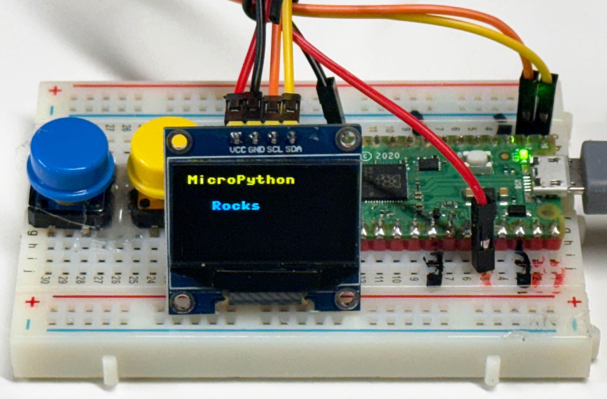

# A Tiny SSD1306 OLED Clock on an I2C Interface


This clock is an ideal starter clock since you can get
the displays for just $3-4 for the small 1" displays.
Because they have a simple four-wire I2C connection they
are also easy to wire up.

Note that the I2C bus can be slower than the faster SPI bus.
However, for a clock that only updates once per second,
this is not usually an issue since we don't need
the 20 frames per second updates for real-time animation.

## Testing the I2C Bus

We start by putting SDA on pin 0 and clock on pin 1.
We can leave the freq parameter out or
we can set the clock to a frequency of 3M or 3000000.
I have found values from freq=198000 to 3600000 seem to work.
Use 3000000 as a safe option.

```python
from machine import I2C, Pin

# OLED DATA Pin
OLED_SSD1306_SDA_PIN = 0
# OLED Clock Pin
OLED_SSD1306_SCL_PIN = 1

sda=Pin(OLED_SSD1306_SDA_PIN, Pin.OUT)
scl=Pin(OLED_SSD1306_SCL_PIN, Pin.OUT)

i2c = I2C(0, scl=scl, sda=sda, freq=3000000)
first_device = i2c.scan()[0]
# print("dec:", first_device, "hex:", hex(first_device))

if first_device == 60:
    print("PASS: OLED Found on dec: 60 hex: 0x3c")
else:
    print("FAIL: OLED not found on expected address dec: 60 hex: 0x3c")
```

## Testing the OLED Driver and Connections



```python
from machine import Pin, I2C
from ssd1306 import SSD1306_I2C

# OLED DATA Pin on GPIO 0
OLED_SSD1306_SDA_PIN = 0
# OLED Clock Pin on GPIO 1
OLED_SSD1306_SCL_PIN = 1

sda=Pin(OLED_SSD1306_SDA_PIN, Pin.OUT)
scl=Pin(OLED_SSD1306_SCL_PIN, Pin.OUT)

# freq=198000 to 3600000 seem to work.  Use 3000000 as a safe option.
i2c = I2C(0, scl=scl, sda=sda, freq=3000000)

# Initialize display (128x64 pixels)
oled = SSD1306_I2C(128, 64, i2c)

# Clear display
oled.fill(0)

# Write text
oled.text("MicroPython", 0, 0)
oled.text("Rocks!", 20, 20)

# Show the display
oled.show()
```

## Display the Localtime

```python
from machine import Pin, I2C
from ssd1306 import SSD1306_I2C
from utime import localtime

# OLED DATA Pin on GPIO 0
OLED_SSD1306_SDA_PIN = 0
# OLED Clock Pin on GPIO 1
OLED_SSD1306_SCL_PIN = 1

sda=Pin(OLED_SSD1306_SDA_PIN, Pin.OUT)
scl=Pin(OLED_SSD1306_SCL_PIN, Pin.OUT)

# freq=198000 to 3600000 seem to work.  Use 3000000 as a safe option.
i2c = I2C(0, scl=scl, sda=sda, freq=3000000)

# Initialize display (128x64 pixels)
oled = SSD1306_I2C(128, 64, i2c)

# Clear display
oled.fill(0)

year = localtime()[0]
month = localtime()[1]
day = localtime()[2]
hour = localtime()[3]
minute = localtime()[4]

# display the time in hour and minute on the first line
oled.text(str(hour) + ":" + str(minute), 0, 0, 1)

# display the date on the second line
oled.text(str(month) + "/" + str(day) + "/" + str(year), 20, 20, 1)
oled.show()
```