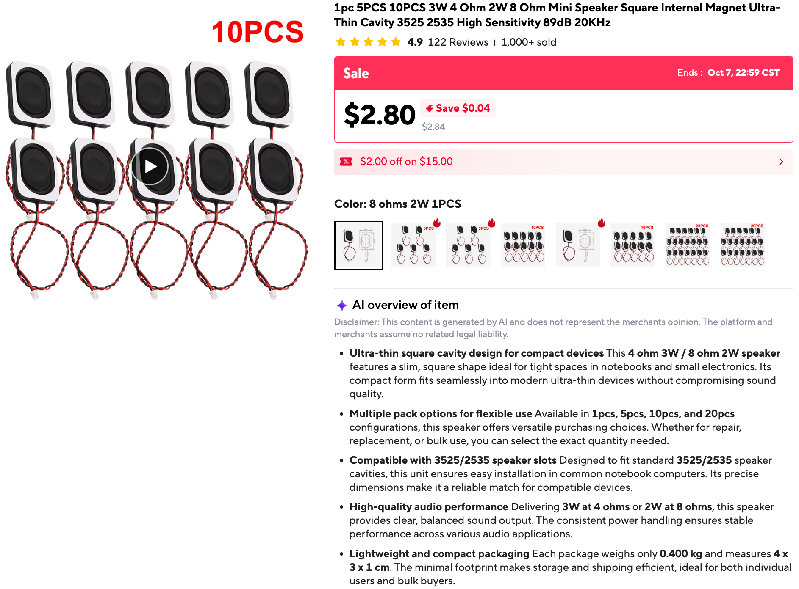

# Study Buddy Kit

!!! note "Status: design specification"
    This section describes a kit that is **not built yet**. Nothing here has
    been run on hardware. Statements marked **(verify)** are things we
    believe from the datasheets or the MicroPython docs and still need to be
    checked on the bench. Pages are written as specs: what the thing must
    do, and the decisions behind it.

The Study Buddy is the [GC9B72 Smartwatch Kit](../sw-gc9b72/index.md) with
a **speaker** added and a new set of modes aimed at studying. Press MODE
to step through the modes, as on the watch. New modes and new quiz
decks can be **downloaded** over WiFi.

## What It Does

| Feature | One-line description |
|---|---|
| **Next Quiz** | Shows a countdown to your next quiz or test, and chimes at the right moments, whatever mode is showing. |
| **Flash Quiz** | Multiple-choice drills built from simple decks, such as *US state capitals*. It brings back the ones you miss. |
| **Daily Quote** | An encouraging quote about learning, new each day. |
| **Study Timer** | A 25-minute focus timer with a 5-minute break and real chimes. |
| **Math Facts** | Times-table drills generated on the Pico. No deck needed. |
| **Library** | Browse and install new modes and decks from a teacher-controlled web address. |

The clock modes from the smartwatch kit (digital, analog, weather) still
work. Study Buddy is the same program with more modes.

[Features](02-features.md){ .md-button }
[Architecture](01-architecture.md){ .md-button }

## Design Goals

1. **Same hardware, one new part.** Everything in the smartwatch kit is
   reused. The only addition is an I2S amplifier and a small speaker.
2. **Three buttons.** No keyboard, no touch, no microphone. Every feature
   must work with MODE, UP, and DOWN.
3. **Students and teachers both use the Library.** A student can add or
   remove decks and modes without a computer, from what the teacher has
   published. A quiz deck is just data, so any student can write one and
   hand it in. A mode is code, so only a teacher publishes those.
4. **Reuse the mode contract.** A new mode is a module with the same four
   functions as in [Lab 12](../sw-gc9b72/12-main-template.md).
5. **Works plugged in.** The Pico has no clock battery, so the Study Buddy
   sets its clock over WiFi at power-up. It is a desk device, not a
   wearable.

## Parts

Everything in the [GC9B72 kit](../sw-gc9b72/index.md#whats-in-the-kit), plus:

| Part | Notes |
|---|---|
| **MAX98357A I2S amplifier board** | Takes digital audio from the Pico and drives a speaker directly. |
| **Mini speaker, square, ultra-thin, "3525/2535" size** | The kit's speaker, bought on AliExpress as "3W 4 Ohm / 2W 8 Ohm Mini Speaker ... 89dB 20KHz" (listing screenshot: [img/speaker-on-aliexpress.png](img/speaker-on-aliexpress.png)). It was $2.80 for the 1-piece option shown, and the listing also sells 5, 10, and 20 packs. See [About the speaker](#about-the-speaker). |
| *(optional)* **16 MB flash board** | A Pico-sized board with 16 MB of flash and PSRAM, such as the Pimoroni Pico Plus 2 W **(verify MicroPython support)**. Only needed for lots of recorded speech. See [Audio](04-audio.md). |

The kit already runs on a **Pico 2 W** (RP2350, 520 KB RAM, 4 MB flash).
RAM is not the limit for any feature in this spec. Flash space for
recorded audio is.

## About the speaker



What the listing says: a square, ultra-thin, internal-magnet speaker for
the "3525/2535" slots found in notebook computers, rated **3 W at 4 ohms
or 2 W at 8 ohms**, with a sensitivity of **89 dB** and "20KHz" in the
title. (The listing's "4 x 3 x 1 cm" is the packed size. A 2535 part is
usually about 25 × 35 mm, which is my reading of the model number, not
something the listing states.)

What that means for the labs:

- **It is a small, clear speaker, not a full-range one.** A speaker this
  size is usually good from the low hundreds of hertz up into the high
  treble. It cannot make deep bass, because moving that much air takes a
  big cone or a big box. The "20KHz" is the top of what the speaker is
  *listed* for, and is not a promise that it is loud or even there. Lab 04
  has you find out where **this** speaker starts and stops, by ear.
- **Power is not the limit.** The MAX98357A makes about 3 W into 4 ohms at
  5 V, and less at 3.3 V or into 8 ohms. At the default volume of 40 the
  speaker is nowhere near its 2 W rating.
- **It is the 8 ohm, 2 W version.** The same listing sells a 4 ohm 3 W
  speaker and an 8 ohm 2 W one, and the speaker has no markings. Dan
  measured its DC resistance with a multimeter at **7.4 ohms**. A 4 ohm
  speaker reads about 3 to 3.5, and an 8 ohm one about 6 to 7.5, so this
  is the 8 ohm one. Into 8 ohms the amplifier is a little quieter than
  into 4, and the most it can deliver at 5 V is, as I remember the
  datasheet, a bit under the speaker's 2 W rating. At the default volume of
  40 it is nowhere near.

## Wiring Added

The display and buttons keep their wiring from the
[smartwatch kit](../sw-gc9b72/index.md#how-it-is-wired). The amplifier adds
four signal wires on four neighboring pins, plus power and ground:

| Amplifier pin | Pico pin | Notes |
|---|---|---|
| **LRC** | GP21 | Word select. Must be the pin right after BCLK. |
| **BCLK** | GP20 | Bit clock |
| **DIN** | GP19 | Audio data |
| **GAIN** | GP18 | Loudness setting. See below. |
| **VIN** | VBUS (5 V) or 3V3 | 5 V is louder. **(verify)** that the WiFi stays stable at full volume, and add a 100 µF capacitor across VIN and GND near the amplifier. |
| **GND** | GND | |

Leave the amplifier's **SD** pin unconnected.

!!! note "The I2S pin rule"
    MicroPython's I2S on the Pico needs the word-select pin (LRC) to be
    **one higher** than the bit-clock pin (BCLK). The MicroPython docs say
    "The `ws` pin number must be one greater than the `sck` pin number",
    where `ws` is LRC and `sck` is BCLK. Here BCLK is GP20 and LRC is GP21,
    so it works. Swap the two wires and `I2S()` raises an error. Lab 02
    checks this rule and says so if it is broken.

**GAIN on a GPIO pin.** The MAX98357A sets its loudness from what its GAIN
pin is wired to. Because GAIN is on GP18, software can choose, using the
values on Adafruit's breakout page:

| `GAIN_DB` | The GAIN pin is | GP18 is set to |
|---|---|---|
| 6 | tied to the amplifier's VIN | output, high |
| 9 | left floating | input (disconnected) |
| 12 | tied to GND | output, low |

The default is 9 dB, the same as an unwired GAIN pin. The 6 dB setting
assumes VIN is 3.3 V, the same as a Pico pin's high level. With VIN on 5 V,
use 9 or 12.

These pins avoid GP2 to GP7 (display), GP13 to GP15 (buttons), and
GP23, GP24, GP25, and GP29, which belong to the Pico's wireless chip.

The kit's `config.py` has the matching entries:

```python
I2S_LRC_PIN = 21
I2S_BCLK_PIN = 20     # LRC must be BCLK + 1
I2S_DIN_PIN = 19
I2S_GAIN_PIN = 18
GAIN_DB = 9           # 6, 9, or 12
VOLUME = 40           # 0-100
```

## Pages in This Spec

| Page | What it covers |
|---|---|
| [Architecture](01-architecture.md) | How downloadable modes and decks fit the existing mode system, and the changes the main template needs. |
| [Features](02-features.md) | Each feature: screens, buttons, behavior, and edge cases. |
| [Pack Formats](03-pack-formats.md) | The file formats for decks, quotes, events, the manifest, and saved progress. |
| [Audio](04-audio.md) | The sound module, how the buddy "speaks", and the flash budget. |
| [Roadmap and Risks](05-roadmap.md) | Labs 01 to 10 in build order (01 and 02 are done), known risks, and open questions. |
