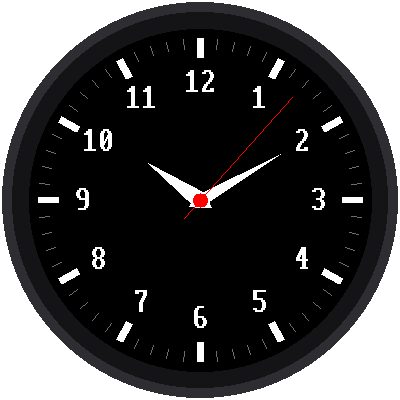

# Lab 05: An Analog Watch Face

{ width="360" }

"Analog" means a clock with hands that sweep around a dial. This lab draws
a complete watch face: 60 tick marks, the numbers 1 to 12, and hour,
minute, and second hands that move. It even sets its own time from the
internet when it starts.

## What You Will Learn

- how to point a hand at any angle around a circle
- how to move something on a screen without redrawing everything
- why the layout of a watch face matters to the program

## Run It

Open `05-analog-watch-face.py` in Thonny and click **Run**. First the
screen says "Setting clock" while it asks the internet for the time, as
in [lab 04](04-wifi-sync-time.md). Then the watch face appears and the
second hand starts ticking.

!!! tip "No WiFi?"
    Near the top of the program, change `SYNC_WITH_WIFI = True` to
    `SYNC_WITH_WIFI = False`. The watch will then use the time Thonny set.

## Pointing a Hand Around a Circle

Every hand starts at the center and points out at an **angle**. The
second hand moves 6 degrees every second, because 60 seconds × 6 degrees
= 360 degrees, a full circle.

To find where the tip of a hand goes, the program uses two math tools
called **sine** and **cosine**. They turn an angle into "how far across"
and "how far down." You'll learn them in high school, but you can use them
now:

```python
x = CENTER_X + length * sin(angle)
y = CENTER_Y - length * cos(angle)
```

In the program, this math lives in a function called `point()`, which
every hand and tick mark uses. Why the minus sign? Remember from
[lab 02](02-hello.md) that on a screen,
y gets bigger as you go **down**. The minus flips it, so the 12 is at the
top.

## Moving Without Flicker

Clearing the whole screen and redrawing every tick, number, and hand once
a second would make the watch **flicker**. So the program draws the dial
only once, at the start. After that, each second it:

1. **erases** the old second hand by drawing it again, in black
2. **repairs** anything the black line cut through, like part of a number
3. **draws** the hands in their new positions

It's like moving a sticker on a poster: you peel it off, touch up the
paint underneath, and stick it on in the new spot.

The watch face is designed to make step 2 easy. The tick marks sit
*outside* where any hand reaches, so a hand can never cut through them.
The numbers sit outside the hour and minute hands, so only the long
second hand ever crosses a number, and never more than one at a time.

!!! tip "Try This: Break It on Purpose"
    Near the top of the program, change `MINUTE_LENGTH = 92` to
    `MINUTE_LENGTH = 120`. Run it and watch the numbers as the minute
    hand passes over them. They get chewed up! The minute hand now reaches
    into the numbers, and the program doesn't repair them after erasing
    it. Change it back to 92 when you're done.

!!! tip "More to Try"
    1. Change `SECOND_COLOR` from `config.RED` to `config.CYAN`.
    2. Make the hour hand fatter by changing `HOUR_HALF_WIDTH`.
    3. The program has a list of what's on the dial. Can you find where it
       draws the numbers, and make them yellow?

## Make It Your Watch

When the Pico is powered on, it automatically runs a file named `main.py`
if there is one. Save a copy of this lab to the Pico as `main.py`, and
your watch starts on its own, even with no computer attached.

**Next:** [Lab 06: Test the Buttons](06-button-test.md)
