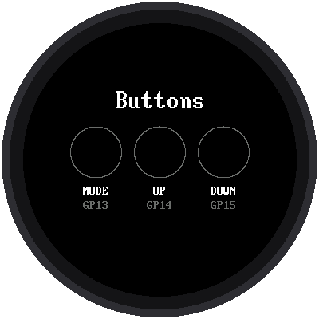

# Lab 06: Test the Buttons

{ width="360" }

Your watch has three buttons: **MODE**, **UP**, and **DOWN**. Before you
write programs that use them, this lab checks that each one is wired
correctly. Each circle on the screen lights up while you hold its button
down.

!!! mascot-welcome "Welcome to Lab 06"
    { class="mascot-admonition-img" }
    Up to now, your watch has only talked. With buttons, it can listen!
    Every lab after this one uses them, so a quick test now saves a lot of
    head-scratching later. Let's make time tick!

## What You Will Learn

- how the Pico reads a button
- what a **pull-up** is, and why a pressed button reads 0
- why programs remember what they drew last

## Run It

Open `06-button-test.py` in Thonny and click **Run**. Press each button
one at a time:

| Button | Pico pin | Circle lights up |
|---|---|---|
| MODE | GP13 | yellow |
| UP | GP14 | green |
| DOWN | GP15 | red |

Thonny's shell also prints a line each time, like `UP pressed` and
`UP released`.

## How a Button Talks to the Pico

A button is just a switch. When you press it, it connects its pin to
**GND** (ground). But what does the pin read when the button is *not*
pressed? Without help, nothing is connected, and the pin would read
random 0s and 1s, like a radio tuned between stations.

So the program turns on the Pico's **pull-up**: a tiny built-in
connection that gently pulls the pin up to 1. Pressing the button
connects the pin straight to ground, which wins, so the pin reads 0.

| Button is... | Pin reads |
|---|---|
| not pressed | **1** |
| pressed | **0** |

It seems backwards, but it's how almost every button on every gadget
works. That's why the program checks for 0:

```python
held = pin.value() == 0
```

## Only Draw When Something Changes

The program checks all three buttons 50 times a second. Redrawing three
circles 50 times a second would keep the display busy for nothing. So the
program remembers what each button looked like last time, in a list
called `last`, and only redraws a circle when its button changes:

```python
held = pin.value() == 0
if held != last[i]:
    last[i] = held
    # ... fill the circle, or make it empty again ...
```

`!=` means "is not equal to." You'll see this trick, *remember what you
drew and only redraw what changed*, in almost every lab from now on.

!!! tip "Try This"
    1. Press two buttons at once. Does the program handle it?
    2. Change the colors in the list called `BUTTONS` near the top of the
       program.
    3. Add a counter that prints how many times UP has been pressed.

## If It Doesn't Work

- **A circle never lights up.** That button isn't connected. An
  unconnected button reads 1, "not pressed," forever. Check that one leg
  goes to the right pin and the other leg goes to GND.
- **A circle is lit even when you're not touching anything.** That pin is
  connected straight to ground. Check for a wire in the wrong row of the
  breadboard.

**Next:** [Lab 07: Set the Time with the Buttons](07-set-time.md)
