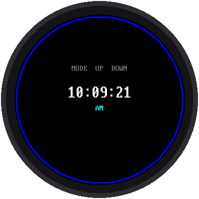

# Lab 07: Set the Time with the Buttons

{ width="360" }

What if there's no WiFi? A real watch lets you set the time with its
buttons. This lab does too:

| Button | What it does |
|---|---|
| **MODE** | Steps through: run → set hour → set minute → run |
| **UP** | Adds one to the highlighted number |
| **DOWN** | Takes one away from it |

The part you're changing is highlighted in yellow. Hold UP or DOWN and
the number keeps changing by itself, so you don't have to press 45 times
to get to 45 minutes.

!!! mascot-welcome "Welcome to Lab 07"
    { class="mascot-admonition-img" }
    After this lab, your watch can be set anywhere, even with no WiFi, just
    like a store-bought watch. You'll also fix a sneaky problem hiding
    inside every button. Let's make time tick!

## What You Will Learn

- why a single press can count as three (and how to fix it)
- how "hold to repeat" works
- how to set the Pico's clock from a program

## Run It

Open `07-set-time.py` in Thonny and click **Run**. Then:

1. Press **MODE**. The hour turns yellow.
2. Press **UP** or **DOWN** to change it.
3. Press **MODE** again. Now the minutes are yellow.
4. Change them, then press **MODE** once more to get back to running.

Setting the minutes also sets the seconds to zero. That way you can match
another clock exactly: set the minutes one ahead, then press MODE right
when the other clock gets there.

## Problem 1: Bouncing Buttons

Inside a button, two bits of metal touch when you press it. But they
don't touch just once. They bounce, like a basketball, touching and
letting go several times in a few thousandths of a second. The Pico is so
fast that it sees every bounce as a separate press, so one push could move
the hour three places!

The fix is called **debouncing**: after the button changes, ignore it for
the next 40 thousandths of a second (40 **milliseconds**, or ms). By then,
the bouncing has stopped.

```python
DEBOUNCE_MS = 40
```

## Problem 2: Hold to Repeat

Pressing a button 45 times would be miserable. So if a button is held for
half a second, it starts "pressing itself" about 8 times a second until
you let go:

```python
HOLD_MS = 500      # wait this long before repeating
REPEAT_MS = 120    # then repeat this often
```

Both of these fixes live inside a **class** called `Button`. A class is a
blueprint: the program makes one `Button` from it for each real button,
and each one keeps track of its own bouncing and holding.

## Setting the Pico's Clock

Once you change a number, the program writes the new time into the
Pico's clock, the RTC:

```python
rtc.datetime((year, month, day, weekday, hour, minute, second, 0))
```

That means [lab 03](03-digital-clock.md) and [lab 05](05-analog-watch-face.md)
will show your new time, too, as long as the Pico stays plugged in.

!!! tip "Try This"
    1. Change `DEBOUNCE_MS` to `0`. Can you get one press to count twice?
    2. Change `REPEAT_MS` to `40`. Now how fast does it count?
    3. Make the highlight color green instead of yellow. Look for
       `HIGHLIGHT_BG` near the top of the program.

!!! mascot-celebration "Set It Yourself!"
    { class="mascot-admonition-img" }
    You tamed bouncing buttons, made them repeat when held, and wrote a new
    time into the Pico's clock. Next, you'll build a digital watch face with
    giant numbers.

**Next:** [Lab 08: A Digital Watch Face](08-digital-watch-face.md)
