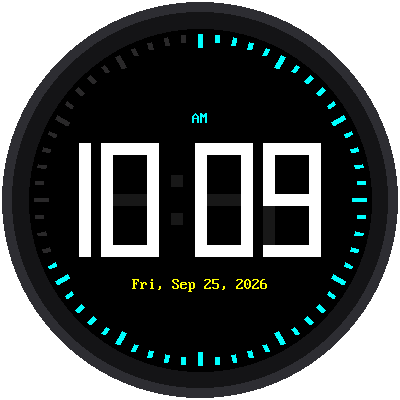

# Lab 08: A Digital Watch Face

{ width="360" }

This watch face has **giant** numbers, 114 pixels tall, big enough to read
from across the room. The date sits underneath, and a ring of 60 tick
marks around the edge fills up as the seconds go by.

!!! mascot-welcome "Welcome to Lab 08"
    { class="mascot-admonition-img" }
    This is the watch face people notice from across the room. Build it,
    and you'll know the secret behind the numbers on scoreboards, gas
    pumps, and alarm clocks. Let's make time tick!

## What You Will Learn

- how every digit from 0 to 9 is made of just seven bars
- how a number can store seven on/off switches
- how to change only the pixels that need to change

## Run It

Open `08-digital-watch-face.py` in Thonny and click **Run**. Like the
analog face, it sets its own time from the internet first.

## Seven Bars Make Every Digit

Look closely at a microwave, an alarm clock, or a calculator. Their
numbers are built from seven bars, called **segments**. The segments have
letters, a through g:

```text
     aaa
    f   b
    f   b
     ggg
    e   c
    e   c
     ddd
```

Light up different segments to make different digits:

| Digit | Lit segments |
|---|---|
| 1 | b, c |
| 7 | a, b, c |
| 4 | b, c, f, g |
| 8 | all seven |

Look at the dim gray shapes behind the white digits in the picture.
Those are the unlit segments, painted in a faint "ghost" color, like the
segments you can just barely see on a real LCD watch.

!!! note "Filling in the corners"
    If you only draw the seven bars, each digit has black gaps at its
    corners and joints, and the numbers are hard to read. So this face
    also draws the six little squares where the bars meet. A square lights
    up whenever any bar touching it is lit, so each digit looks like one
    solid shape.

## A Number Full of Switches

Computers store numbers as **bits**, 1s and 0s. A 7-bit number has seven
places, one for each segment: 1 means lit and 0 means dark. Here's the
digit 7, which lights segments a, b, and c:

```python
0b0000111   # 7: a b c
```

The `0b` means "this number is written in binary." Reading from the
right, the first three bits are for a, b, and c, and they're 1.

## Change Only What Changes

When the time goes from 12:59 to 1:00, which segments need redrawing?
Compare the old digit and the new digit, bit by bit. Where they're
different, that segment changed. Python has an operator that does exactly
this comparison, called **XOR** and written `^`:

```python
changed = old ^ new
```

The program repaints only the segments in `changed`. A segment that's lit
in both digits isn't touched at all, so there's no flicker. In a normal
second, this watch sends only 333 pixels to the display, out of 129,600.

!!! tip "Try This"
    1. Near the top, change `BLINK_COLON = True` to `False`. What's
       different?
    2. Change `TWELVE_HOUR = True` to `False` for a 24-hour clock, like
       the ones used in hospitals and the military.
    3. Change `GHOST` to `config.BLACK`. The unlit segments disappear.
       Which way do you like better?
    4. What digit is `0b1100110`? (Hint: bits are read from the right: a,
       b, c, d, e, f, g.)

!!! mascot-celebration "Giant Digits Done!"
    { class="mascot-admonition-img" }
    You stored a whole digit in seven bits and used XOR to repaint only the
    segments that changed. Next, your watch learns to read the weather
    forecast.

**Next:** [Lab 09: The Weather Clock](09-weather-clock.md)
