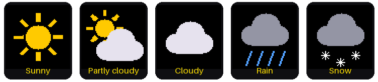

# Lab 09: The Weather Clock

{ width="360" }

Now your watch knows more than the time. It gets the weather forecast
from the internet and shows today's and tomorrow's high and low
temperatures, with a little picture of the weather.

## What You Will Learn

- what a **web service** is, and how a program asks one a question
- what **JSON** is
- how latitude and longitude tell the forecast where you are
- how to draw a picture off-screen, so it never flickers

## Run It

Open `09-weather-clock.py` in Thonny and click **Run**. The screen says
"Weather clock" while it gets the forecast and sets the time over WiFi.
Then the watch appears, forecast and all.

## Asking a Web Service for the Weather

When you visit a website, a computer somewhere sends back a page for
people to read. A **web service** is similar, but it sends back data for
programs to read. This kit uses a free weather service called
[Open-Meteo](https://open-meteo.com).

The program asks a question by visiting a web address. It's a long one,
but every part means something:

```text
http://api.open-meteo.com/v1/forecast
    ?latitude=44.98&longitude=-93.27              <- where
    &daily=weather_code,temperature_2m_max,temperature_2m_min   <- what
    &temperature_unit=fahrenheit                  <- which units
    &timezone=auto                                <- start each day at your midnight
    &forecast_days=2                              <- today and tomorrow
```

The answer comes back in a format called **JSON**, which is text that
programs can easily read. Here's the important part of a real answer:

```json
{"daily": {"time": ["2026-09-25", "2026-09-26"],
           "weather_code": [3, 63],
           "temperature_2m_max": [70.3, 61.0],
           "temperature_2m_min": [58.1, 56.8]}}
```

Can you read it? Today (the first number in each list) has a high of 70.3°
and a low of 58.1°. Tomorrow's high is 61.0°. The program rounds these to
whole numbers.

## Where Are You?

The forecast needs to know where you live. Any place on Earth can be
described with two numbers:

- **latitude**: how far north of the equator (Minneapolis is 44.98)
- **longitude**: how far east or west (Minneapolis is -93.27; in the
  United States, longitude is negative)

To get your own forecast, search the web for "*your town* latitude
longitude", and put the two numbers in `config.py`:

```python
LATITUDE = 44.98
LONGITUDE = -93.27
```

## From a Number to a Picture

The forecast doesn't say "rainy." It sends a number called a **weather
code**. For example, 3 means "overcast" and 63 means "moderate rain." The
program turns each code into one of five pictures:



| Codes | Picture | Words on the screen |
|---|---|---|
| 0, 1 | Sunny | Sunny |
| 2 | Partly cloudy | Pt cloudy |
| 3, 45, 48 | Cloudy | Cloudy, Fog |
| 51 to 67, 80 to 82, 95 to 99 | Rain | Drizzle, Rain, Showers, T-storms |
| 71 to 77, 85, 86 | Snow | Snow |

## Drawing on Scrap Paper First

Each icon is made of circles, lines, and triangles. If the program drew
them right on the screen, you could see the icon being built, piece by
piece. So it draws each one on "scrap paper" first: a small patch of
memory called a **frame buffer**, 64 × 64 pixels. When the icon is
finished, the whole thing is sent to the screen in one quick step.

## Keeping the Forecast Fresh

The watch gets a new forecast every 30 minutes, at half past and on the
hour. The one just after midnight moves Tomorrow over to Today. If the
internet doesn't answer, the watch keeps showing the old forecast and
tries again 5 minutes later.

!!! tip "Try This"
    1. Put in the latitude and longitude of a city far away, like Miami
       (25.76, -80.19) or Anchorage, Alaska (61.22, -149.90). How different
       is the forecast?
    2. Change `TEMPERATURE_UNIT` in `config.py` to `"celsius"`.
    3. Near the top of `forecast.py` there's a comment with the whole web
       address on one line. Paste it into a web browser, and you'll see the
       same JSON answer the Pico gets!

## If It Doesn't Work

- **The temperatures show `--`.** The watch hasn't gotten a forecast yet.
  Look in Thonny's shell for a line that says `Forecast failed`, and check
  your WiFi settings in `secrets.py`.

**Next:** [Lab 10: A Stopwatch with Lap Times](10-stopwatch.md)
