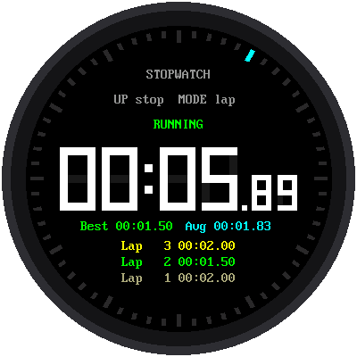

# Lab 10: A Stopwatch with Lap Times

{ width="360" }

Time a race, see how long you can hold your breath, or time each lap
around the track. This stopwatch shows minutes, seconds, and hundredths of
a second. It also keeps **lap times**: press a button each time you pass
the starting line, and it tells you how long each lap took.

## What You Will Learn

- how a stopwatch keeps time (it's not what you'd guess)
- how to find the fastest lap and the average lap

## Run It

Open `10-stopwatch.py` in Thonny and click **Run**.

| Button | What it does |
|---|---|
| **UP** | Start and stop |
| **MODE** | Record a lap, while the stopwatch is running |
| **DOWN** | Reset to zero, only while stopped |

A line near the top of the screen always tells you what the buttons do
right now, like `UP stop  MODE lap`.

!!! note "Why can't DOWN reset a running stopwatch?"
    Imagine timing a friend's mile run and bumping the reset button by
    accident at the last lap. To keep that from happening, you have to
    stop the stopwatch before you can reset it.

## How a Stopwatch Keeps Time

You might guess that a stopwatch adds a little bit of time, over and
over. It doesn't, because that would drift. Each time around the loop
takes a slightly different amount of time, especially when the screen is
busy drawing, and all those tiny errors would add up.

Instead, the stopwatch writes down **when it started**. The Pico has a
millisecond counter that's always running, like a clock on the wall.
Whenever the stopwatch needs to know the time, it asks: how long ago did
I start?

```python
elapsed = banked_ms + ticks_diff(now, run_started)
```

It's like writing down "the race started at 3:15" instead of counting
"one Mississippi, two Mississippi..." the whole way. The `banked_ms` part
holds time from before you stopped it, so starting again picks up where
you left off.

## Fastest and Average Laps

The newest lap shows on top in yellow. Once you have two laps or more,
the watch finds:

- the **fastest** lap, which it shows in **green**. (Python's `min()`
  finds the smallest number in a list.)
- the **average** lap: add up all the laps, then divide by how many
  there are.

In the picture, the laps were 2.00, 1.50, and 2.00 seconds.
The fastest is 1.50. The average is (2.00 + 1.50 + 2.00) ÷ 3 = 5.50 ÷ 3,
which is about 1.83.

!!! tip "Try This"
    1. Time yourself saying the alphabet. Then try again and see if you
       can beat your time.
    2. Record five laps. Then look at the "Best" line. It still shows the
       fastest lap, even after that lap has scrolled off the list.
    3. The list shows 3 laps. Find `LAP_ROWS` near the top of the program.
       What happens if you change it to 2?

**Next:** [Lab 11: A Countdown Timer](11-countdown-timer.md)
