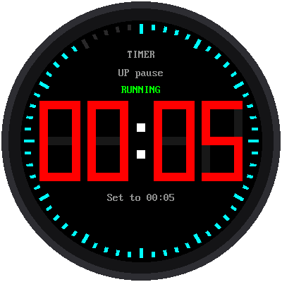
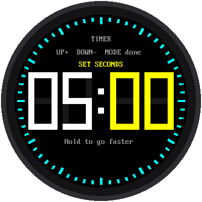
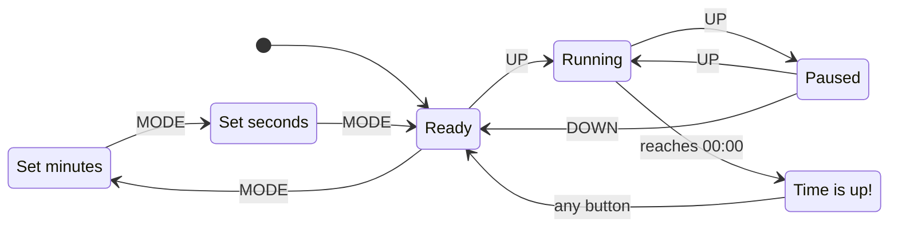

# Lab 11: A Countdown Timer

{ width="360" }

A countdown timer counts **down** to zero, then sounds an alarm. It's
great for cooking, homework breaks, or board games. Set the minutes and
seconds with the buttons, press start, and watch the ring around the edge
empty as time runs out.

## What You Will Learn

- how to set a number with buttons
- what a **state machine** is (every video game uses them!)
- how a program can count down without drifting

## Run It

Open `11-countdown-timer.py` in Thonny and click **Run**. It starts at
5:00. To change it:

1. Press **MODE**. The minutes turn yellow.
2. Press **UP** or **DOWN** to change them. Hold a button to go faster.
3. Press **MODE**. Now the seconds are yellow. Change them too.
4. Press **MODE** once more when you're done.
5. Press **UP** to start!

{ width="300" }

While it counts down, **UP** pauses it and UP again keeps going. While
it's paused, **DOWN** resets it back to the time you set. For the last 10
seconds the numbers turn red. At zero, the screen flashes **00:00** and
**TIME'S UP!** in red, and the Pico's little green light flashes too,
until you press any button.

## What Is a State Machine?

Here's a puzzle: what does the UP button do? It depends!

- While you're setting the time, UP **adds one**.
- When the timer is ready, UP **starts** it.
- While it's running, UP **pauses** it.

The timer is always in exactly one **state**, and the state decides what
each button does. The program keeps the current state in one variable,
`state`, and every time a button is pressed it asks, "What state am I in
right now?" Here are all six states, with arrows showing which button
moves the timer from one state to the next:



This picture is called a **state diagram**. Video games use state
machines all the time: a character might be *standing*, *running*,
*jumping*, or *falling*, and pressing the jump button only works in some
of those states.

## Counting Down Without Drifting

Like the [stopwatch](10-stopwatch.md), the timer doesn't subtract a little
each time around its loop. When you press start, it works out the exact
moment the timer will **end**. Then, whenever it needs to, it checks how
far away that moment is:

```python
end_ticks = time.ticks_add(now, remaining_ms)     # when you press start
remaining_ms = time.ticks_diff(end_ticks, now)    # every time it checks
```

## The Shrinking Ring

The ring of 60 ticks shows how much time is left. At the start, all 60
are lit. When half the time is gone, only 30 are lit. Only the one tick
that goes dark gets redrawn, so the ring never flickers.

!!! tip "Add a buzzer"
    The alarm is silent unless you add a small **piezo buzzer**, a tiny
    speaker that beeps. Connect its + leg to a free pin, such as GP16,
    and its − leg to GND. Then open `config.py` and change
    `BUZZER_PIN = None` to `BUZZER_PIN = 16`. It will beep in time with
    the flashing.

!!! tip "Try This"
    1. Set the timer for 10 seconds and watch the numbers turn red.
    2. Change `START_MINUTES = 5` at the top of the program to the number
       of minutes you use most.
    3. Change `WARNING_MS = 10_000` to `30_000`. When do the numbers turn
       red now? (1,000 ms is one second.)

**Next:** [Lab 12: One Watch, Five Modes](12-main-template.md)
