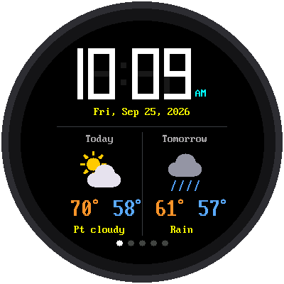
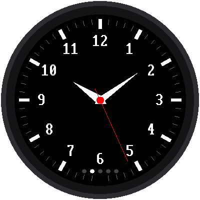
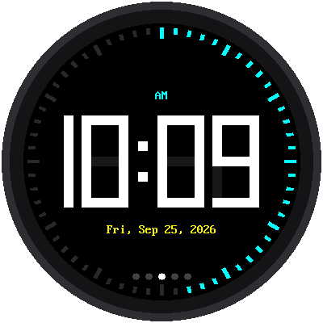
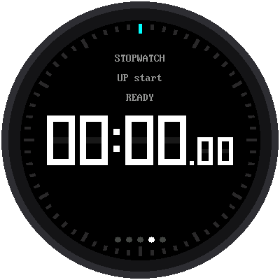
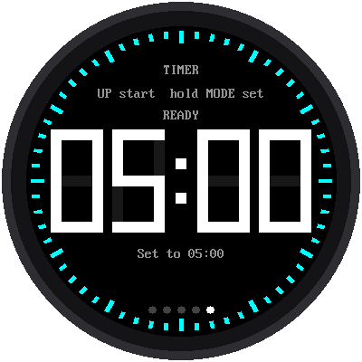

# Lab 12: One Watch, Five Modes

{ width="360" }

This is the big one. Everything you've built so far comes together into
**one watch**. Press **MODE** to go from one mode to the next:

**Weather → Analog → Digital → Stopwatch → Timer →** and back to Weather.

A row of five dots at the bottom of the screen shows which mode you're
in. The bright dot is the one you're on.

!!! mascot-welcome "Welcome to Lab 12"
    { class="mascot-admonition-img" }
    Look how far you've come: from one blinking light to five watch faces.
    In this lab, you'll learn how real apps juggle many screens without
    running out of memory, and you'll finish with a watch that's truly
    yours. Let's make time tick!

## What You Will Learn

- how one program can run five different watch faces
- why a program should only load what it needs
- how a stopwatch or timer keeps going when you're not looking at it

## Run It

Open `12-main-template.py` in Thonny and click **Run**. The watch sets its
clock from the internet, then starts in Weather mode. Press MODE to step
through the others.

| Weather | Analog | Digital | Stopwatch | Timer |
|---|---|---|---|---|
| { width="130" } | { width="130" } | { width="130" } | { width="130" } | { width="130" } |

## The Buttons Changed a Little

In this watch, the MODE button's job is changing modes. So the stopwatch
and the timer can't use MODE the way they did in labs 10 and 11. Here's
how they work now:

| Mode | UP | DOWN | MODE |
|---|---|---|---|
| **Stopwatch** | start / stop | lap while running, reset while stopped | next mode |
| **Timer** | start / pause, or +1 when setting | reset while paused, or −1 when setting | next mode |

To set the timer, **hold MODE down for one second**. While you're
setting it, MODE moves from the minutes to the seconds, and it won't
change modes until you're done. That way you can't leave by accident in
the middle of setting it.

## Only Load What You Need

Think about your school backpack. You could carry every textbook you own,
every day, but it would be heavy, and you'd only use a few of them. It
makes more sense to pack just the books for today's classes.

This watch works the same way. Each mode is a separate file:
`mode_weather.py`, `mode_analog.py`, `mode_digital.py`, `mode_stopwatch.py`,
and `mode_timer.py`. Only the mode on the screen is loaded into the
Pico's memory. When you press MODE, the watch:

1. tells the current mode to **stop**
2. **unloads** it, freeing up its memory
3. **loads** the next mode and tells it to **start**

However many times you press MODE, the watch always has about 380 KB of
memory free.

## Modes That Keep Going

What happens to a stopwatch that's running when you switch to the
weather? It keeps running! When a mode stops, it can hand the watch a
note to remember, like "I started at this moment" or "I'll reach zero at
this moment." When the mode loads again, it reads its note and carries on.

- A **running stopwatch** is still running, with the right time, when
  you come back to it.
- A **running timer** keeps counting down. When it reaches zero, the
  watch jumps straight to the timer and sounds the alarm, whatever mode
  you're looking at.
- The **weather** remembers its last forecast, so it doesn't have to ask
  the internet again every time you pass by.

## Make It Your Watch

Save a copy of this program to the Pico as `main.py`, along with the five
`mode_` files. Now whenever the Pico gets power, it becomes your
five-mode smartwatch, even with no computer attached.

!!! note "For the curious: how to add a sixth mode"
    Every mode file has the same four functions, and that's all the watch
    needs to know about a mode:

    | Function | When the watch uses it |
    |---|---|
    | `start()` | when the mode is loaded: draw the whole screen |
    | `update()` | about 100 times a second: redraw whatever changed |
    | `stop()` | when you switch away: hand back a note to remember |
    | `on_mode()` | when MODE is pressed. This one is optional. |

    To add a sixth mode, copy one of the `mode_` files, change it, and add
    its name to the `MODES` list at the top of `12-main-template.py`. You
    don't need to add a dot: the watch always draws one dot for each mode
    in the list.

!!! tip "Try This"
    1. Change `START_MODE = 0` to `START_MODE = 1`. Which mode does the
       watch start in now?
    2. Start the stopwatch, switch to the weather, wait 10 seconds, then
       go back. Is the time right?
    3. Set the timer for 20 seconds, start it, then switch to the analog
       face. What happens when it reaches zero?
    4. Take `mode_analog` out of the `MODES` list. How many dots are there
       now?

**Back to:** [the kit's main page](index.md)
