# GC9B72 Smartwatch Clock Kit

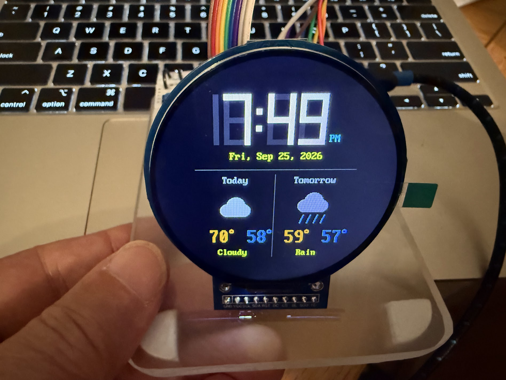

This kit turns a tiny computer and a round color screen into a watch that
**you** program. By the end, your watch will:

- show the time with big, bright numbers or with an old-style clock face
- set its own clock by asking the internet what time it is
- show today's and tomorrow's weather, with little pictures of sun, clouds,
  rain, and snow
- work as a stopwatch that times laps, and as a countdown timer with an
  alarm
- switch between all of these with the press of a button

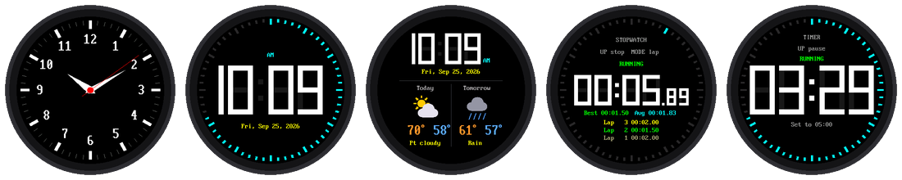

You will build it one small step at a time. There are 13 labs, numbered
00 to 12. Each lab is one program. Start at lab 00, and each lab teaches
one new idea you will use in the labs after it.

## What's in the Kit

| Part | What it does |
|---|---|
| **Raspberry Pi Pico 2 W** | The brain of the watch. It's a *microcontroller*, a tiny computer on a board about the size of a stick of gum. The **W** means it has WiFi, so it can talk to the internet. |
| **Round color display** | The watch face. It is 2.1 inches across and has 360 × 360 tiny dots of light called **pixels**. A chip on the back called the **GC9B72** turns the Pico's messages into pictures. |
| **Three push buttons** | How you control the watch. They are called **MODE**, **UP**, and **DOWN**. |
| **Breadboard and wires** | Connect everything without soldering. |
| **USB cable** | Gives the Pico power, and lets your computer send it programs. |

## How It Is Wired

The display has a row of 10 connection points along its bottom edge.
Reading from left to right, they are labeled:
**GND VCC SCL SDA RST DC CS BL SDO TE**.
Only the first eight are used. Each one connects to a numbered pin on the
Pico, like this:

| Display pin | Pico pin | Wire color | What it carries |
|---|---|---|---|
| GND | GND | black | Ground, the "minus" side of the power |
| VCC | 3V3 | red | Power, 3.3 volts |
| SCL | GP2 | orange | The clock beat that keeps the Pico and display in step |
| SDA | GP3 | yellow | The data: the actual colors of the pixels |
| RST | GP4 | green | Reset: tells the display to start fresh |
| DC | GP5 | blue | Says whether the next data is a command or a picture |
| CS | GP6 | purple | "Hey display, I'm talking to you!" |
| BL | GP7 | gray | The backlight that makes the screen glow |

!!! warning "Use 3V3, not 5 volts"
    The display's VCC wire must go to the Pico's **3V3** pin. The display
    is built for 3.3 volts, and 5 volts can damage it.

Each button has two legs. One leg goes to a Pico pin, and the other goes
to GND:

| Button | Pico pin | What it usually does |
|---|---|---|
| MODE | GP13 | Changes what the watch is doing |
| UP | GP14 | Makes a number go up, or starts something |
| DOWN | GP15 | Makes a number go down, or resets something |

## Before You Start

You only need to do these steps once.

1. **Put MicroPython on the Pico.** MicroPython is the version of the
   Python language that runs on small boards like the Pico. Be sure to use
   the version for the **Pico 2 W**, which your teacher can find at
   [micropython.org](https://micropython.org/download/RPI_PICO2_W/). The
   version for the plain Pico 2 has no WiFi.
2. **Install Thonny.** [Thonny](https://thonny.org) is the program you
   will use to write code and send it to the Pico.
3. **Copy the kit's files onto the Pico.** The labs need some helper files
   that live in a folder called `lib` on the Pico, and a settings file
   called `config.py`. Your teacher may have done this for you. If not, the
   kit folder has a script called `upload-code.sh` that copies everything
   at once.
4. **Tell the watch about your WiFi.** Copy the file `secrets-template.py`
   to a new file called `secrets.py`, and type in your WiFi network's name
   and password. Labs 04, 05, 09, and 12 use it. (`secrets.py` is kept
   private: it never gets shared online.)
5. **Tell the watch your time zone.** Open `config.py` and find
   `TIMEZONE_HOURS`. Use -5 for Eastern time, -6 for Central, -7 for
   Mountain, or -8 for Pacific.

## The Labs

Click a picture to open that lab.

| Lab | | What you will do |
|---|---|---|
| [00](00-blink-onboard-led.md) | [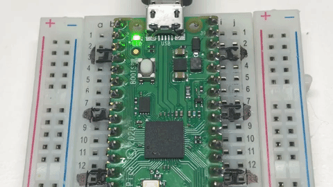{ width="110" }](00-blink-onboard-led.md) | Make a tiny light on the Pico blink, to check that everything works |
| [01](01-probe.md) | [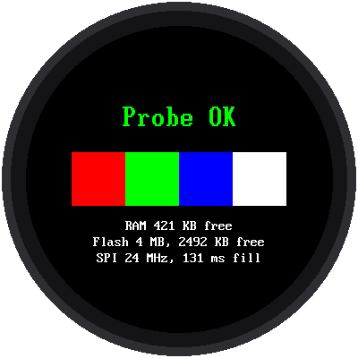{ width="110" }](01-probe.md) | Give the whole kit a checkup, like a doctor's visit |
| [02](02-hello.md) | [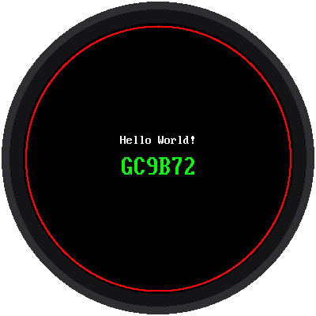{ width="110" }](02-hello.md) | Say hello on the round screen |
| [03](03-digital-clock.md) | [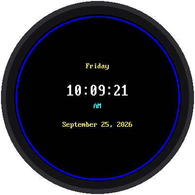{ width="110" }](03-digital-clock.md) | Show the time, day, and date |
| [04](04-wifi-sync-time.md) | [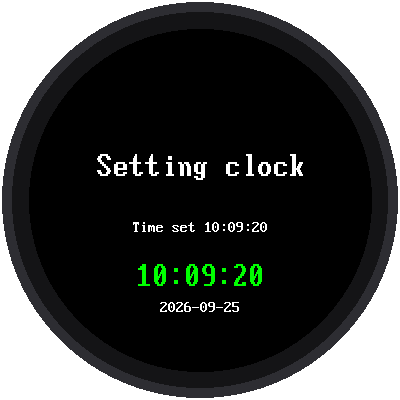{ width="110" }](04-wifi-sync-time.md) | Ask the internet what time it is |
| [05](05-analog-watch-face.md) | [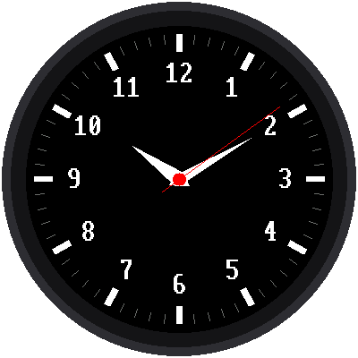{ width="110" }](05-analog-watch-face.md) | Build a clock face with moving hands |
| [06](06-button-test.md) | [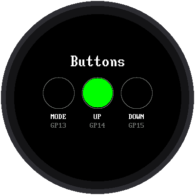{ width="110" }](06-button-test.md) | Test the three buttons |
| [07](07-set-time.md) | [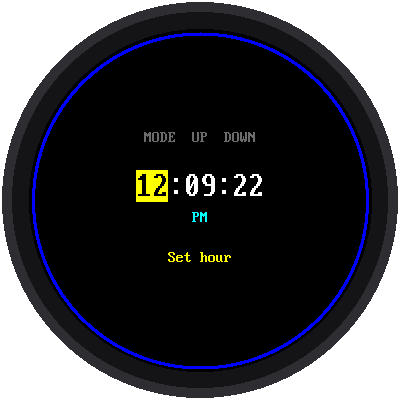{ width="110" }](07-set-time.md) | Set the time with the buttons |
| [08](08-digital-watch-face.md) | [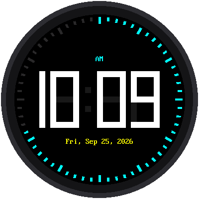{ width="110" }](08-digital-watch-face.md) | Build a digital watch with giant numbers |
| [09](09-weather-clock.md) | [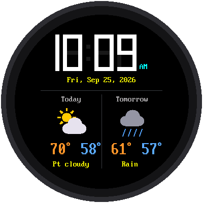{ width="110" }](09-weather-clock.md) | Add the weather forecast |
| [10](10-stopwatch.md) | [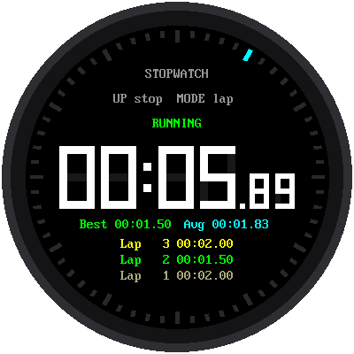{ width="110" }](10-stopwatch.md) | Make a stopwatch that times laps |
| [11](11-countdown-timer.md) | [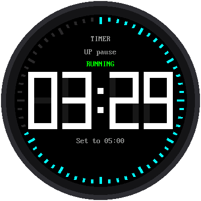{ width="110" }](11-countdown-timer.md) | Make a countdown timer with an alarm |
| [12](12-main-template.md) | [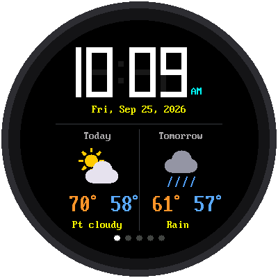{ width="110" }](12-main-template.md) | Put it all together into one watch with five modes |

!!! tip "Which program is running?"
    Every lab prints its name and version number in Thonny's shell when it
    starts, like `05-analog-watch-face.py v1.0`. If the screen isn't doing
    what you expect, check that line first. It tells you which program the
    Pico is actually running.

## Words to Know

| Word | What it means |
|---|---|
| **Pixel** | One tiny dot of light on the screen. This screen has 360 × 360 = 129,600 of them. |
| **Microcontroller** | A small computer built to control one thing, like a watch, a toy, or a microwave. |
| **Program** | A list of instructions for a computer, written in a language like Python. |
| **Loop** | Part of a program that repeats over and over. A watch's program runs in a loop forever. |
| **Variable** | A name that holds a value, like `second = 42`. |
| **Function** | A named set of instructions you can use again and again, like `draw_hand()`. |
| **Module** | A file of Python code that other programs can borrow from with `import`. |
| **WiFi** | A way for devices to connect to the internet without wires. |

## For Teachers

The [Notes for Teachers](teacher-notes.md) page has the technical details:
where the display driver came from, how fast the hardware really is, how
each watch face avoids flicker, and a troubleshooting table. The screen
pictures in these pages were made by running each lab's real code in a
simulator of the display.
