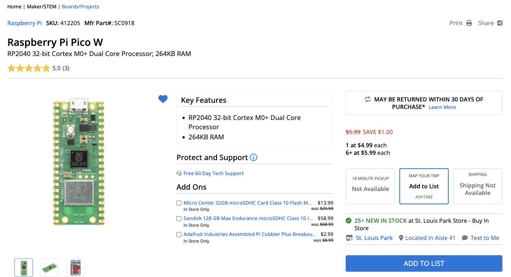

# Notes for Teachers

These notes are for teachers, parents, and anyone who wants the technical
story behind the [Chrono Smart Clock Kit](index.md): where to buy the
parts, where the driver came from, how fast the hardware really is, and
how each watch face keeps flicker to a minimum. The lab pages themselves are written for students
around 11 years old.

!!! note "About the pictures in these pages"
    Every screen picture in the lab pages was made by running that lab's
    real code in a desktop simulator of the GC9B72 display. The simulator
    decodes the same SPI commands the Pico sends to the panel, so the
    pictures show exactly the pixels the program draws. Every lab has also
    been run on a real Pico 2 W and GC9B72 panel.

    The simulator is in the repository at
    [`src/display-simulators/gc9b72`](https://github.com/dmccreary/clocks-and-watches/tree/main/src/display-simulators/gc9b72).
    After changing a lab, `render_sw_gc9b72_docs.py` regenerates all of
    these pictures, and `checks/run_all.py` re-runs the checks described
    on this page.

## Sourcing Parts

Prices on these parts change every week, and single listings come and go.
So the display links below are **searches**, each one already sorted from
lowest to highest price.

### The Pico: buy it at MicroCenter

The kit works with a **Pico W** or a **Pico 2 W**. It needs the **W** for
WiFi, but not the 2. We built it on a Pico 2 W only because that is the
board we had on hand, so the timings on this page come from a Pico 2 W.

MicroCenter has had consistently lower prices on Raspberry Pi Pico boards
than anywhere else we have found, online or in a store. Here is its Pico W
page in September 2026:



Two things to notice in the picture:

- **The sale price has a limit.** It is $4.99 for one, and the regular
  $5.99 each for six or more.
- **It is not shipped.** MicroCenter's Pico prices are for pickup at one of
  its stores.

The [Pico WH](https://www.microcenter.com/product/650109/raspberry-pi-pico-wh-pico-wireless-with-headers-soldered)
comes with its pins already soldered on, so it goes straight into a
breadboard.

### The round display

The display is a 2.1-inch round TFT with 360×360 pixels and a GC9B72
driver chip. Searching for the chip name finds only a few listings, but
nearly all of them are the right display. Searching by size and
resolution finds more sellers, mixed in with other displays.

| Store | Search by chip | Search by size |
|---|---|---|
| AliExpress | [GC9B72](https://www.aliexpress.com/w/wholesale-gc9b72.html?sortType=price_asc) | [2.1 inch round 360x360](https://www.aliexpress.com/w/wholesale-2.1-inch-round-tft-360x360.html?sortType=price_asc) |
| eBay | [GC9B72](https://www.ebay.com/sch/i.html?_nkw=GC9B72&_sop=15) | [2.1 inch round 360x360](https://www.ebay.com/sch/i.html?_nkw=2.1+inch+round+tft+display+360x360&_sop=15) |
| Amazon | [GC9B72](https://www.amazon.com/s?k=GC9B72&s=price-asc-rank) | [2.1 inch round 360x360](https://www.amazon.com/s?k=2.1+inch+round+tft+display+360x360&s=price-asc-rank) |

One part of each URL does the sorting. To sort a search of your own, keep
that part and change the search words:

| Store | Sorting part of the URL | Sorts by |
|---|---|---|
| AliExpress | `sortType=price_asc` | Price, lowest first |
| eBay | `_sop=15` | Price plus shipping, lowest first |
| Amazon | `s=price-asc-rank` | Price, lowest first |

eBay's sort adds in the shipping, which matters when a cheap display ships
from overseas for $12.

!!! warning "Check the listing before you buy"
    Sorting by price brings the wrong items to the top along with the
    cheap right ones. Make sure the listing says **2.1 inch**,
    **360×360**, **SPI**, and **GC9B72**. Watch out for:

    - **2.1-inch round panels with 480×480 pixels.** They look the same,
      but they use a parallel RGB or MIPI connection instead of SPI, and
      this kit's driver cannot run them.
    - **1.28-inch round panels with a GC9A01 chip.** These are the
      240×240 displays for our [GC9A01 kit](../gc9a01/index.md), and they
      need a different driver.
    - **Price ranges** like "$3.78 to $4.83". The low price is for the
      cheapest choice in the listing, which may be a different screen or
      just a cable.
    - **AliExpress "Welcome deal" prices** of a dollar or two. They are
      for a shopper's first order only.
    - **eBay's "Results matching fewer words."** Below the real matches,
      eBay adds listings that match only some of your words, and it does
      not sort them by price.
    - **Amazon** mixes square displays into its round-display results.

    The kit's display has a row of 10 pins labeled
    **GND VCC SCL SDA RST DC CS BL SDO TE**. A board with the same labels
    wires up exactly as shown in [How It Is Wired](index.md#how-it-is-wired).

Displays from AliExpress, and many on eBay, ship from overseas and can
take several weeks to arrive. Order them well before the class needs them.

### The display cable

For the display cable, buy **20 cm Male-Female Dupont jumper wires**. The
female ends push onto the display's pins, and the male ends go into the
breadboard. They usually come as a 40-wire ribbon. Peel off eight wires
starting at a brown one, and the colors come out in the same order as the
kit's [wiring table](index.md#how-it-is-wired): brown (in place of
black) for GND, then red, orange, yellow, green, blue, purple, and gray.

| Store | Search, lowest price first |
|---|---|
| eBay | [20cm male female dupont](https://www.ebay.com/sch/i.html?_nkw=20cm+male+female+dupont+jumper+wires&_sop=15) |
| AliExpress | [20cm male female dupont](https://www.aliexpress.com/w/wholesale-20cm-male-female-dupont.html?sortType=price_asc) |
| Amazon | [20cm male female dupont](https://www.amazon.com/s?k=20cm+male+to+female+dupont+jumper+wires&s=price-asc-rank) |

Check for **Male-Female** (or M-F) in the listing. Many of the cheapest
are Female-Female. Mixed packs of 120, with 40 each of M-F, M-M, and F-F,
work too, and the Male-Male wires are handy for the buttons.

Loose wires get pulled out of a breadboard, and then the screen goes
black. Hot-gluing the wires into a **display harness** keeps them in
order, so a student plugs in the whole display in one move. Two guides
show how to build one:

- [Display Cable Harness](../../setup/03-display-cable-harness.md), in
  this book
- [Display Wiring Harness](https://dmccreary.github.io/learning-micropython/hands-on-labs/15-oled-setup/19-wiring-harness/),
  a step-by-step student lab in *Learning MicroPython*

Both build a seven-wire harness for our OLED displays, and those seven
wires land on the same Pico pins this kit uses (GP2 to GP6, GND, and
3V3). This display adds an eighth wire, the gray BL (backlight) wire.
It goes on GP7, in breadboard row 10, right after CS in row 9.

### The USB cable

The Pico W and Pico 2 W both have a **micro-USB** port. You need a
micro-USB **data** cable whose other end fits your computer: USB-A (the
wide rectangle) on most older computers, or USB-C on newer Macs and many
Chromebooks.

| Computer port | Search, lowest price first |
|---|---|
| USB-A | [Amazon](https://www.amazon.com/s?k=usb+a+to+micro+usb+data+cable&s=price-asc-rank), [eBay](https://www.ebay.com/sch/i.html?_nkw=usb+a+to+micro+usb+data+cable&_sop=15) |
| USB-C | [Amazon](https://www.amazon.com/s?k=usb+c+to+micro+usb+data+cable&s=price-asc-rank), [eBay](https://www.ebay.com/sch/i.html?_nkw=usb+c+to+micro+usb+data+cable&_sop=15) |

Two kinds of cable look right but are not:

- **Charge-only cables.** They power the Pico, but the computer never
  sees it, and Thonny cannot connect. The listing should say "data" or
  "data sync". Test every cable before class.
- **USB 3 Micro-B cables**, sold for external hard drives. The plug is
  twice as wide as micro-USB and will not fit the Pico.

### Buttons and breadboards

The push buttons and breadboards are the same parts our other kits use.
See our [parts purchasing guide](../../setup/02-purchasing-parts.md) for
where we buy them in bulk.

## What the Probe Reports

`01-probe.py` checks everything software can check. Here is what it
measured on our kit:

| Check | Result |
|---|---|
| Board | Raspberry Pi Pico 2 W with RP2350, MicroPython 1.29.0, 150 MHz |
| RAM | 436 KB of Python heap (of the chip's 520 KB) |
| Full frame buffer | A 360×360 RGB565 buffer (253 KB) **fits** |
| Flash | 4 MB chip: 1.5 MB firmware, 2.5 MB filesystem |
| SPI | Asked for 24 MHz, got 24 MHz |
| Full-screen fill | 131 ms, so at most about 8 full redraws per second |

The flash chip size is not something MicroPython will tell you. The probe
finds it with a trick: the flash chip ignores address bits it does not
have, so on a 4 MB chip, reading 4 MB past the start "wraps around" and
returns the same bytes as the start.

## The Driver

GalaxyCore has never published a public datasheet for the GC9B72. The
register start-up sequence in `lib/gc9b72.py` comes from the xboot
project's [`fb-gc9b72.c`](https://github.com/xboot/xstar/blob/main/xstar/driver/framebuffer/fb-gc9b72.c), by way of
the [MaliosDark/Arduino_GC9B72](https://github.com/MaliosDark/Arduino_GC9B72)
Arduino driver (MIT). It was translated to MicroPython for the
[robot-faces](https://github.com/dmccreary/robot-faces) project, where it
was first tested on real hardware. This kit uses that same file, unchanged.

The driver works like the GC9A01 driver in our other smartwatch kit:

- **There is no frame buffer and no `show()`.** Every drawing call sends
  its pixels over SPI immediately.
- **There is no built-in font.** `text()` takes a font module as its first
  argument: `config.SMALL_FONT` (8×16) or `config.BIG_FONT` (16×32).
- **There is no `ellipse()` or `poly()`.** `lib/shapes.py` builds circles,
  rings, polygons, and triangles from the horizontal lines the driver can
  draw.

### SPI speed

MicroPython makes the SPI clock by dividing a 48 MHz peripheral clock, and
it rounds *down* to the nearest speed it can make. That gives 24 MHz or
12 MHz, with nothing in between and nothing above 24:

| You ask for | You get |
|---|---|
| 20,000,000 | 12,000,000 |
| 24,000,000 | 24,000,000 |
| 62,500,000 | 24,000,000 |

The kit runs at 24 MHz. If you see speckled pixels on long wires, change
`BAUDRATE` in `config.py` to `12_000_000`.

## How the Watch Face Avoids Flicker

A full-screen fill takes 131 ms. Clearing and redrawing the whole face
every second would make the screen flash. So `05-analog-watch-face.py`
draws the dial **once** and then, each second:

1. erases the old second hand by drawing it again in black
2. if the minute changed, erases the old minute and hour hands the same way
3. repairs whatever the erased second hand passed over
4. draws all three hands at their new angles

Step 3 stays small because of how the dial is laid out:

- The ticks sit **outside** the tip of the longest hand, so no hand ever
  touches them.
- The numerals sit **outside** the minute and hour hands, so only the
  second hand crosses them, and only the numeral nearest to it at that.
- The hour and minute hands get redrawn every second anyway.

Measured on the real kit, drawing the dial takes 617 ms at start-up, and
each second's update takes at most 232 ms (302 ms when the minute changes).

To check this layout, we ran the watch face against a simulated screen
and compared every second's partial redraw, pixel by pixel, with a fresh
drawing of the same time. They matched at every step, including noon,
midnight, and large time jumps. Making the minute hand long enough to
reach the numerals broke the match 208 times. Lab 05's comments suggest
trying this yourself.

## The Digital Watch Face

`08-digital-watch-face.py` shows the time in seven-segment digits 114
pixels tall, big enough to read across a room. The date sits below in the
small font, and a ring of 60 ticks around the rim fills up as the seconds
pass.

It follows one rule: **only send the pixels that change.**

- Each digit is seven segments plus the six square joints where
  segments meet. A joint lights up whenever any segment touching it is
  lit, so each digit reads as one solid stroke. Each digit's pattern is
  stored as a number with one bit per piece, so `old ^ new` gives exactly
  the pieces that switched. Only those get repainted. Going from 12:59 to
  1:00, a piece lit in both is never touched.
- On a 12-hour clock the leftmost digit is only ever "1" or blank, so it
  is drawn as a narrow half digit (just the right-hand column), and the
  row is centered around it.
- Unlit segments are painted a faint "ghost" color, like a real LCD
  watch. Turning a segment off means repainting it, never erasing it.
- Each second lights one more tick on the ring.
- The date is padded to a fixed width, and only characters that differ
  are repainted.

Run in a simulator with the real driver, every update sent exactly the
pixels that changed and no others:

| Update | Pixels sent | Time on the Pico 2 W |
|---|---|---|
| A normal second | 333 | 8.5 ms |
| A new minute (10:31 to 10:32) | 5,490 | about 0.3 s |
| 12:59:59 to 1:00:00 | 9,078 | about 0.3 s |

Most of the new-minute time goes to the 59 ticks that go dark at the top
of the minute, which shows as a quick sweep around the ring. For
comparison, the analog face in lab 05 takes up to 232 ms every second,
because erasing its second hand also means redrawing the other hands.

The tick shapes use sines, cosines, and a scanline fill, which takes
about 7 ms per tick. None of that changes, so the face computes each
tick's pixels once at startup and replays them after that. It's a
**compute once, draw many times** trade: 0.6 s at startup and 53 KB of
RAM.

## The Weather Clock

`09-weather-clock.py` shows the time in smaller seven-segment digits and
the date. Below them are two columns, Today and Tomorrow, each with a
weather icon, the high and low temperatures, and a word or two.

### Where the forecast comes from

The forecast comes from [Open-Meteo](https://open-meteo.com), a free
weather service that needs no account and no API key. You ask for exactly
the numbers you want, and it sends back only those. For two days of
highs, lows, and weather codes the whole answer is about 450 bytes:

```json
{"daily": {"time": ["2026-09-25", "2026-09-26"],
           "weather_code": [3, 63],
           "temperature_2m_max": [70.3, 61.0],
           "temperature_2m_min": [58.1, 56.8]}}
```

The Pico fetches and reads that in about a second. `forecast.py` does the
fetching. To see the same answer from your computer, run:

```bash
curl "http://api.open-meteo.com/v1/forecast?latitude=44.98&longitude=-93.27&daily=weather_code,temperature_2m_max,temperature_2m_min&temperature_unit=fahrenheit&timezone=auto&forecast_days=2"
```

Set your own location with `LATITUDE` and `LONGITUDE` in `config.py`
(the default is Minneapolis), and `TEMPERATURE_UNIT` to `"fahrenheit"` or
`"celsius"`.

!!! note "Why not OpenWeatherMap?"
    The weather labs in the Learning MicroPython course use OpenWeatherMap.
    Its 5-day forecast also has sun, cloud, and rain conditions, but it
    needs an API key and sends 40 three-hour forecasts, about 16 KB. You
    would then work out each day's high and low yourself. Open-Meteo sends
    the daily high and low directly.

### The icons

The `weather_code` is a WMO code, a numbering the World Meteorological
Organization uses for weather. `forecast.describe()` turns it into one of
five icons:

| Icon | WMO codes | Words shown |
|---|---|---|
| Sunny | 0, 1 | Sunny |
| Partly cloudy | 2 | Pt cloudy |
| Cloudy | 3, 45, 48 | Cloudy, Fog |
| Rain | 51-67, 80-82, 95-99 | Drizzle, Rain, Frz rain, Showers, T-storms |
| Snow | 71-77, 85, 86 | Snow |

Each icon is built from circles, polygons, and lines. Drawn straight to
the glass, you would see it being built. So each icon is drawn first in
RAM, in a 64×64 frame buffer (8 KB) using MicroPython's `framebuf` module
and its filled `ellipse()` and `poly()`. It is then sent to the display in
one `blit_buffer()` call, and the screen goes straight from the old icon
to the new one.

One catch: `framebuf` stores each RGB565 pixel low byte first, and the
GC9B72 wants the high byte first. Every color drawn into the frame buffer
goes through `swapped()` to fix that. Without it, red comes out as a murky
green.

### How often it updates

The forecast refreshes at :00:30 and :30:30 every hour. The one just after
midnight moves Tomorrow over to Today. If the WiFi or the service does not
answer, the clock keeps showing the last forecast and tries again every 5
minutes. The clock stands still for the second or two a fetch takes, then
catches up.

Measured on the Pico 2 W, a normal second takes 1.8 ms, and a new forecast
takes about 190 ms to draw.

## Stopwatch and Countdown Timer

Both tools use the three buttons the same way, so moving between them is
easy. UP starts and stops, DOWN resets, and MODE does each tool's extra
job. DOWN only resets when the tool is stopped or paused, so a bump can't
wipe out a run. A line near the top of the screen always shows what the
buttons do right now.

| Button | Stopwatch (lab 10) | Timer (lab 11) |
|---|---|---|
| UP (GP14) | Start / stop | Start / pause. While setting: add one. |
| DOWN (GP15) | Reset, when stopped | Reset, when paused. While setting: take one away. |
| MODE (GP13) | Lap, while running | Set: minutes, then seconds, then done |

### The stopwatch

The time shows as MM:SS in large digits, with hundredths of a second in
smaller ones, and a dot runs around the rim once a minute. Each MODE press
while running records a lap, and the three most recent laps are listed
below the time, newest on top in yellow. Once there are two laps, the
fastest one turns green, and a line just under the digits shows the best
and average lap times. The best time stays there even after the fastest
lap has scrolled off the list.

A stopwatch never keeps time by adding a little each time around its
loop, because the loop's speed changes whenever it draws something. It
remembers *when* it started and asks the Pico's millisecond clock how long
ago that was. Stopping adds the time so far to a running total, so the
next start carries on from there.

### The countdown timer

Press MODE to set the minutes, then the seconds, with UP and DOWN. Hold
either one and the number keeps changing. Press MODE once more when done,
then UP to start. The ring starts full and empties back toward 12 o'clock
as time runs out, and the digits turn red for the last 10 seconds. At zero
the display flashes 00:00 in red, the onboard LED flashes with it, and
both keep going until any button is pressed.

The timer is a good first look at a **state machine**. What a button does
depends on what the timer is doing: UP means "add one" while setting,
"start" when ready, and "pause" while running. The program keeps one
variable that says which of six states it is in, and handles every button
press by checking that state first. The header of
`11-countdown-timer.py` has the whole machine drawn out.

!!! tip "Adding a buzzer"
    The alarm is silent unless you add a piezo buzzer. Wire its + leg to a
    free GPIO pin and its − leg to GND, then set `BUZZER_PIN` in
    `config.py` to that pin number. It will then beep in time with the
    flashing.

### The watch parts module

The seven-segment digits and the seconds ring from lab 08, and the button
handling from lab 07, are packaged in `lib/watchparts.py` so that any face
can use them:

| Part | What it does |
|---|---|
| `Digit` | A seven-segment digit of any size, repainting only the pieces that change |
| `TickRing` | 60 ticks around the rim, each repainted only when its color changes |
| `TextLine` | A fixed-width line of text, repainting only the characters that change |
| `Button` | A push button with debounce, hold-to-repeat, short and long presses, and an interrupt that catches quick taps |

Each display part remembers what it last drew, so showing the same thing
again sends nothing at all.

## One Watch, Five Modes

`12-main-template.py` turns the kit into one watch. Press MODE to step
through five modes:

**Weather → Analog → Digital → Stopwatch → Timer →** back to Weather

It starts in Weather. A row of five dots at the bottom of the screen shows
which mode you are in. On the analog face, the dots take the place of the
6 o'clock hour marker.

### Modes are loaded only when needed

Each mode is its own module: `mode_weather.py`, `mode_analog.py`,
`mode_digital.py`, `mode_stopwatch.py`, and `mode_timer.py`. Only the mode
on the screen is in memory. When you press MODE, the template:

1. asks the current mode to `stop()`, and keeps whatever it hands back
2. removes that mode, and every module it brought in with it, from
   memory, then runs the garbage collector
3. imports the next mode and calls its `start()`

Measured on the Pico 2 W, 364–400 KB stays free in every mode, and it does
not creep down as you switch. A switch takes 0.7–0.9 s from pressing MODE
to the new mode fully drawn.

### The four functions every mode has

That is all the template knows about a mode, so a sixth mode is just one
more module like these:

| Function | What it does |
|---|---|
| `start(display, up, down, saved)` | Draw the whole screen. `saved` is what `stop()` returned last time, or `None`. |
| `update(now)` | Called about every 10 ms. Read UP and DOWN, redraw only what changed. |
| `on_mode(kind)` | Optional. MODE was pressed, `SHORT` or `LONG`. Return `True` if the mode used the press itself. |
| `stop()` | Turn off anything that is on, and return a dict to keep for next time, or `None`. |

A mode must also leave the strip where the dots go clear, and must not
clear the whole screen except in `start()`.

### Modes keep running in the background

What `stop()` hands back is how a mode keeps going while you look at
another one:

- **Stopwatch:** a running stopwatch keeps running. Its time always comes
  from the Pico's millisecond clock, so it is still right when you come
  back.
- **Timer:** a running timer keeps counting down. Its saved state includes
  a `wake_at` time, and when that moment comes the template switches
  straight to the timer for the alarm, whatever mode is showing.
- **Weather:** the weather mode keeps its last forecast. If that forecast
  is less than 30 minutes old and from today, it is shown right away with
  no wait for WiFi.

### The buttons in each mode

MODE now switches modes, so the stopwatch and timer use it differently
than labs 10 and 11 do:

| Mode | UP | DOWN | MODE |
|---|---|---|---|
| Stopwatch | Start / stop | Lap while running, reset while stopped | Next mode |
| Timer | Start / pause (+1 while setting) | Reset while paused (−1 while setting) | Next mode. **Hold 1 s** to set; while setting, next field. |

While the timer is being set, or its alarm is going off, it keeps MODE
for itself, so a press there can't switch modes by accident.

Short and long presses are told apart by `Button.short_or_long()` in
`lib/watchparts.py`. A short press is reported when the button is let go,
and a long press as soon as it has been held for a second. Each `Button`
also uses a pin **interrupt** to catch quick taps. The analog face spends
up to 232 ms each second drawing, and a weather fetch takes a second or
two. A tap that goes down and up during that time would otherwise never be
seen by the loop.

## Making the Watch Start by Itself

MicroPython runs `main.py` from the Pico's filesystem at power-up. To turn
the kit into a standalone watch, copy `12-main-template.py` to the Pico
as `main.py` for all five modes. Or copy just one face:
`05-analog-watch-face.py`, `08-digital-watch-face.py`, or
`09-weather-clock.py`. With `SYNC_WITH_WIFI = True` either face sets its clock over
WiFi at power-up and again at 3:00 AM every night. If WiFi is not
available it keeps running on whatever time the clock already has.

## Troubleshooting

| Symptom | Likely cause |
|---|---|
| `mpremote: failed to access ... (it may be in use by another program)` | Thonny is still connected. Quit it or click Stop/Disconnect. |
| `ImportError: no module named 'gc9b72'` | The `lib/` files did not upload. Run `upload-code.sh` again. |
| Screen stays black | Check the five signal wires (SCL, SDA, RST, DC, CS). Swapped SCL and SDA is the most common mistake. Check that VCC is on 3V3. |
| The LED does not blink in lab 00 | You flashed firmware without WiFi (`RPI_PICO` or `RPI_PICO2`). Use `RPI_PICO_W` on a Pico W, or `RPI_PICO2_W` on a Pico 2 W. |
| The clock shows the wrong time on battery | The Pico has no clock battery. Thonny sets the clock while it is connected. Use lab 04, or `SYNC_WITH_WIFI` in lab 05. |
| Time is off by one hour | Check `TIMEZONE_HOURS` and `USE_US_DST` in `config.py`. |
| The probe says your network was not found | Check the spelling in `secrets.py`, and that the network is 2.4 GHz. |
| The weather clock shows `--` for every temperature | It has not received a forecast yet. Check the Thonny shell for `Forecast failed`. It tries again every 5 minutes. |
| A button does nothing | An unwired button reads "not pressed" forever. Use lab 06 to test each one. |
