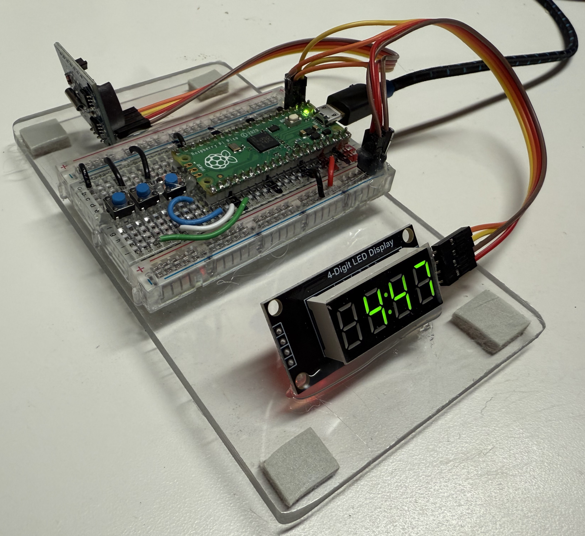

# TM1637 LED Display

<iframe width="560" height="315" src="https://www.youtube.com/embed/0fLNS-BfQ48?si=9EUzF7gv-UDJ5R3z" title="YouTube video player" frameborder="0" allow="accelerometer; autoplay; clipboard-write; encrypted-media; gyroscope; picture-in-picture; web-share" referrerpolicy="strict-origin-when-cross-origin" allowfullscreen></iframe>
[Setting the Time](https://youtu.be/0fLNS-BfQ48)




The TM1637 LED digital display is an incredibly popular and cost-effective 4-digit 7-segment display module widely used in hobbyist electronics and educational projects. At around 30 cents per unit when purchased in bulk, it offers exceptional value for clock projects, counters, and basic numeric displays.

Key features:
- 4 digits with decimal points
- Built-in controller chip that handles multiplexing
- Simple 2-wire interface (clock and data)
- 3.3V or 5V compatible
- Brightness control
- Colon indicator for clock displays

What makes the TM1637 particularly appealing for MicroPython projects is its straightforward programming interface. Using just two pins (clock and data), you can control all segments and digits through a simple serial protocol. The module handles all the multiplexing internally, making it much easier to use than raw 7-segment displays.

The TM1637 LED Clock is a low-cost way to
get started.  It is simple to setup and use
and only requires the user to make 4 connections.


## Parts List

1. 1/2 Size 400 tie solderless Breadboard
2. 4 Male-Female 20cm jumper wires (Dupont Cables)
3. Raspberry Pi Pico (or Pico W)
4. TM1637 LED Clock display
5. Real time clock

## Connection Diagram

## The MicroPython Preamble

```python
import tm1637
from machine import Pin, RTC
from utime import sleep, localtime, ticks_ms

# Initialize display
tm = tm1637.TM1637(clk=Pin(0), dio=Pin(1))
```

Here's some example MicroPython code to test various display features using your preamble:

```python
# Basic number display
tm.numbers(12, 59)  # Display 12:59
sleep(1)

# Show temperature with decimal
tm.temperature(23.4)  # Display 23.4
sleep(1)

# Control brightness (0-7)
tm.brightness(2)  # Set to medium brightness

# Blank the display
tm.show('    ')
sleep(1)

# Show individual digits
tm.write([0, 1, 2, 3])  # Display 0123
sleep(1)

# Toggle colon
tm.show('1234', True)  # Show 12:34 with colon
sleep(1)
tm.show('1234', False)  # Show 1234 without colon
sleep(1)

# Scroll some numbers
for i in range(10):
    tm.number(i * 111)
    sleep(0.5)

# Test all segments
tm.write([0x7f, 0x7f, 0x7f, 0x7f])  # All segments on
sleep(1)
```

Given its popularity, there are several MicroPython libraries available for the TM1637. The example above uses one of the most common libraries. The display's simplicity and reliability have made it a staple in DIY electronics, particularly for clock projects, temperature displays, and basic counters. You'll find it used in countless Arduino and Raspberry Pi Pico projects, making it one of the most recognizable LED display modules in the maker community.

