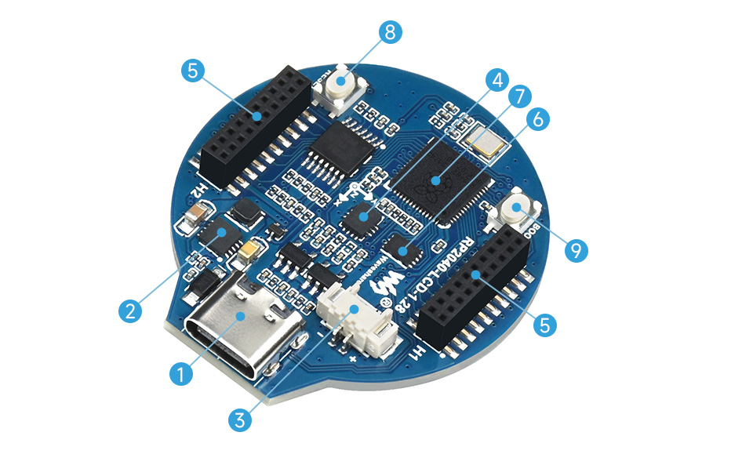

# Waveshare RP2040

The Waveshare RP2040 1.28" IPS LCD Board is a wonderful developent board with a build in RP2040 processor
that currently sells for about $18.  The board has a USB-C connector, a place for a LiPo battery connection
and built in Accelerometer & Gyroscope.  It is a great value and a wonderful way to start to learn
Python for smart watches!

1. Waveshare SKU: 22668
2. Waveshare Part Number: RP2040-LCD-1.28
1. [Link to Waveshare site](https://www.waveshare.com/rp2040-lcd-1.28.htm)

Note that this watch does not have a real-time clock and has no ability to connect to time syhronization using WiFi.
However, it is an ideal development tool for learning to program watch displays and integrate sensors.

## MicroPython Version

To use these lessions you much use MicroPython runtime v1.19.1-854-g35524a6fd released on 2023-02-07 or later.
This version supports all the native framebuf drawing libraries (ellipse and polygon)

See the documentation here: [MicroPython Framebuffer Functions](https://docs.micropython.org/en/latest/library/framebuf.html)

## Lessons

### #1 Hello World

1. [Hello world! Lesson](./01-hello-world.md)
2. [Color Lab](./02-color-test.md)
3. [Drawing Analog Hands](./)

## Detailed Components

|Component|Description|
|-------|-----------|
|USB Type-C connector|USB 1.1 with device and host support|
|ETA6096|high efficiency Lithium battery recharge manager|
|Battery Header|MX1.25 header, for 3.7V Lithium battery, allows recharging the battery and powering the board at the same time
|QMI8658C|IMU, includes a 3-axis gyroscope and a 3-axis accelerometer|
|1.27mm pitch headers|Adapting all GPIO and Debug pins|
|W25Q16JVUXIQ|2MB NOR-Flash|
|RP2040|Dual-core processor, up to 133MHz operating frequency|
|RESET Button|Reset the processor|
|BOOT Button|press it when resetting to enter download mode|

## References

[wiki](https://www.waveshare.com/wiki/RP2040-LCD-1.28)

[Instructable by Tony Goodhew](https://www.instructables.com/Digital-Watch-Display-MicroPython/) - note that this 
version does not leverage the built-in drawing libraries that were made available in version 19 of the MicroPython
release. See [The MicroPython FrameBuf Library](https://docs.micropython.org/en/latest/library/framebuf.html)

[Github Gist by Alasdair Allan](https://gist.github.com/aallan/ea16d05f7967d8ab899dfff12833a70f)