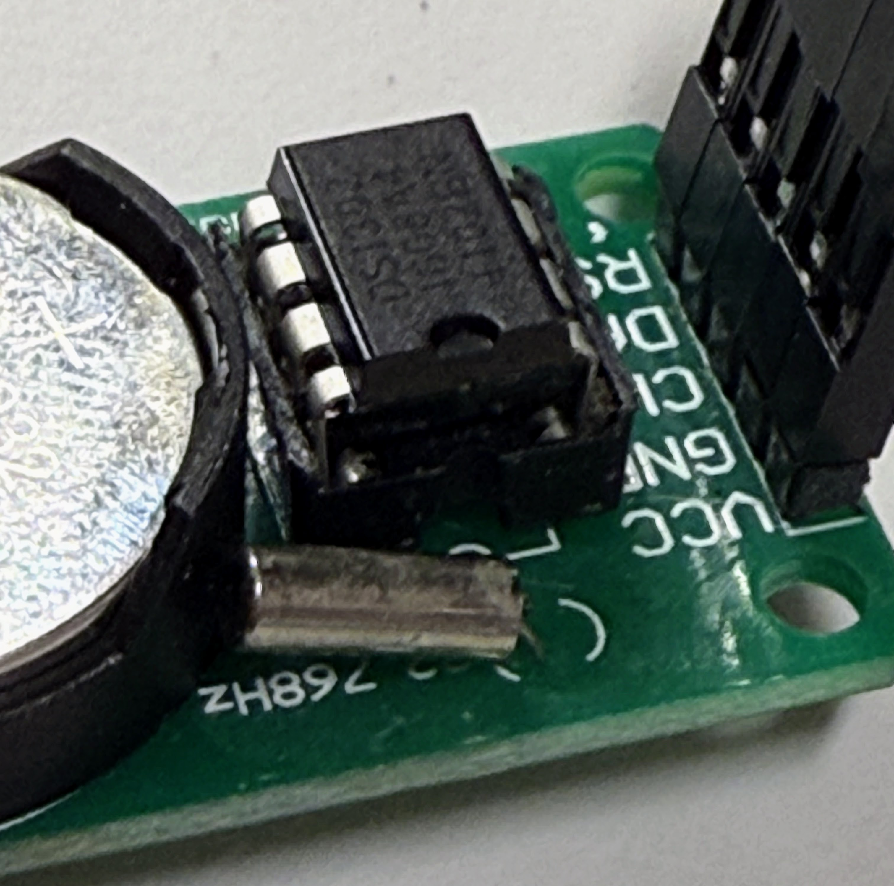

# Testing the RTC Type

When you order a RTC board, you need to make sure
you are getting the correct version.  Sometimes
the label on the chip will be visible.  However,
they are sometimes hard to read.  In that case
we can use software to test the features of the two chips.

- **DS1307** older with no temperature compensation
- **DS3231** newer with temperature compensation

## Photos of Different RTC Boards

### DS1307



## DS3231


## Tests

### Tests specific register patterns that are unique to the DS3231:

-   Control register bit patterns
-   Status register bit patterns
-   Temperature register behavior

### Performs consistency checks:

-   Verifies temperature readings are in valid range (-40°C to +85°C)
-   Checks if temperature readings make sense
-   Verifies register bit patterns match datasheet specifications

### Better DS1307 detection:
    -   Checks the DS1307's control register pattern
    -   Verifies the register behaves as expected

```py
from machine import Pin, I2C
from utime import sleep

def test_ds3231_features(i2c, addr):
    """
    More thoroughly test if the device is actually a DS3231
    Returns: (is_ds3231, error_message)
    """
    try:
        # Test 1: Check control and status registers with specific masks
        # DS3231 control register (0x0E) should have bits 6,5,4,2 readable/writable
        # Other bits should be 0
        control = i2c.readfrom_mem(addr, 0x0E, 1)[0]
        if control & 0x83 != 0:  # Bits 7,1,0 should be 0
            return False, "Control register pattern doesn't match DS3231"

        # Test 2: Status register (0x0F) should only have bits 7,3,2,1,0 possibly set
        status = i2c.readfrom_mem(addr, 0x0F, 1)[0]
        if status & 0x70 != 0:  # Bits 6,5,4 should be 0
            return False, "Status register pattern doesn't match DS3231"

        # Test 3: Try temperature register consistency check
        # Read temperature twice with a forced conversion between
        temp1 = i2c.readfrom_mem(addr, 0x11, 2)
        
        # Force conversion
        control |= (1 << 5)  # Set CONV bit
        i2c.writeto_mem(addr, 0x0E, bytes([control]))
        sleep(0.01)  # Wait for conversion
        
        temp2 = i2c.readfrom_mem(addr, 0x11, 2)
        
        # The readings should be similar and in a reasonable range (-40°C to +85°C)
        msb1 = temp1[0]
        msb2 = temp2[0]
        
        # Check if temperatures are in valid range
        if abs(msb1) > 85 or abs(msb2) > 85:
            return False, "Temperature readings out of valid range"

        return True, "DS3231 verified"

    except Exception as e:
        return False, f"Error testing DS3231 features: {str(e)}"

def identify_rtc():
    """
    Identify whether the RTC is a DS1307 or DS3231
    """
    # Initialize I2C
    i2c = I2C(0, sda=Pin(8), scl=Pin(9), freq=100000)
    
    RTC_ADDR = 0x68
    
    # First check if any device is present
    devices = i2c.scan()
    if RTC_ADDR not in devices:
        return "No RTC found at address 0x68"
    
    # Test for DS3231 features
    is_ds3231, message = test_ds3231_features(i2c, RTC_ADDR)
    
    if is_ds3231:
        # Get temperature if it's really a DS3231
        try:
            temp_msb = i2c.readfrom_mem(RTC_ADDR, 0x11, 1)[0]
            temp_lsb = i2c.readfrom_mem(RTC_ADDR, 0x12, 1)[0] >> 6
            
            if temp_msb & 0x80:
                temp_msb = -(~temp_msb & 0x7F) - 1
            
            temp_c = temp_msb + ((temp_lsb & 0x03) * 0.25)
            temp_f = (temp_c * 9/5) + 32
            
            return f"DS3231 found! Current temperature: {temp_c:.2f}°C ({temp_f:.2f}°F)"
        except Exception as e:
            return f"DS3231 found but error reading temperature: {str(e)}"
    else:
        # Test for DS1307
        try:
            # DS1307 has a unique control register at 0x07
            # It should only have bit 4 (OUT) possibly set
            control = i2c.readfrom_mem(RTC_ADDR, 0x07, 1)[0]
            if control & 0xEF == 0:  # All bits except bit 4 should be 0
                return "DS1307 found!"
            else:
                return "Found RTC at 0x68 but cannot definitively identify type"
        except:
            return "Unknown RTC device type"

def main():
    print("\nRTC Identifier")
    print("-" * 40)
    
    result = identify_rtc()
    print(result)

if __name__ == "__main__":
    main()
```