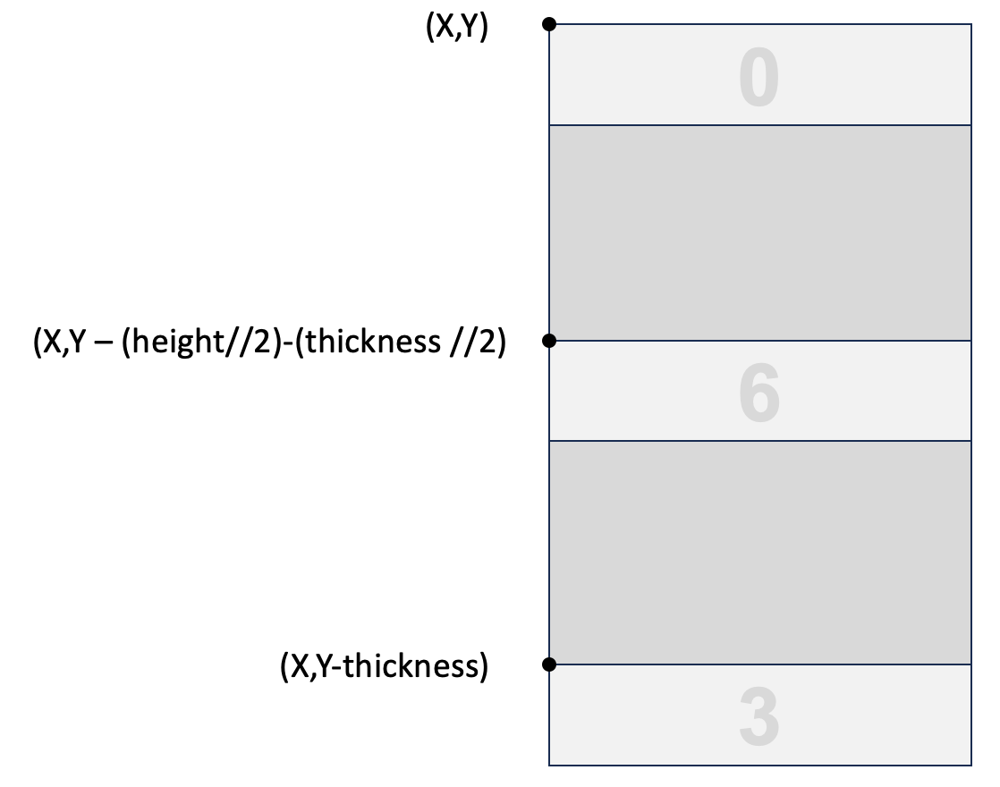

# Creating Digit Functions

In the last section, we drew a seven-segment digit number using the line
function.  In this section, we will build a better function that
will add a flexible new parameter for the thickness of the digit segments.  We will then test the function under a variety of conditions and see how
we can make the function easier to use.

## New Thickness Parameters

Placing the rectangles correctly within a seven-segment display when
we have many drawing parameters requires some precision.  We
will use a decomposition process and take "one step at a time" to work out the details.



## Draw Segment Function

Here is our revised parameters list:

1. The digit to display - an integer in the range 0-9
2. x of the upper left corner
3. y of the upper left corner
4. the width of the digit (about 20 is a good value)
5. the height of the digit
6. (NEW) the thickness of each segment (3 or 4 are good values)
7. the color (0=black, 1=white)

Here is our revised function for drawing a single digit with the
segment thickness added.

```py
# digit is the number to display
# x and y are upper-left-corner
# width and height are the dimensions of the digit
# thickness is the width of the line segments
# color is 1 for white and 0 for black
def drawDigit(digit, x, y, width, height, thickness, color):
  # get a list of the segments that are on for this digit
  segmentOn = segmentMapping[digit];
  
  # Draw the horizontal segments: top, bottom, middle
  for i in [0, 3, 6]:
    if (segmentOn[i]):
      if (i==0): # top
          yOffset = 0 
      if (i==3):
          yOffset = height - thickness # bottom element
      if (i==6):
          yOffset = height // 2 - thickness // 2# bottom
      # oled.line(x - size, y+yOffset-size, x + size, y+yOffset-size, 1);
      oled.fill_rect(x, y+yOffset, width, thickness, color)

  # Draw the vertical segments ur, lr, ll, ul
  for i in [1, 2, 4, 5]:
    if (segmentOn[i]) :
      # upper vertical lines
      if (i==1 or i==5):
          startY = y
          endY = y + height // 2
      # lower two vertical lines (2=lower right and 4=lower left)
      if (i==2 or i==4):
          startY = y + height // 2
          endY = y + height
      if (i==4 or i==5): xOffset = 0
      if (i==1 or i==2): xOffset = width-thickness

      oled.fill_rect(x+xOffset, startY, thickness, endY-startY, color)
```

Let's now take a look at how we had to modify our code.

The first item to note is that when we calculate a starting point
to draw, we can't just draw at the edge of the region.  We need
to back off our initial drawing point by the width of the segment.

Here is an example of subtracting the thickness from y when
we draw the bottom segment:

```py
yOffset = height - thickness # bottom element
```


## Full Test Program

```py
# Clock Lab 20: Draw Seven Segments
# this lab uses the fill_rect function to draw the segments
import machine
import utime
import ssd1306
from utime import sleep, localtime
led = machine.Pin(25, machine.Pin.OUT)

SCL=machine.Pin(2) # SPI CLock
SDA=machine.Pin(3) # SPI Data
spi=machine.SPI(0, sck=SCL, mosi=SDA, baudrate=100000)

RES = machine.Pin(4)
DC = machine.Pin(5)
CS = machine.Pin(6)

oled = ssd1306.SSD1306_SPI(128, 64, spi, DC, RES, CS)

segmentMapping = [
  #a, b, c, d, e, f, g
  [1, 1, 1, 1, 1, 1, 0], # 0
  [0, 1, 1, 0, 0, 0, 0], # 1
  [1, 1, 0, 1, 1, 0, 1], # 2
  [1, 1, 1, 1, 0, 0, 1], # 3
  [0, 1, 1, 0, 0, 1, 1], # 4
  [1, 0, 1, 1, 0, 1, 1], # 5
  [1, 0, 1, 1, 1, 1, 1], # 6
  [1, 1, 1, 0, 0, 0, 0], # 7
  [1, 1, 1, 1, 1, 1, 1], # 8
  [1, 1, 1, 1, 0, 1, 1]  # 9
];

# digit is the numer to display
# x and y are upper-left-corner
# width and height are the dimensions of the digit
# thickness is the width of the line segments
# color is 1 for white and 0 for black
def drawDigit(digit, x, y, width, height, thickness, color):
  # get a list of the segments that are on for this digit
  segmentOn = segmentMapping[digit];
  
  # Draw the horizontal segments: top, bottom, middle
  for i in [0, 3, 6]:
    if (segmentOn[i]):
      if (i==0): # top
          yOffset = 0 
      if (i==3):
          yOffset = height - thickness # bottom element
      if (i==6):
          yOffset = height // 2 - thickness // 2# bottom
      # oled.line(x - size, y+yOffset-size, x + size, y+yOffset-size, 1);
      oled.fill_rect(x, y+yOffset, width, thickness, color)

  # Draw the vertical segments ur, lr, ll, ul
  for i in [1, 2, 4, 5]:
    if (segmentOn[i]) :
      # upper vertical lines
      if (i==1 or i==5):
          startY = y
          endY = y + height // 2
      # lower two vertical lines (2=lower right and 4=lower left)
      if (i==2 or i==4):
          startY = y + height // 2
          endY = y + height
      if (i==4 or i==5): xOffset = 0
      if (i==1 or i==2): xOffset = width-thickness

      oled.fill_rect(x+xOffset, startY, thickness, endY-startY, color)

oled.fill(0)
oled.text('Lab 12: rect', 0, 0, 1)
x = 10 # upper left corner x
y = 10 # upper left corner y
w = 20 # digit width
h = 30 # digit height
t = 3

while True:
    for i in range(0, 10):

        print(i)
        # create an outline on px away from the drawing region
        oled.rect(x-2, y-2, w+4, h+4, 1)
        # draw one digit
        drawDigit(i, x, y, w, h, t, 1)
        # draw a second digit
        #drawDigit(i, x + w + 4, w, h, t, 1)
        oled.text(str(i), 0, 54, 1)
        oled.show()
        sleep(2)
        oled.fill(0)
```