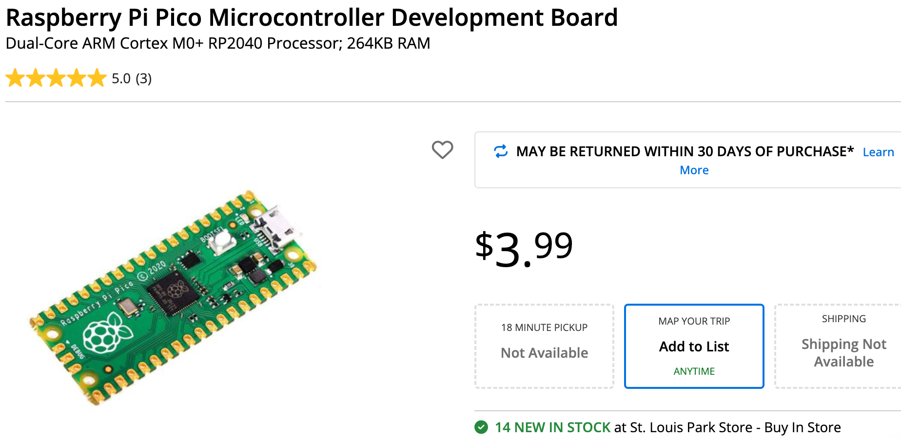
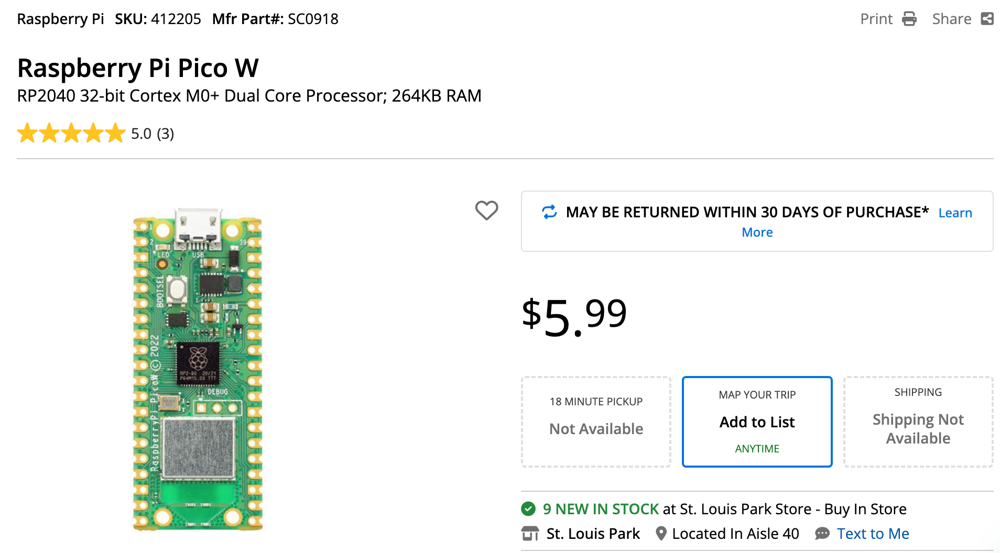

# Strategy for Parts Purchasing Guide

We have seen many well intended parent come into our workshops telling stories
about a $400 robot kit that was used for an hour and then sat in the back
of a closet.  Before you go out and purchase an expensive STEM kit, we
suggest you start small and see if your student will really use the kit.

## Breadboards

We strongly suggest purchasing breadboards in bulk at least 10 at a time.
We use eBay for purchasing all our breadboards.

Many of our projects use the 1/2 size 400-tie breadboards.  This is usually
sufficient for simple projects.

## MicroControllers

Because all or examples run MicroPython, your microcontroller will also need to run MicroPython.
Unfortunately, older microcontrollers like the Arduino Uno only come with 2K of RAM.  Since we need at least 16K of RAM to run MicroPython, the older Arduino systems will not work.

Therefore we strongly suggest you go with a newer microcontroller like the Raspberry Pi Pico which
typically sells for under $4.

### Purchasing the Raspberry Pi Pico

We love MicroCenter because they sell the [Raspberry Pi Pico for only $3.99](https://www.microcenter.com/product/661033/raspberry-pi-pico-microcontroller-development-board).  If there is a MicroCenter near your home, we strongly suggest purchasing the parts there.  

### Raspberry Pi Pico W

If you are going wireless, you will need to pay an extra dollar to get the [Raspberry Pi Pico for $5.99](https://www.microcenter.com/product/650108/raspberry-pi-pico-w)

If the Raspberry Pi Picos are out of stock, a backup plan might be an ESP-32 microcontroller.
There are two challenges you might face with the ESP-32:

1. The development boards at MicroCenter, SparkFun and Adafruit are 4x more expensive
2. There is a huge variety of these boards from many different manufactures.  So the instructions you get on each website may not match the device you purchase.

## Displays

### OLED Displays

Although the small 1" OLED displays work, they are hard to read from a distance.
We like the 2.42" inch OLED displays since they are bright and have a wide viewing angle.

[eBay $13](https://www.ebay.com/itm/335543250746)

[2.4" 2.42 inch 128x64 OLED LCD Display Module SSD1309 12864 7 Pin SPI/IIC I2C Serial Interface 2.42 inch oled module](https://www.alibaba.com/product-detail/2-4-2-42-inch-128x64_1600942149379.html) - Alibaba $8.00

[Amazon](https://www.amazon.com/Teyleten-Robot-Display-SSD1309-Interface/dp/B09LND6QJ1) - $21

### SmartWatch Displays

[Waveshare RP2040-LCD-1.28](https://www.waveshare.com/wiki/RP2040-LCD-1.28)

[Ebay Listing for $21](https://www.ebay.com/itm/265865445423)

### LED Strips

## Smartwatch Displays

## Real-Time Clocks

Learning how to use a real-time clock (RTC) is a core part of building
digital clocks.  So almost all our kits include an RTC.  Here is
a description of the two main options for RTCs.

### The DS1307

Although the DS1307 is has been around for a long time, it is still a simple low-cost part that is easy to use.  The DS1307 is still perfectly suitable for many basic timekeeping applications and for learning how to use a
Most of the development boards come with their own crystal and an I2C interface.  Most of our clock kits have now been upgraded to the newer more accurate DS3231 which we can also purchase for under $1.

### The DS3231

The DS3231 is one of the most commonly used real-time clock (RTC) modules paired with microcontrollers like the Raspberry Pi Pico. It's popular because it:

1. Has high accuracy (temperature-compensated crystal oscillator) +/- 2 seconds per month
2. Maintains accuracy over a wide temperature range suitable for indoor and outdoor use
3. Uses the I2C interface, which is easy to implement
4. Includes a 3V lithium coin-cell battery backup option which allows it to remember the time and alarm settings even when the power is off
6. Is relatively inexpensive (under $1 each)
7. Has extensive library support across different platforms
8. You can also use it to display the temperature
9. Includes the ability to store 4K in EEPROM for information such as when alarms and timers should go off

For microcontrollers in particular, the DS3231 tends to be favored because its accuracy doesn't depend on the microcontroller's clock, and it maintains accurate time even when the main microcontroller is reset or loses power.

Here is an example of a DS3231 listing on eBay for under $1:

AliExpress currently has the DS3231 boards listed for $0.73 each.

