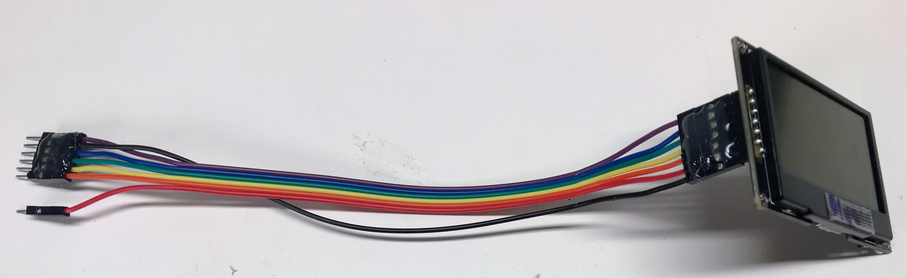
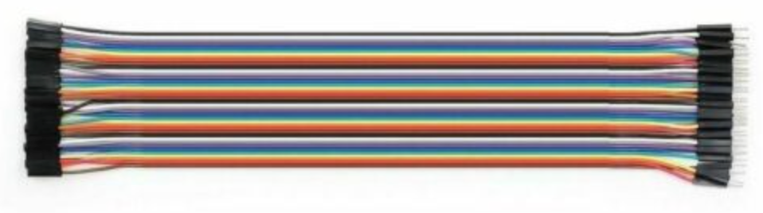
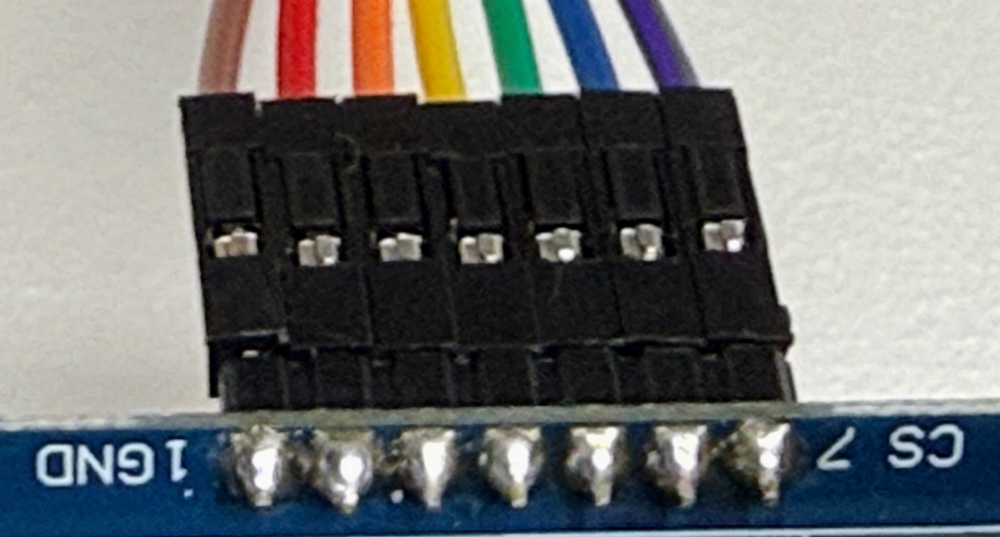
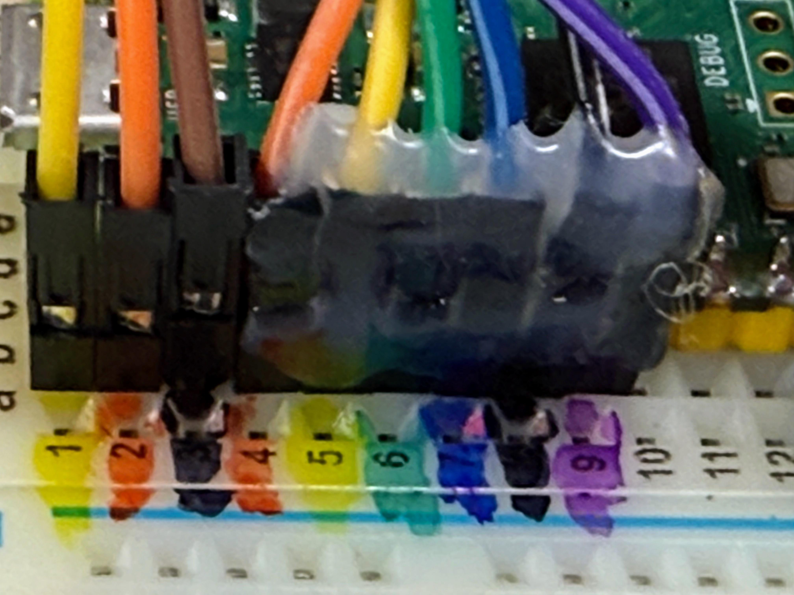

# Display Cable Harness

Unlike simple sensors that only have a few wires, displays have up to seven wires that need to be connected. This can be tricky when we use breadboards where we can accidentally pull one wire out.

To keep our displays running reliably, we can use a 20 cm ribbon cable and some hot glue to make a connector that is easy to hook up and be much more reliable.

Here is what our final display cable harness will look like when connected to the display at the right:



Note that the male pins are on the left side and you will note that the red power wire is separated from the rest of the wires which are all glued together so they can be plugged directly into the breadboard.

## Building the Display Harness

We start by purchasing some 20cm long Male-Female Dupont ribbon connectors from eBay. The price should be about $8 for 120 connectors. Make sure to get the Male-Female version.  The female pins will go on the display and the male ends will go into our breadboard.



We then separate out seven of these wires trying to use the black (or brown) and red colors in the GND and VCC edge of the group of wires.  Note that some of the display cable use brown for GND rather than black.

## The Display Connection

You can see a close-up of each of the colors and their connections in the picture below.

Backside view of the display harness at the display end:


Note that from the backside, the brown wire on the right (near the "1") is GND and the purple wire on the left (near the "7") is CS (chip select).  Note that "VSS" is the same an GND and "VDD" is the same and 3.3 volt power.

Front side view of display harness at the display end:

Note from this perspective that the brown wire is GND and the purple wire is CS (chip select).

At the other end of the cable, we need to make a small change in the order of the cable. Here are the changes:

1. We separate the red wire from the rest of the group and connect the red to the 3.3V regulated output of the Raspberry Pi Pico.  Almost all the displays in our kits run on 3.3V now.  Some older LCD displays needed exactly 5 volts, but our OLED displays work fine on either 3.3V or 5V.
2. We move the black GND wire to be in between the blue (DC) and purple (CS) wires. This allows the row of all the wires to be connected in a single block of wires.  We can hot glue these pins together to get a more reliable connection.  This is called a "Wire Harness".


## Breadboard Connections


In our kits the USB connector is placed at the **top** of the breadboard near row 1.  Make sure your breadboard is oriented correctly so the row numbers in this document will make sense.  Note that the breadboard row numbers are on the left and begin with the number "1".  Don't confuse this with
the logical GPIO numbers inside the Pico that begin with "0".  So in our setup, GPIO 0 is on breadboard row 1.

We can then plug this group of wires directly into the left side of the breadboard from breadboard rows 3 to 9. This is shown below.  Make sure the black GND is on the Pico GND on row 8 of the breadboard.


Note in this figure, the I2C bus uses breadboard rows 1 to 3.  The display cable only uses breadboard rows 4 to 9.

We designed these connections with the following rules:

1. The Clock (SCL) and Data (SDA) **MUST** be connected to rows 4 and 5 respectively because this is where SPI0 CLK and SPI0 TX are located.
2. The other three signals RES, DC and CS can be on any pin so we will use the rows that make the cable connectors direct to rows 6, 7 and 9. Note that GND is on breadboard row 8 which I mark with a black
marker.

We have found that once we create these cable assemblies with hot glue to keep the pins in the right order it makes it much easier to connect the displays.

!!! Warning
    Note that we still MUST make sure that the black (or brown) wire in the wiring harness is connected to the GND. It is easy to get the cable reversed so make sure to double-check the cable orientation before you apply power to the Pico or USB.

For younger students, don't be shy about providing a few color-coded hints on the breadboard to guide their assembly process as in the image above.

## SPI Display to Breadboard Connections

If you use a standard display cable the connectors will be as follows when
reading the connection labels from the **bottom** of the display end to the **top** of the display:

|Display Label|Name|Wire Color|Breadboard Row|
|---|---|---|---|
|VSS|Ground|Black or Brown|BB Row 8|
|VCC|Power|Red|3.3 volt rail or row 5 on the right|
|SCL|Clock|Orange|BB Row 4 - GPIO 2|
|SDA|Data|Yellow|BB Row 5 - GPIO 3|
|RES|Reset|Green|BB Row 6 - GPIO 4|
|DC|Data or Command|Blue|BB Row 7|
|CS|Chip Select|Purple|BB Row 9|

Note that "BB Row" refers to the breadboard row which starts at row 1 at the top
where the USB is.  Note that any row that ends in "3" or "8" is a GND.

## Sample Code

```python
import machine
import ssd1306

# Pins for our standard display cable harness where GND is in row 8
# Note the order from row 4 to 6, skip 8 for GND and 9
SCL = machine.Pin(2) # SPI CLock bb row 4
SDA = machine.Pin(3) # SPI Data (mosi) bb row 5
RES = machine.Pin(4) # Reset bb rwo 6
DC  = machine.Pin(5) # Data/command bb row 7
CS  = machine.Pin(6) # Chip Select bb row 9

spi=machine.SPI(0, sck=SCL, mosi=SDA)
oled = ssd1306.SSD1306_SPI(128, 64, spi, DC, RES, CS)

# erase the entire screen with black (0=black)
oled.fill(0)

# place a hello message at point (0,0) in white (1=white text)
oled.text("Hello World!", 0, 0, 1)

# send the entire frame buffer to the display via the SPI bus
oled.show()
```

When you press "Run" on Thonny you should see "Hello World!" on the display.


## Debugging Tips

One of the challenges of this project is that there is no status indicator on the display.  It usually works perfectly or it does not work at all.  The OLED displays are pretty robust. I have not had any fail yet.  But they require all seven wires to be hooked up perfectly, which can be a challenge!

If your test "Hello World!" program does not run, please try the following debugging tips:

1. Carefully check your connections from the display to the breadboard.  Sometimes the colors get mixed up.
2. Verify that both the GND (black or brown) and the CS (purple) pins on the display are connected correctly.  It is easy to get the connections reversed.
3. Trace the wires from their label on the the display to the right GPIO pin.  Make sure that your code references the right pin.
4. Try checking the conductivity of the wires using an ohm meter with the power disconnected.
5. Double check the pin numbers in your code.  Having just one pin number incorrect will cause the display to not work.
6. With the power applied to the pico, check the voltage at the display ned on the VDD pin.  It should read 3.3 volts.
7. If you have an extra display harness, try swapping that harness in for the current one.
8. If you have another OLED display, try swapping that display in for the current display.
9. According to the [SSD1306 Datasheet](https://www.digikey.com/htmldatasheets/production/2047793/0/0/1/ssd1306.html) the Chip Select (CS) pin is active low.  Which means it should be at GND for the device
to be working.  With an ohm meter, check the voltage of the CS pin.  It should be near zero.
10. If you have a logic analyzer, hook it up to the the SCL, SDA, DC, Reset and CS.  You should see CS be at GND and a clock signal on the SCL line.  The SDA, DC and RES signals should appear similar to the diagrams in the datasheets.
11. If you see what looks like random noise or "show" on the display, it usually means that one of the DC/RES or CS wires has gotten reversed.  This means you are close!

