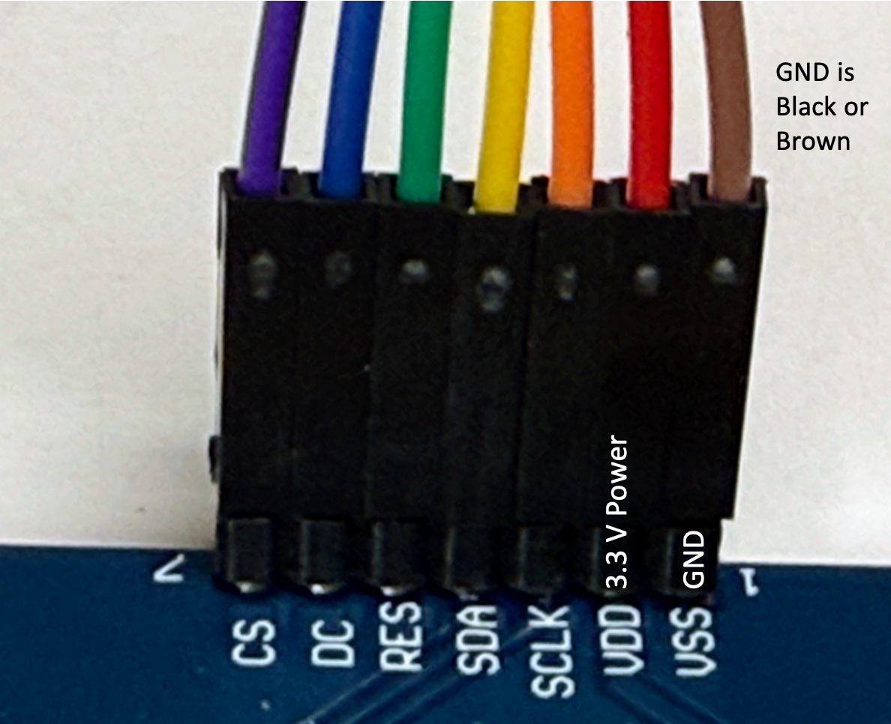

# Display Cable Harness

Unlike simple sensors that only have a few wires, displays have up to seven wires that need to be connected. This can be tricky when we use breadboards where we can accidentally pull one wire out.

To keep our displays running reliably, we can use a 20 cm ribbon cable and some hot glue to make a connector that is easy to hook up and be much more reliable.

We start by purchasing some 20cm long Male-Female Dupont ribbon connectors from eBay. The price should be about $8 for 120 connectors. Make sure to get the Male-Female version.


We then separate out seven of these wires trying to use the black (or brown) and red colors in the GND and VCC edge of the group of wires.  Note that some of
the display cable use brown for GND rather than black.

You can see a close-up of each of the colors and their connections in the picture below.

Backside view:

Note that the brown wire is GND and the purple wire is CS (chip select).

Front side view:

Note again that the brown wire is GND and the purple wire is CS (chip select).

At the other end of the cable, we need to make a small change in the order of the cable. Here are the changes:

1. We separate the red wire from the rest of the group and connect the red to the 3.3V regulated output of the Raspberry Pi Pico.  All our displays run on 3.3v now.
2. We move the back GND wire to be in between the blue and purple CS and DC wires. This allows the row of all the wires to be connected in a single block of wires.


We can then plug this group of wires directly into the breadboard from breadboard rows 3 to 9. This is shown below.  Make sure the black GND is on the Pico GND on row 8 of the breadboard.


We designed these connections with the following rules:

1. The Clock (SCL) and Data (SDA) MUST be connected to rows 4 and 5 respectively because this is where SPI0 CLK and SPI0 TX are located.
2. The other three signals RES, DC and CS can be on pin so we will use the rows that make the cable connectors direct to rows 6, 7 and 9. Note that GND is on breadboard row 8 which I mark with a black
marker.

We have found that once we create these cable assemblies with hot glue to keep the pins in the right order it makes it much easier to connect the displays.

!!! Warning
    Note that we still MUST make sure that the black (or brown) wire in the wiring harness is connected to the GND. It is easy to get the cable reversed so make sure to double-check the cable orientation before you use power on the board.

For younger students, don't be shy about providing a few color-coded hints on the breadboard to guide their assembly process as in the image above.

## SPI Display to Breadboard Connections

If you use a standard display cable the connectors will be as follows when
reading the wires from the bottom of the display end to the top:

|Display|Name|Color|Breadboard|
|---|---|---|---|
|GND|Ground|Black or Brown|BB Row 8|
|VCC|Power|Red|3.3 volt rail or row 5 on the right|
|SCL|Clock|Orange|BB Row 4 - GPIO 2|
|SDA|Data|Yellow|BB Row 5 - GPIO 3|
|RES|Reset|Green|BB Row 6 - GPIO 4|
|DC|Data or Command|Blue|BB Row 7|
|CS|Chip Select|Purple|BB Row 9|

Note that "BB Row" refers to the breadboard row which starts at row 1 at the top
where the USB is.  Note that any row that ends in "3" or "8" is a GND.

## Sample Code

```python
import machine
import ssd1306

# Note the order from row 4 to 6, skip 8 for GND and 9
SCL=machine.Pin(2) # SPI CLock bb row 4
SDA=machine.Pin(3) # SPI Data (mosi) bb row 5
RES = machine.Pin(4) # Reset bb rwo 6
DC = machine.Pin(5) # Data/command bb row 7
CS = machine.Pin(6) # Chip Select bb row 9

spi=machine.SPI(0, sck=SCL, mosi=SDA)
oled = ssd1306.SSD1306_SPI(128, 64, spi, DC, RES, CS)

# erase the entire screen with black (0=black)
oled.fill(0)

# place a hello message at point (0,0) in white (1=white text)
oled.text("Hello World!", 0, 0, 1)

# send the entire frame buffer to the display via the SPI bus
oled.show()
```

When you press "Run" on Thonny you should see "Hello World!" on the display.


## Debugging Tips

1. Carefully check your connections from the display to the breadboard.  Sometimes the colors get mixed up.
2. Verify that both the 

