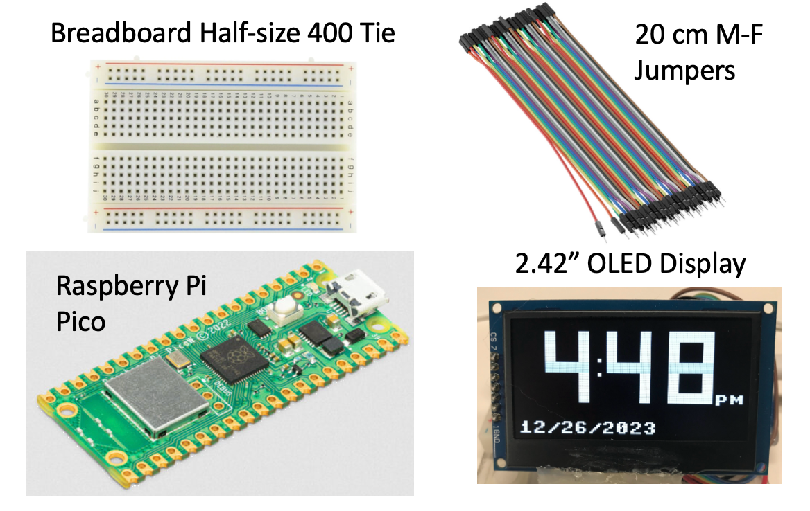
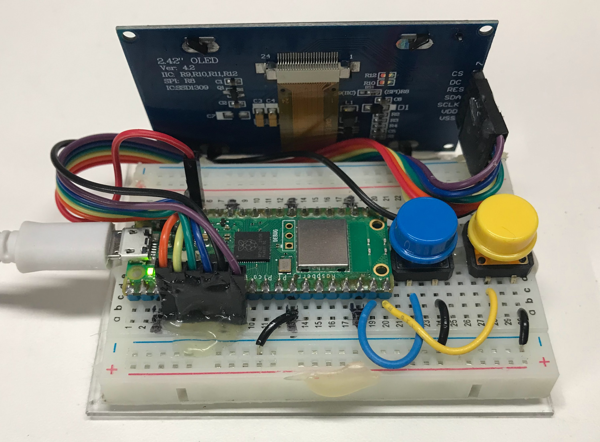

# A Guide to Setting up Your Clocks and Watches Labs

This section is intended for parents, mentors, teachers and curriculum developers who are responsible for creating a great experience for your students.  Within this audience
we have typically seen two extremes.

1. Value-based purchasers with limited budgets who are good at long-term planning.  They pre-order parts form China on eBay and Alibaba in bulk and avoid high-cost shipping fees.

2. Parents in high-disposable income households with limited time and large budgets.  They just want to click on a few links and have the parts shipped overnight.

This Setup Guide attempts to provide information for both of these groups.  Note that we have used generative AI to help you source the lowest costs parts.  We encourage you to ask your
generative AI chatbot about sourcing strategies that balance low-cost and fast delivery.

## Minimal Setup

The minimal setup consists of just four parts:

1. A 1/2 size solderless breadboard - about $2
2. 20cm jumper wires (male-to-female) - also known as Dupont connectors - about $1
3. A Raspberry Pi Pico - about $4 or $5 with headers presoldered - you can get the "W" if you want to go wireless and use WiFi to sync the time
4. A OLED display - which range from $5 to $20 depending on the size

If you are patient and clever you can purchase these parts in bulk and keep the kit price
under $10 - although the OLED display will be hard to read from more than a few feet away.

Image Caption: An example of a 2.42" OLED display connected to a 400-tie breadboard holding
a Raspberry Pi W with two buttons for changing the display settings.

### Sample Amazon Links

Here are the Amazon Links for these parts:

1. [Half Size Solderless Breadboard Search on Amazon](https://www.amazon.com/half-size-breadboard/s?k=half-size+breadboard)
2. [Sample 4-Pack for $6](https://www.amazon.com/Pcs-MCIGICM-Points-Solderless-Breadboard/dp/B07PCJP9DY)
3. [20cm male-to-female Dupont Connectors $4 for 40 connectors](https://www.amazon.com/California-JOS-Breadboard-Optional-Multicolored/dp/B0BRTHR2RL?crid=1UU9NQV2KET3J&th=1)
4. [Raspberry Pi Pico $8](https://www.amazon.com/Raspberry-Pi-Pico/dp/B09KVB8LVR)
5. [Amazon Keyword Search for 2.42" OLED Display 128*64 SPI SSD1309](https://www.amazon.com/s?k=2.42%22+OLED+Display+128*64+SPI+SSD1309)
6. [Amazon Prime 2.42" OLED Display for $14 in 4 Colors](https://www.amazon.com/DWEII-Display-SSD1309-Interface-Electronic/dp/B0B2R57SCJ?th=1)

Note that MicroCenter sells the Pico for [$3.99](https://www.microcenter.com/product/661033/raspberry-pi-pico-microcontroller-development-board).  So you are paying about double on Amazon for some of these parts.

### Sample E-Bay Links

1. [Half Size Solderless Breadboard Search on EBay](https://www.ebay.com/sch/i.html?_nkw=Half+Size+Solderless+Breadboard)
2. [10X 400 Point Solderless Breadboard for $14](https://www.ebay.com/itm/193868631702)
3. [20cm male-to-female dupont connectors](https://www.ebay.com/sch/i.html?_nkw=20cm+male-to-female+dupont+connectors)
4. [10/20/30CM MM, MF, FF Dupont Wire Jumper Cable 40PIN Dupont Line Connector for $4](https://www.ebay.com/itm/394946481407)
5. [2.42" OLED Display 128*64 SPI SSD1309](https://www.ebay.com/itm/176451452762)

## Other Components

### Display Cable Harness

[Display Cable Harness](./display-cable-harness.md)

### Real Time Clocks

Technically you can get a clock or watch running without a real-time clock (RTC).
The problem is that the clock will not be very accurate unless you continually
sync the time using WiFi or with your host computer.

However, learning how to use the a RTC is a key learning concept and
learning how to use the I2C serial interface is also a good concept to
know.  So it is optional but strongly encouraged.

#### The DS1307

Although this board is old, it is a simple and low-cost part that is easy to use.
Most of the development boards come with their own crystal and an I2C interface.

#### The DS3231
The DS3231 is one of the most commonly used real-time clock (RTC) modules paired with microcontrollers like the Raspberry Pi Pico. It's popular because it:

1. Has high accuracy (temperature-compensated crystal oscillator)
2. Maintains accuracy over a wide temperature range
3. Has built-in temperature compensation
4. Uses the I2C interface, which is easy to implement
5. Includes a battery backup option
6. Is relatively inexpensive
7. Has extensive library support across different platforms

The second most common is probably the DS1307, which is an older and simpler version. While less accurate than the DS3231, it's even less expensive and still perfectly suitable for many basic timekeeping applications.

For microcontrollers in particular, the DS3231 tends to be favored because its accuracy doesn't depend on the microcontroller's clock, and it maintains accurate time even when the main microcontroller is reset or loses power.
